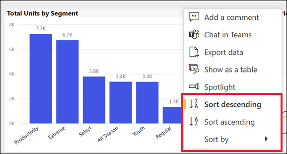
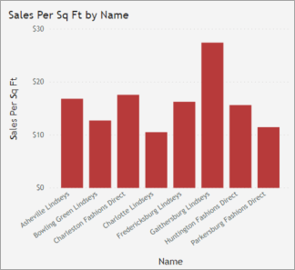
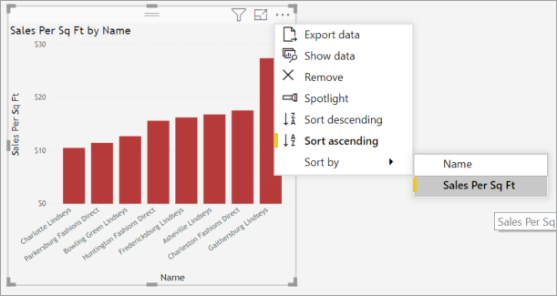

# Change how a chart is sorted in a Power BI report

[!INCLUDE[consumer-appliesto-ynnn](../includes/consumer-appliesto-ynnn.md)]

> [!IMPORTANT]
> **This article is intended for Power BI users who do not have edit permissions to the report or dataset and who only work in the online version of Power BI (the Power BI service). If you are a report *designer* or *administrator* or *owner*, this article may not have all the information you need. Instead, please read [Sort by column in Power BI Desktop](../create-reports/desktop-sort-by-column.md)**.

In the Power BI service, you can change how a visual looks by sorting it by different data fields. By changing how you sort a visual, you can highlight the information you want to convey. Whether you're using numeric data (such as sales figures) or text data (such as state names), you can sort your visuals as desired. Power BI provides lots of flexibility for sorting, and quick menus for you to use. 

Visuals on a dashboard cannot be sorted. But in a Power BI report, you can sort most visuals by one, and sometimes two, fields at a time. For certain types of visuals, sorting is not available at all: tree maps, gauges, maps, etc. 

## Get started

To get started, open any report that you have created or that has been shared with you. Select a visual (that can be sorted) and choose **More actions** (...).  There are three options for sorting: **Sort descending**, **Sort ascending**, and **Sort by**. 
    

### Sort alphabetically or numerically

Visuals can be sorted alphabetically by the names of the categories in the visual, or by the numeric values of each category. For example, this chart is sorted alphabetically by the X-axis category store **Name**.

To change the sort from a category (store name) to a value (sales per square feet), select **More actions** (...) and choose **Sort by**. Select a numeric value used in the visual.  In this example, we've selected **Sales Per Sq Ft**.

If necessary, change the sort order between ascending and descending.  Select **More actions** (...) again and choose **Sort descending** or **Sort ascending**. The field that is being used to sort is in bold and has a yellow bar.

   

> [!NOTE]
> Not all visuals can be sorted. For example, the following visuals cannot be sorted: treemap, map, filled map, scatter, gauge, card, waterfall.

## Sorting by multiple columns
The data in this table is sorted by **Number of customers**.  We know this because of the small arrow beneath the word *Number*. The arrow is pointing down which means the column is being sorted in *descending* order.

To add more columns to the sort order, Shift + click the column header you would like to add next in the sort order. For example, if you click **Number of customers** and then Shift + click **Total revenue**, then the table is sorted first by customers, then by revenue. The red outline show areas where sort order changed.

If you Shift + click a second time on the same column, this will change the sort direction (ascending, descending) for that column. Furthermore, if you Shift + click a column you have previously added to the sort order, this will move that column to the back of the sort order.

## Saving changes you make to sort order
Power BI reports retain the filters, slicers, sorting, and other data view changes that you make -- even if you're working in [Reading view](end-user-reading-view.md). So, if you navigate away from a report, and return later, your sorting changes are saved.  If you want to revert your changes back to the report *designer's* settings, select **Reset to default** from the upper menu bar. 

If however, the **Reset to default** button is greyed out, that means the report *designer* has disabled the ability to save (persist) your changes.

## Considerations and troubleshooting

### Sorting using other criteria
Sometimes, you want to sort your visual using a different field (that isn't included in the visual) or other criteria.  For example, you might want
to sort by month in sequential order (and not in alphabetical order) or you might
want to sort by entire numbers instead of by digit (example, 0, 1, 9, 20 and not 0, 1, 20, 9).  

- To learn how to sort by another field in the dataset, and you have edit permissions to the report, see [Sort by column in Power BI Desktop](../create-reports/desktop-sort-by-column.md).    
- If you are the report designer, you can create new columns in the dataset to address sorting issues with values such as dates and numbers. Contact information for the *designer* can be found by selecting the report name from the header bar.

## Next steps
More about [Visualizations in Power BI reports](end-user-visualizations.md).

[Power BI - Basic Concepts](end-user-basic-concepts.md)
