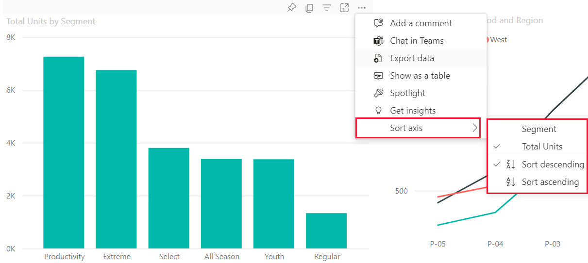
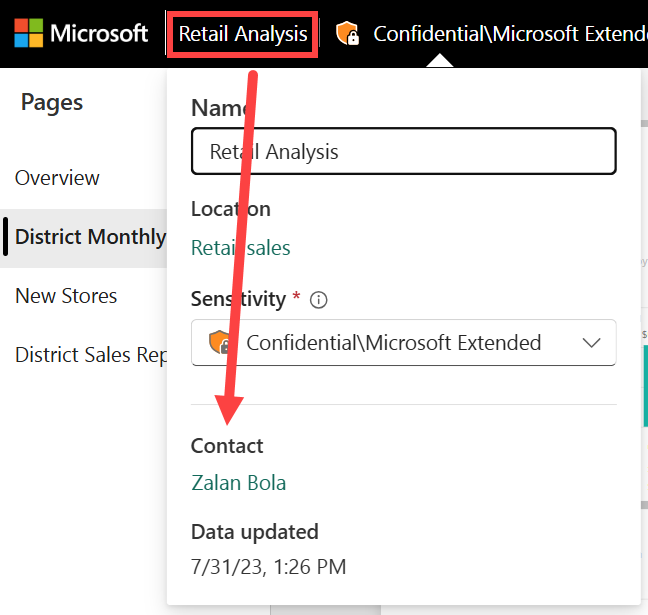

# Change how a chart is sorted in a Power BI report

[!INCLUDE[consumer-appliesto-ynnn](../includes/consumer-appliesto-ynnn.md)]

> [!IMPORTANT]
> **This article is for the Power BI service users who do not have edit permissions for a report or dataset. If you are a report designer, administrator, or owner, this article might not have all the information you need. Instead, read the article [Sort by column in Power BI Desktop](../create-reports/desktop-sort-by-column.md)**.

In the Power BI service, you can sort a visual by different data fields to highlight important information. Use numeric data (such as sales figures) or text data (such as state names) to sort your visuals as desired. Power BI provides a lot of flexibility and quick menus for you to conveniently sort your visuals.

After you sort a visual, you can save a personalized version of your changes with the [**Personalize this visual**](end-user-personalize-visuals.md) feature. Sort your data and then save the visual as a [bookmark](end-user-bookmarks.md) to keep your settings preserved. You don't need edit permissions to create a personalized version of the report.

Visuals on a dashboard cannot be sorted, but in a Power BI report you can sort most visuals by one, and sometimes two, fields at a time. Some visuals can't be sorted, like treemaps, filled maps, scatter charts, gauge charts, waterfall charts, and cards.

This video demonstrates some of the newer sorting features now available in the Power BI service and some of the original features, like how to change the sort order.

> [!VIDEO https://www.microsoft.com/videoplayer/embed/RWRpNT]

## Get started

To get started, open any report that you have created or that has been shared with you. Select a visual that can be sorted and choose **More actions** (...). The three options for sorting are **Sort descending**, **Sort ascending**, and **Sort by**.

## Sort alphabetically or numerically

Visuals can be sorted alphabetically by the names of the categories in the visual or by the numeric values of each category. For example, this chart's X-axis, the store **Name**, is sorted alphabetically.

To change the sort from a category (store name) to a value (sales per square feet), select **More actions** (...), choose **Sort by** and select a numeric value used in the visual. The following example shows the visual sorted by **Sales Per Sq Ft**.

You can also sort in ascending or descending order. Select **More actions** (...) and choose **Sort descending** or **Sort ascending**. Your selections are marked with a checkmark.

   

> [!NOTE]
> Some visuals can't be sorted, like treemaps, filled maps, scatter charts, gauge charts, waterfall charts, and cards.

## Sort by multiple columns

The data in this table is sorted by **Number of customers**. The small arrow in the column header indicates that the column is sorted. The arrow points down because the column is being sorted in descending order.

You can sort multiple columns to create a sorting sequence. To add more columns to the sort order, select the Shift key while selecting the column header you would like to add next in the sort order. For example, if you click **Number of customers** and then Shift + click **Total revenue**, then the table is sorted first by customers, then by revenue. The red outline show areas where sort order changed.

If you Shift + click a second time on the same column, this will change the sort direction (ascending, descending) for that column. Furthermore, if you Shift + click a column you have previously added to the sort order, this will move that column to the back of the sort order.

## Save changes you make to sort order

Power BI reports retain the filters, slicers, sorting, and other data view changes that you make -- even if you're working in [Reading view](end-user-reading-view.md). So, if you navigate away from a report, and return later, your sorting changes are saved.  If you want to revert your changes back to the report designer's settings, select **Reset to default** from the upper menu bar.

If however, the **Reset to default** button is greyed out, that means the report designer has disabled the ability to save (persist) your changes.

Another way to save your changes is with bookmarks. If the report designer enabled the **Personalize visual** feature for this report, you'll be able to change the sort order for a visual (and a lot more) and save it as a bookmark. If you see this icon  in the visual's header, then personalize visuals is enabled.

To learn more, see [Personalize visuals in a report](end-user-personalize-visuals.md)

## Sorting using other criteria

Sometimes, you want to sort your visual using a different field (that isn't included in the visual) or other criteria. For example, you might want to sort by month in sequential order (and not in alphabetical order) or you might want to sort by entire numbers instead of by digit (example, 0, 1, 9, 20 and not 0, 1, 20, 9).  

- To learn how to sort by another field in the dataset, and you have edit permissions to the report, see [Sort by column in Power BI Desktop](../create-reports/desktop-sort-by-column.md).

- If you are the report designer, you can create new columns in the dataset to address sorting issues with values such as dates and numbers. Contact information for the designer can be found by selecting the report name from the header bar.

## Next steps

More about [Visualizations in Power BI reports](end-user-visualizations.md).

[Power BI - Basic Concepts](end-user-basic-concepts.md)
