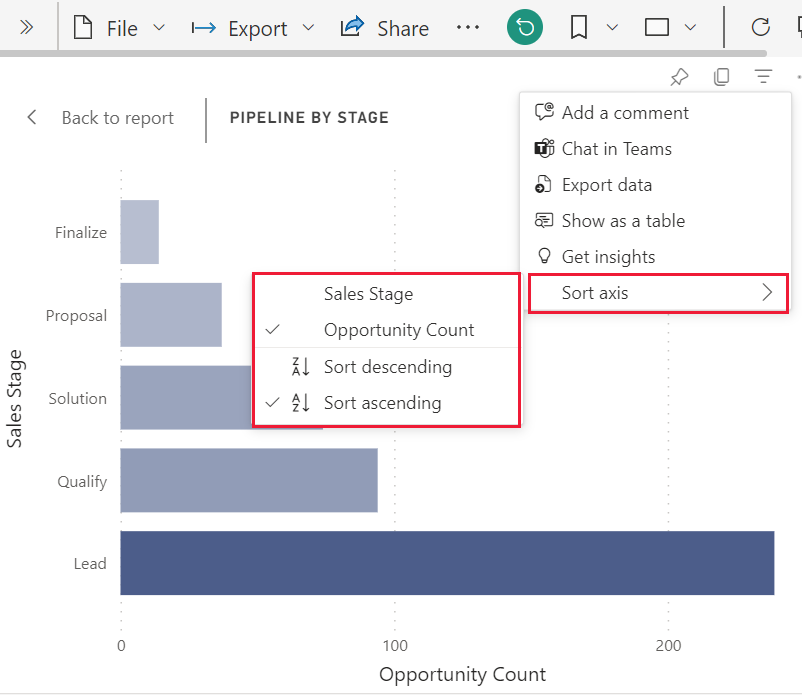

# Change how a chart is sorted in a Power BI report

[!INCLUDE [power-bi-service-new-look-include](../includes/power-bi-service-new-look-include.md)]

> [!IMPORTANT]
> **This article is intended for Power BI users who do not have edit permissions to the report or dataset. For more detailed instructions for sorting, please read [Sort by column in Power BI Desktop](../desktop-sort-by-column.md)**.

In the Power BI service, you can change how a visual looks by sorting it by different data fields. By changing how you sort a visual, you can highlight the information you want to convey.

Visuals on a dashboard cannot be sorted, but in a Power BI report, you can sort most visualizations 

Whether you're using numeric data (such as sales figures) or text data (such as state names), you can sort your visualizations as desired. Power BI provides lots of flexibility for sorting, and quick menus for you to use. 

## Get started

To get started, select any visual and choose **More actions** (...).  There are three options for sorting: **Sort descending**, **Sort ascending**, and **Sort by**. 
    

### Sort alphabetically or numerically

Visuals can be sorted alphabetically by the names of the categories in the visual, or by the numeric values of each category. For example, this chart is sorted alphabetically by the X-axis category store **Name**.

It's easy to change the sort from a category (store name) to a value (sales per square feet) instead. Select **More actions** (...) and choose **Sort by**. Select a numeric value used in the visual.  In this example, we've selected **Sales Per Sq Ft**.

If necessary, change the sort order between ascending and descending.  Select **More actions** (...) again and choose **Sort descending** or **Sort ascending**. The field that is being used to sort is in bold and has a yellow bar.

   

> [!NOTE]
> Not all visuals can be sorted. For example, the following visuals cannot be sorted: treemap, map, filled map, scatter, gauge, card, waterfall.

## Saving changes you make to sort order
Power BI reports retain the filters, slicers, sorting, and other data view changes that you make. So if you navigate away from a report, and return later, your sorting changes are saved.  If you want to revert your changes back to the report designer's settings, select **Reset to default** from the upper menu bar. 

If however, the **Reset to default** button is greyed out, that means the report *designer* has disabled the ability to save (persist) your changes.

## Considerations and troubleshooting

### Sorting using other criteria
Sometimes, you want to sort your visual using a different field (that isn't included in the visual) or other criteria.  For example, you might want
to sort by month in sequential order (and not in alphabetical order) or you might
want to sort by entire numbers instead of by digit (example, 0, 1, 9, 20 and not 0, 1, 20, 9).  Only the person who designed the report can make these changes for you. Contact information for the *designer* can be found by selecting the report name from the header bar.

## Next steps
More about [Visualizations in Power BI reports](end-user-visualizations.md).

[Power BI - Basic Concepts](end-user-basic-concepts.md)
