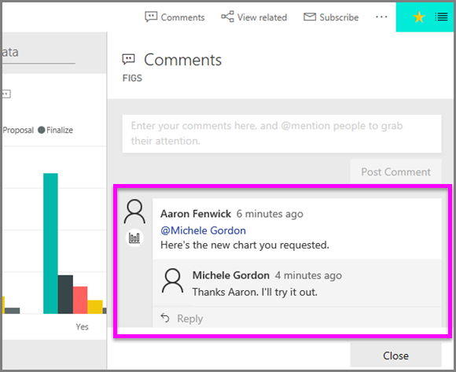

# Add comments to a visualization
Add a personal comment or start a conversation about a visualization with your colleagues. The **comment** feature is just one of the ways a *consumer* can interact with a visualization. 

## How to use the comment feature

1. Hover over the visualization and select the ellipsis (...).    
2. From the dropdown, select **Add a comment**.

      

3.  Type your comment and select **Post comment**. This one is a comment to myself, complete with misspelling.

      

4. Here's a conversation I'm having with the visualization *designer*. He uses the @ symbol to ensure I see the comment. I know this comment is for me. When I open this app dashboard in Power BI, I select **Comments** from the header. The **Comments** pane displays our conversation. 

      

5. Click **Close** to return to the dashboard or report.

## Next steps
Back to [visualizations for consumers](end-user-visualizations.md)    
<!--[Select a visualization to open a report](end-user-open-report.md)-->