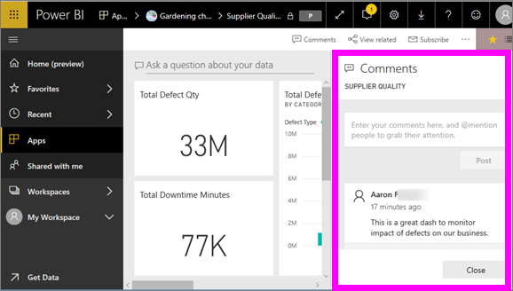
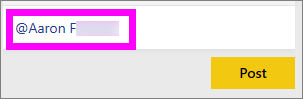
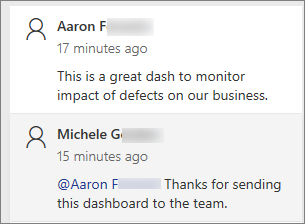
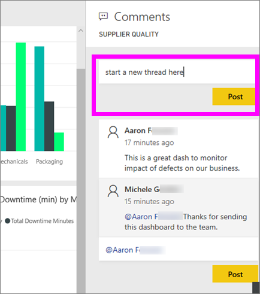
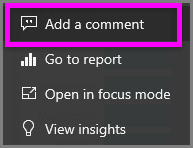
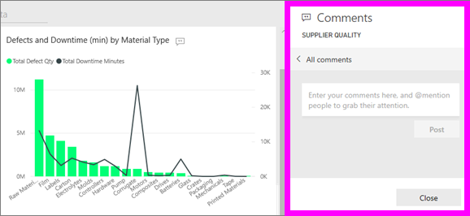
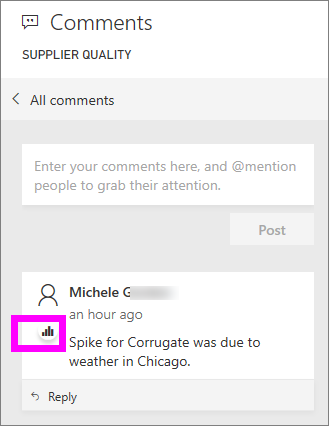
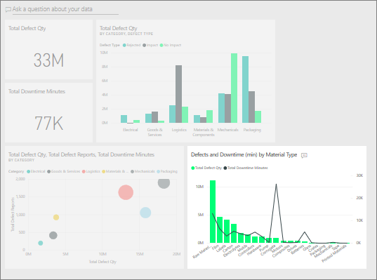
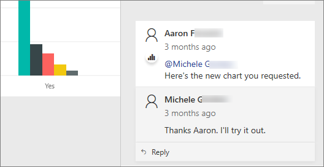

# Add comments to a dashboard
Add a personal comment or start a conversation about a dashboard with your colleagues. The **comment** feature is just one of the ways a *consumer* can collaborate with others. 

## How to use the Comments feature
Comments can be added to an entire dashboard or to individual visuals on a dashboard. Add a general comment or a comment targetted at specific colleagues.  

### Add a general dashboard comment
1. Open a Power BI dashboard and select the **Comments** icon. This opens the Comments dialog.

    

    Here we see that the dashboard creator has already added a general comment.  Anyone with access to this dashboard can see this comment.

    

2. To respond, select **Reply**, type your response, and select **Post**.  

    

    By default, Power BI directs your response to the colleague who started the comment thread, in this case Aaron F. 

    

 3. If you want to add a dashboard comment that is not part of an existing thread, enter your comment in the upper text field.

    

    The comments for this dashboard now look like this.

    

### Add a comment to a specifi dashboard visual
1. Hover over the visual and select the ellipsis (...).    
2. From the dropdown, select **Add a comment**.

      

3.  The **Comments** dialog opens. This visual doesn't have any comments yet. 

      

4. Type your comment and select **Post**.

      

    The chart icon  lets us know that this comment is tied to a specific visual. Select the icon to highlight the related visual on the dashboard.

    

5. Select **Close** to return to the dashboard or report.

### Get your colleagues attention by using the @ sign
Whether you're creating dashboard comments or commenting on a particular visual,grab your colleagues' attention by using the "@" symbol.  When you type the "@" symbol, Power BI opens a  dropdown where you can search for and select individuals from your organization. Any verified name prefaced with the "@" symbol, appears in blue font. 

Here's a conversation I'm having with the visualization *designer*. He uses the @ symbol to ensure I see the comment. I know this comment is for me. When I open this app dashboard in Power BI, I select **Comments** from the header. The **Comments** pane displays our conversation.

  

## Next steps
Back to [visualizations for consumers](end-user-visualizations.md)    
<!--[Select a visualization to open a report](end-user-open-report.md)-->