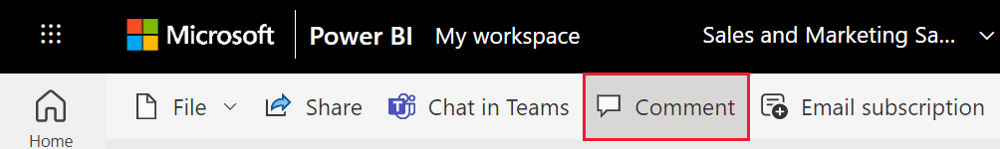

# Add comments to a dashboard or report
Add a personal comment or start a conversation about a dashboard or report with your colleagues. The **comment** feature is just one of the ways a *consumer* can collaborate with others. 

## How to use the Comments feature
Comments can be added to an entire dashboard, to individual visuals on a dashboard, to a report page, and to individual visuals on a report page. Add a general comment or a comment targeted at specific colleagues.  

When you add a comment to a report, Power BI captures the current filter and slicer values. This means that when you select or respond to a comment, the report page or report visual may change to show you the filter and slicer selections that were active when the comment was first added.  

Why is this important? Say a colleague applied a filter that revealed an interesting insight that he wants to share with the team. Without that filter selected, the comment might not make sense. 

### Add a general comment to a dashboard or report
The processes for adding comments to a dashboard or report are similar. In this example, we're using a dashboard. 

1. Open a Power BI dashboard or report and select the **Comments** icon. This opens the Comments dialog.

    

    Here we see that the dashboard creator has already added a general comment.  Anyone with access to this dashboard can see this comment.

    

2. To respond, select **Reply**, type your response, and select **Post**.  

    

    By default, Power BI directs your response to the colleague who started the comment thread, in this case Aaron F. 

    

 3. If you want to add a comment that is not part of an existing thread, enter your comment in the upper text field.

    

    The comments for this dashboard now look like this.

    

### Add a comment to a specific dashboard or report visual
In addition to adding comments to an entire dashboard or to an entire report page, you can add comments to individual dashboard tiles and individual report visuals. The processes are similar, and in this example we're using a report.

1. Hover over the visual and select the ellipsis (...).    
2. From the dropdown, select **Add a comment**.

      

3.  The **Comments** dialog opens, and the other visuals on the page are greyed out. This visual doesn't have any comments yet. 

      

4. Type your comment and select **Post**.

      

    - On a report page, selecting a comment that was made on a visual, highlights that visual (see above).

    - On a dashboard, the chart icon  lets us know that a comment is tied to a specific visual. Comments that apply to the entire dashboard do not have a special icon. Selecting the chart icon highlights the related visual on the dashboard.

        

5. Select **Close** to return to the dashboard or report.

### Get your colleagues attention by using the @ sign
Whether you're creating a dashboard, report, tile, or visual comment, grab your colleagues' attention by using the "\@" symbol.  When you type the "\@" symbol, Power BI opens a dropdown where you can search for and select individuals from your organization. Any verified name prefaced with the "\@" symbol, appears in blue font. 

Here's a conversation I'm having with the visualization *designer*. He uses the @ symbol to ensure I see the comment. I know this comment is for me. When I open this app dashboard in Power BI, I select **Comments** from the header. The **Comments** pane displays our conversation.

  

## Next steps
Back to [visualizations for consumers](end-user-visualizations.md)    
<!--[Select a visualization to open a report](end-user-open-report.md)-->
