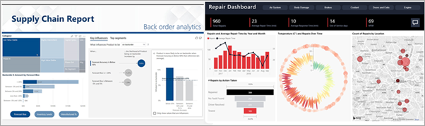
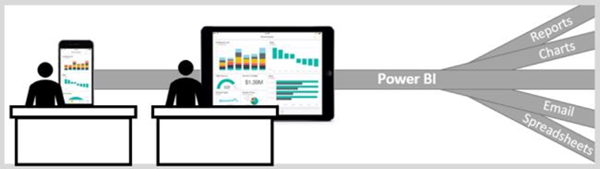
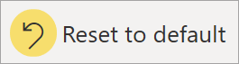

# The Power BI service for consumers

[!INCLUDE[consumer-appliesto-ynny](../includes/consumer-appliesto-ynny.md)]

You live in a data culture, where business decisions are based on facts, not opinions. You need data to make these decisions, and your colleagues don't let you down.     
 
They send you all types of reports, spreadsheets, emails with charts, and even printed handouts. As the data piles up, it becomes harder and harder to find what you need quickly, and you worry that you might not be using the most recent information.  
 

## The Power BI service for *consumers*

Power BI makes your job easier and more impactful at the same time. All that data becomes charts and graphs, that visualize your data for you. Instead of long lists or tables of numbers and words, your data insights are ***beautiful*** – colorful and compelling visuals that tell stories about the insights in your data. 

 
Just open the Power BI service, in a browser or on a mobile device. You and your colleagues work from the same trusted dashboards and reports, that update and refresh automatically, so you're always working with the freshest content.   

Since the content isn't static, you can dig in, looking for trends, insights, and other business intelligence. Slice and dice the content, and even ask it questions using your own words. Or, sit back and let your data discover interesting insights for you; send you alerts when data changes, and email reports to you on a schedule you set. All your data, anytime, in the cloud or on-premises, from any device. That's just the beginning of what Power BI can do. 

## Am I a Power BI *consumer*?

The way you interact with Power BI will depend on your job role. As an end user or *consumer*, you are the person who receives content (dashboards, reports, and apps) from colleagues. You work in the online or mobile version of Power BI, which is called the Power BI service, reviewing and interacting with this content, to make business decisions. 
   
As a consumer, you won't have access to the full capabilities of Power BI, and that's ok, because your job isn't building dashboards and reports. You'll be using the Power BI service for analysis, monitoring, exploration, and decision making. 

You'll undoubtedly hear the term "Power BI Desktop" or just "Desktop", and this is a stand-alone tool used by the *designers* who build and share dashboards and reports with you.  It's important to know that there are other Power BI tools out there, but if you're a consumer, you'll only work with the Power BI service. 

And because you are working with *shared* content, a **free** license is all you'll need because you're working in an organization that is using **Premium** capacity. [Which license do I have?](end-user-license.md)

## Safely interact with content 
As you filter, slice, subscribe, and export, don't worry -- your work is not impacting the underlying dataset or the original shared content (dashboards, reports, and apps).  

You cannot hurt your data.  Power BI is a great place for you to explore and experiment without worrying that you'll "break" anything.  
 
That doesn't mean you can't save your changes - you can. But those changes only affect your view of the content. And reverting to the original default view is as easy as clicking a button.  

## Next steps

[Take a tour of the Power BI service for consumers](end-user-reading-view.md)    
[Power BI service training for consumers](/learn/paths/consume-data-with-power-bi/)    
[Terminology and concepts for Power BI *consumers*](end-user-basic-concepts.md)