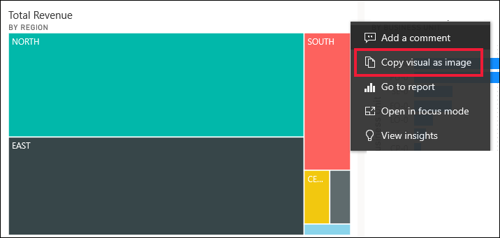
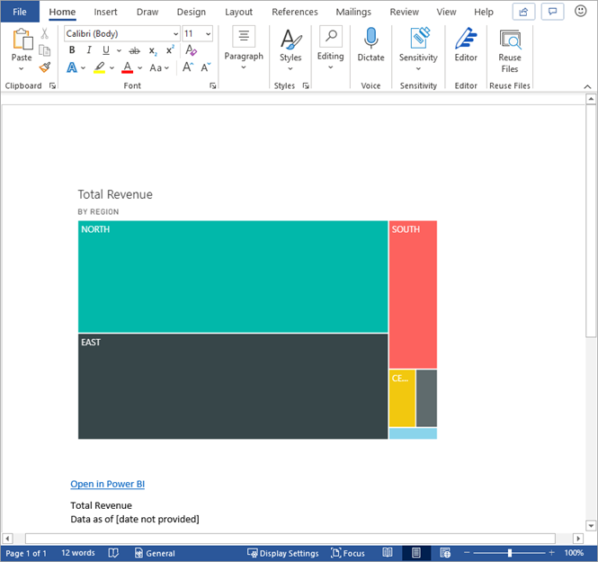
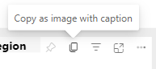
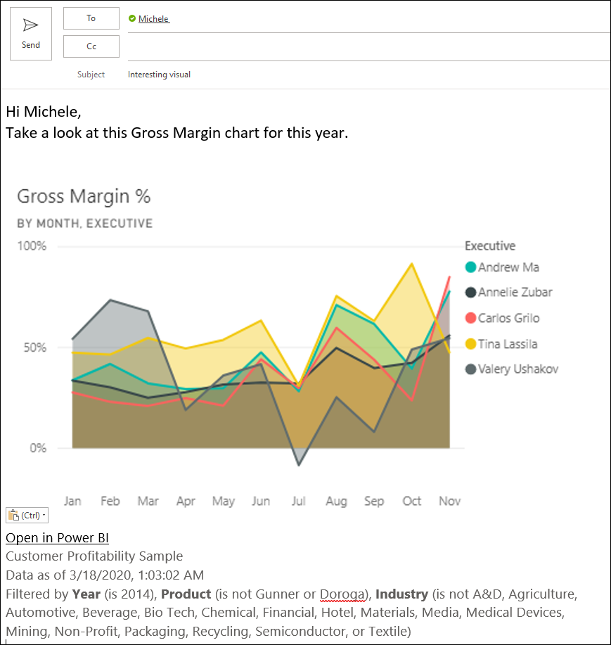
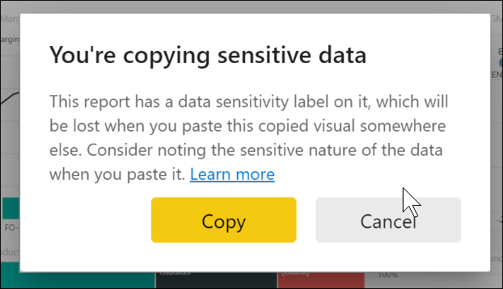
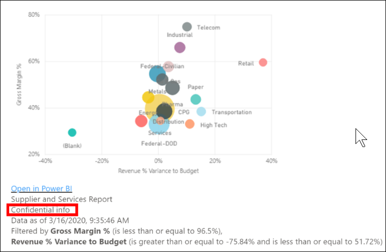
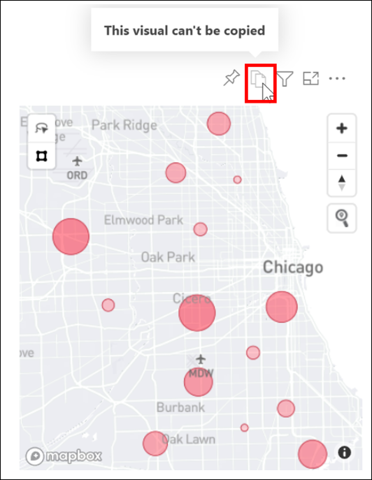

# Copy a visual and then paste it into another application

[!INCLUDE[consumer-appliesto-yyyn](../includes/consumer-appliesto-yyyn.md)]

Have you ever wanted to share an image from a Power BI report or dashboard? Now you can copy the visual and paste it into any other application that supports pasting. Copy an important visual and paste it into an email message, Word, PowerPoint, another Power BI report, and many more applications.

:::image type="content" source="media/end-user-copy-paste/power-bi-copy-paste.png" alt-text="Copy a visual to your clipboard.":::

When you copy a static image of a visual, you get a copy of the visual along with the metadata. This includes:
* link back to the Power BI report or dashboard
* title of the report or dashboard
* notice if the image contains confidential information
* last updated time stamp
* filters applied to the visual

### Copy from a dashboard tile

1. Navigate to the dashboard you want to copy from.

2. From the upper right corner of the visual, select **More actions (...)** and choose **Copy visual as image**. 

    

3. When the **Your visual is ready to copy** dialog appears, select **Copy to clipboard**.

    

4. After your visual is copied, paste it into another application using **Ctrl + V** or **right-click** > **Paste**. In the screenshot below, we've pasted the visual into Microsoft Word. 

    

### Copy from a report visual 

1. Navigate to the report you want to copy from.

2. From the upper right corner of the visual, select the icon for **Copy visual as image**. 

    

3. When the **Your visual is ready to copy** dialog appears, select **Copy to clipboard**.

    

4. After your visual is copied, paste it into another application using **Ctrl + V** or **right-click** > **Paste**. In the screenshot below, we've pasted the visual into an email.

    

5. If there is a data sensitivity label applied to the report, you'll receive a warning when you select the copy icon.  

    

    And, a sensitivity label will be added to the metadata below the pasted visual. 

    

## Considerations and troubleshooting

   

Q: Why is the Copy icon disabled on a visual?    
A: We currently support native Power BI visuals and certified custom visuals. There is limited support for certain visuals including: 
- ESRI and other map visuals 
- Python visuals 
- R visuals 
- PowerApps visuals   

A: The ability to copy a visual can be turned off by your IT department or Power BI administrator.

Q: Why is my visual not pasting correctly?  
A: There are limitations for custom visuals and animated visuals.

Q: Can I to copy a visual from my embedded Power BI report?  
A: *Copy visual* is supported only in the **embed for your organization** scenario. It isn't available in the **embed for your customers** scenario.

## Next steps

More about [Visualizations in Power BI reports](../visuals/power-bi-visualization-types-for-reports-and-q-and-a.md)

If you have edit permissions to a report, you can [copy and paste visuals within the same report](../visuals/power-bi-visualization-copy-paste.md). 

More questions? [Try the Power BI Community](https://community.powerbi.com/)
