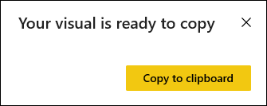

# Copy a visual as an image to your clipboard

[!INCLUDE[consumer-appliesto-yyyn](../includes/consumer-appliesto-yyyn.md)]

Have you ever wanted to share an image from a Power BI report or dashboard? Now you can copy the visual and paste it into any other application that supports pasting. 

When you copy a static image of a visual, you get a copy of the visual along with the metadata. This includes:
* link back to the Power BI report or dashboard
* title of the report or dashboard
* notice if the image contains confidential information
* last updated time stamp
* filters applied to the visual

### Copy from a dashboard tile

1. Navigate to the dashboard you want to copy from.

2. From the upper right corner of the visual, select **More actions (...)** and choose **Copy visual as image**. 

    

3. When the **Your visual is ready to copy** dialog appears, select **Copy to clipboard**.

    

4. After your visual is copied, paste it into another application using **Ctrl + V** or **right-click** > **Paste**. In the screenshot below, we've pasted the visual into Microsoft Word. 

    

### Copy from a report visual 

1. Navigate to the report you want to copy from.

2. From the upper right corner of the visual, select the icon for **Copy visual as image**. 

    

3. When the **Your visual is ready to copy** dialog appears, select **Copy to clipboard**.

    

4. After your visual is copied, paste it into another application using **Ctrl + V** or **right-click** > **Paste**. In the screenshot below, we've pasted the visual into an email.

    

5. If there is a data sensitivity label applied to the report, you'll receive a warning when you select the copy icon.  

    

    And, a sensitivity label will be added to the metadata below the pasted visual. 

    

## Considerations and troubleshooting

   

Q: Why is the Copy icon disabled on a visual?    
A: We currently support native Power BI visuals and certified custom visuals. There is limited support for certain visuals including: 
- ESRI and other map visuals 
- Python visuals 
- R visuals 
- PowerApps visuals   

A: The ability to copy a visual can be turned off by your IT department or Power BI administrator.

Q: Why is my visual not pasting correctly?    
A: There are limitations for custom visuals and animated visuals. 

## Next steps
More about [Visualizations in Power BI reports](end-user-visual-type.md)

If you have edit permissions to a report, you can [copy and paste visuals within the same report](../visuals/power-bi-visualization-copy-paste.md). 

More questions? [Try the Power BI Community](https://community.powerbi.com/)

