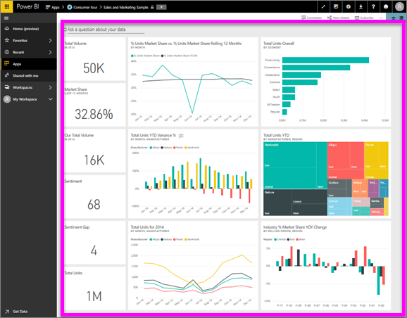

# View a dashboard
Power BI consumers spend a lot of time viewing dashboards. Dashboards are designed to highlight specific information from the underlying reports and datasets. And Power BI consumers use that information for tracking, monitoring, answering questions, testing, and more -- in order to make data-driven business decisions.

Power BI Pro is required for both sharing a dashboard and viewing a shared dashboard.

## Open a dashboard

|              |         |
|------------|--------------------------------|
|      |Dashboards can be opened from many locations in Power BI service.   Just look for this dashboard icon. Once you've identified a  dashboard, opening it is simple - just select it and the dashboard fills  your Power BI canvas. |
|                    |          |

You may find dashboards in all of the containers in the left navigation bar. 
- **Home** (Preview)
- **Favorites** - if you've [set a dashboard as a favorite](end-user-favorite.md)
- **Recent** - if you've recently visited a dashboard
- **Apps** - most apps contain both dashboards and reports
- **Shared with me** - if a colleague has [shared a dashboard with you](end-user-shared-with-me.md)
- **My workspace** - if you've downloaded any of the [Power BI samples](../sample-datasets.md)

## Next steps
* Get comfortable with dashboards by taking a tour of one of our [sample dashboards](../sample-tutorial-connect-to-the-samples.md).
* Learn about [dashboard tiles](end-user-tiles.md) and what will happen when you select one.