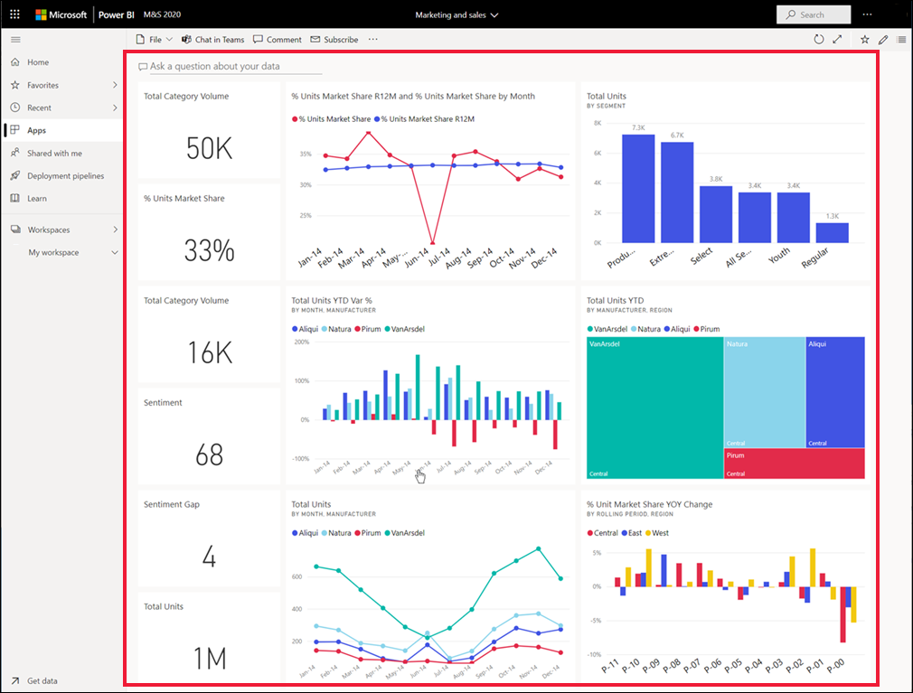
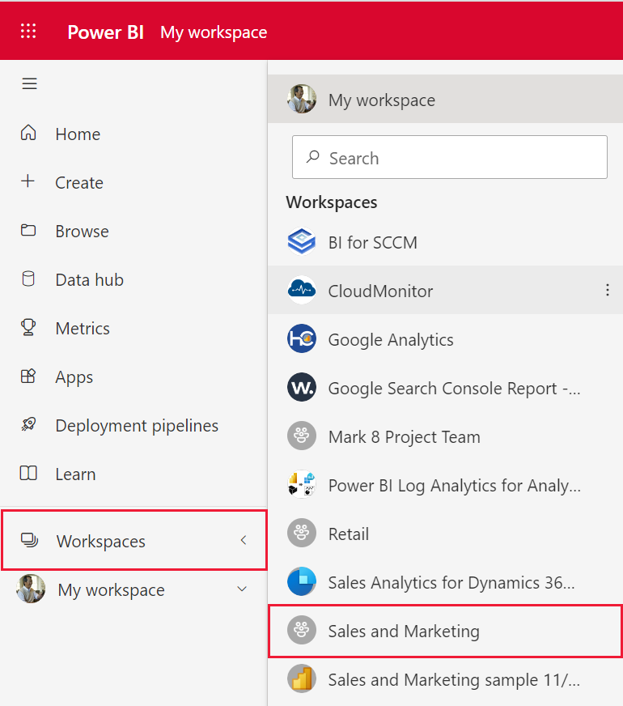

# View a dashboard

[!INCLUDE[consumer-appliesto-ynny](../includes/consumer-appliesto-ynny.md)]

Power BI *business users* spend a lot of time viewing dashboards. Dashboards are designed to highlight specific information from the underlying reports and datasets. And Power BI business users rely on that information for tracking, monitoring, answering questions, testing, and more -- in order to make data-driven business decisions.

A Power BI Pro or Premium license is required for both sharing a dashboard and viewing a shared dashboard. [Which license do I have?](end-user-license.md). 

## Open a dashboard

Dashboards can be opened from many locations in the Power BI service. One way to open a dashboard is to select and open a workspace. 

If that workspace contains a dashboard, you'll see the following icon.

:::image type="content" source="media/end-user-dashboard-open/power-bi-dashboard.png" alt-text="Workspace showing contents including a dashboard.":::

Once you've identified a dashboard, open it by selecting it and the dashboard will fill your Power BI canvas.

You may find dashboards in all of the containers in the nav pane. 

- **Home** 
- **Favorites** - if you've [set a dashboard as a favorite](end-user-favorite.md)
- **Recent** - if you've recently visited a dashboard
- **Apps** - most apps contain both dashboards and reports
- **Shared with me** - if a colleague has [shared a dashboard with you](end-user-shared-with-me.md)
- **My workspace** - if you've downloaded any of the [Power BI samples](../create-reports/sample-datasets.md)

## Next steps
* Back to [dashboard overview](end-user-dashboards.md)

* Get comfortable with dashboards by taking a tour of one of our [sample dashboards](../create-reports/sample-tutorial-connect-to-the-samples.md).    
* Learn about [dashboard tiles](end-user-tiles.md) and what will happen when you select one.
