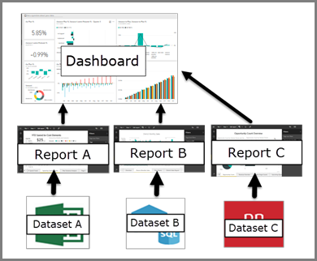

# Dashboards for business users of the Power BI service

[!INCLUDE[consumer-appliesto-ynny](../includes/consumer-appliesto-ynny.md)]

A Power BI *dashboard* is a single page, often called a canvas, that uses visualizations to tell a story. Because it's limited to one page, a well-designed dashboard contains only the most important elements of that story.

:::image type="content" source="media/end-user-dashboards/power-bi-dashboard.png" alt-text="Screenshot showing the Sales and Marketing Sample dashboard."lightbox="media/end-user-dashboards/power-bi-dashboard.png#lightbox":::

The visualizations on the dashboard are called *tiles*. Report designers *pin* tiles to the dashboard. In most cases, selecting a tile takes you to the report page where the visualization was created. If you're new to Power BI, start with [Power BI basic concepts](end-user-basic-concepts.md) to get a good foundation. Hovering over an element on a dashboard displays a tooltip. 

> [!NOTE]
>
>You can view and share dashboards on [mobile devices](mobile/mobile-apps-view-dashboard.md).
>
>To view dashboards that colleagues share with you, you must have a Pro or Premium Per User (PPU) license or the content must be shared with you from a workspace in Premium capacity. For more information, see [Power BI license types](end-user-license.md).

The visualizations on a dashboard come from reports, and each report is based on one semantic model. You can think of a dashboard as an entryway into the underlying reports and semantic models. Select a visualization to take you to the report that was used to create it.

## Advantages of dashboards

Dashboards are a great way to monitor your business, find answers, and see your most important metrics at a glance. The visualizations on a dashboard can come from one or more underlying semantic models or reports. A dashboard can combine on-premises and cloud data, which provides a consolidated view regardless of where the data lives.

A dashboard isn't just a pretty picture, it's an interactive canvas. The tiles update as the underlying data changes.

## Dashboards vs. reports for Power BI business users

How you interact with Power BI depends on your job role. As a consumer or business user, you receive content, like dashboards, reports, and apps, from colleagues who are designers. Reports can be confused with dashboards because they're both canvases filled with visualizations, but there are major differences from a Power BI business user's point of view. The following table shows an overview of the different capabilities of dashboards and reports.

| **Capability** | **Dashboards** | **Reports** |
| --- | --- | --- |
| **Pages** | One page | One or more pages |
|**Ask a question about your data (Power BI Q&A) field** | Yes, almost always available | No Q&A field |
| **Data sources** | One or more report or semantic model per dashboard |A single semantic model per report |
| **Filtering** | No, you can't filter or slice | Yes, there are many ways to filter, highlight, and slice |
| **Set alerts** | Yes, you can create email alerts when certain conditions are met | No, you can't set alerts |
| **Can see underlying semantic model tables and fields** |No. Can export data but can't see the semantic model tables and fields in the dashboard itself |Yes. Can see semantic model tables and fields and values that you have permissions to see |

## Related content

* [View a dashboard](end-user-dashboard-open.md).
* Learn about [dashboard tiles](end-user-tiles.md) and what happens when you select one.
* Track and receive email alerts for individual dashboard tiles by [Creating alerts on tiles](end-user-alerts.md).
* Learn how to use [Power BI Q&A](end-user-q-and-a.md) to ask a question about your data and get the answer in the form of a visualization.

> [!TIP]
> Use the table of contents available on this page to find even more information. 
