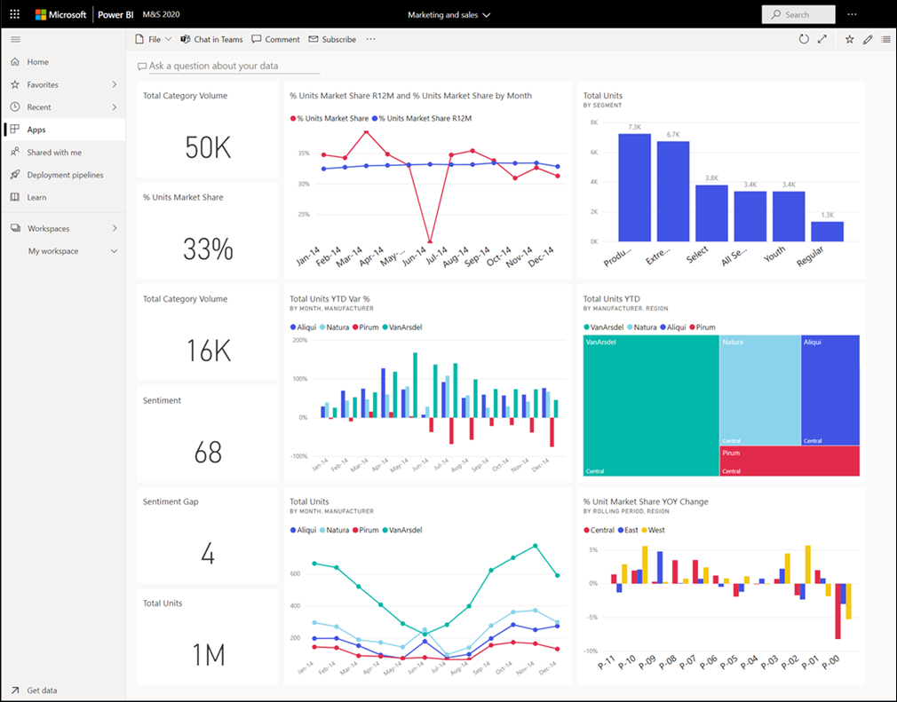

# Dashboards for business users of the Power BI service

[!INCLUDE[consumer-appliesto-ynny](../includes/consumer-appliesto-ynny.md)]

A Power BI ***dashboard*** is a single page, often called a canvas, that uses visualizations to tell a story. Because it is limited to one page, a well-designed dashboard contains only the most-important elements of that story.

The visualizations you see on the dashboard are called *tiles* and are *pinned* to the dashboard by report *designers*. In most cases, selecting a tile takes you to the report page where the visualization was created. If you're new to Power BI, you can get a good foundation by reading [Power BI basic concepts](end-user-basic-concepts.md).

> [!NOTE]
> Dashboards can be [viewed and shared on mobile devices](mobile/mobile-apps-view-dashboard.md).
>
> For colleagues to be able to share dashboards with you, your version of Power BI must be "Pro" or "Premium." For more information, see [Power BI license types](end-user-license.md).

The visualizations on a dashboard come from reports and each report is based on one dataset. In fact, one way to think of a dashboard is as an entryway into the underlying reports and datasets. Selecting a visualization takes you to the report that was used to create it.

## Advantages of dashboards
Dashboards are a wonderful way to monitor your business, to look for answers, and to see all of your most-important metrics at a glance. The visualizations on a dashboard may come from one underlying dataset or many, and from one underlying report or many. A dashboard can combine on-premises and cloud data, providing a consolidated view regardless of where the data lives.

A dashboard isn't just a pretty picture; it's interactive and the tiles update as the underlying data changes.

## Dashboards versus reports for Power BI ***business users***
The way you interact with Power BI will depend on your job role. As a consumer or *business user*, you are the person who receives content (dashboards, reports, and apps) from *creator* colleagues. Reports are often confused with dashboards since they too are canvases filled with visualizations. But there are some major differences from a Power BI *business user* point of view.

| **Capability** | **Dashboards** | **Reports** |
| --- | --- | --- |
| Pages |One page |One or more pages |
|**Ask a question about your data** (Power BI Q&A) field at top |almost always | no |
| Data sources |One or more reports and one or more datasets per dashboard |A single dataset per report |
| Filtering |Can't filter or slice |Many different ways to filter, highlight, and slice |
| Set alerts |Can create alerts to email you when certain conditions are met |No |
| Featured |Can set one dashboard as your "featured" dashboard |Cannot create a featured report |
| Can see underlying dataset tables and fields |No. Can export data but can't see tables and fields in the dashboard itself. |Yes. Can see dataset tables and fields and values. |

## Dashboard designers and dashboard business users
As a Power BI ***business user***, you receive dashboards from *designers*. Continue learning about dashboards with these topics:

* [View a dashboard](end-user-dashboard-open.md)
* Learn about [dashboard tiles](end-user-tiles.md) and what will happen when you select one.
* Want to track an individual dashboard tile and receive an email when it reaches a certain threshold? [Create alerts on tiles](end-user-alerts.md).
* Have fun asking your dashboard questions. Learn how to use [Power BI Q&A](end-user-q-and-a.md) to ask a question about your data and get the answer in the form of a visualization.

> [!TIP]
> If you didn’t find what you’re looking for here, use the Table of Contents to the left.
> 

## Next steps
[View a dashboard](end-user-dashboard-open.md) 