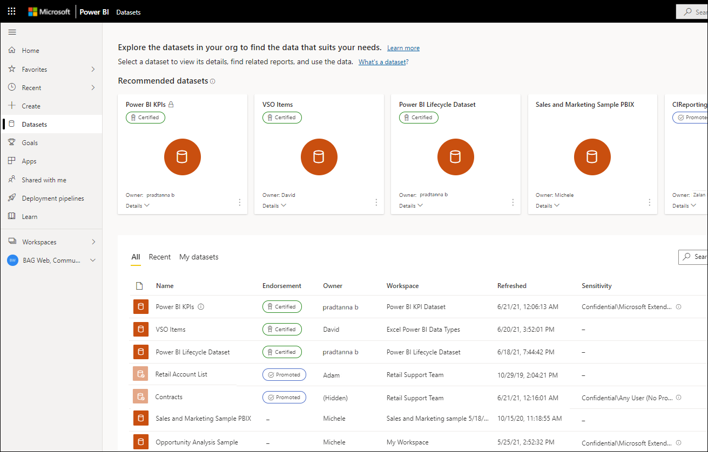

# Discover datasets using the datasets hub (preview)

The datasets hub helps you find, explore, and use the datasets and reports in your organization. It provides information about the datasets as well as reports built using those datasets. In this way, report consumers can find reports based on trustworthy datasets.

entry points for creating reports on top of those datasets or for using those datasets with Analyze in Excel. Datasets in the datasets hub 

This article explains what you see on the datasets hub and describes how to use it. For more details and advanced features available from the datasets hub, see [Dataset discovery using the datasets hub](../connect-data/service-datasets-understand.md).  

## Find the dataset you need

The dataset discovery experience starts on the datasets hub page. To get to the datasets hub page:
* In the Power BI service left navigation pane, select **Datasets**.
* In the Power BI app in Teams, select either the **Datasets** tab or **Datasets** in the navigation pane.

The image below shows the datasets hub in the Power BI service.

The datasets hub presents you with a selection of recommended datasets and a list of all the datasets in the organization that you have permissions to access. If [dataset discoverability](../collaborate-share/service-discovery.md) is enabled for you, you also see datasets you don't have access to.

[Continue learning about the datasets hub](../connect-data/service-datasets-hub.md) and explore additional information, including how to select a dataset, how to explore reports built using a dataset, and how to create a new report yourself. 
  
## Next steps
[Continue learning about the datasets hub](../connect-data/service-datasets-hub.md)
[Power BI Home](end-user-home.md)
