# Drill mode in a visualization in Power BI

## Drill requires a hierarchy

When a visualization has a hierarchy, you can drill down to reveal additional details. For example, you might have a visualization that looks at Olympic medal count by a hierarchy made up of sport, discipline, and event. By default, the visualization would show medal count by sport -- gymnastics, skiing, aquatics, and so on. But, because it has a hierarchy, selecting one of the visualization elements (like a bar, line, or bubble), would display an increasingly more-detailed picture. Select the **aquatics** element to see data for swimming, diving, and water polo.  Select the **diving** element to see details for springboard, platform, and synchronized diving events.

You can add hierarchies to reports you own, but not to those reports shared with you.
Are you not sure which Power BI visualizations contain a hierarchy? Hover over a visualization. If you see these drill controls in the top corners, your visualization has a hierarchy.

    
   

Dates are a unique type of hierarchy. When you add a date field to a visualization, Power BI automatically adds a time hierarchy that contains year, quarter, month, and day. For more info, see [visualization hierarchies and drill down behavior](../guided-learning/visualizations.yml?tutorial-step=18) or watch the video below.

<iframe width="560" height="315" src="https://www.youtube.com/embed/MNAaHw4PxzE?list=PL1N57mwBHtN0JFoKSR0n-tBkUJHeMP2cP" frameborder="0" allowfullscreen></iframe>

> [!NOTE]
> To learn how to create hierarchies using Power BI Desktop, watch the video [How to create and add hierarchies](https://youtu.be/q8WDUAiTGeU).

## Prerequisites

1. In the Power BI service or Desktop, drill requires a visualization with a hierarchy.

1. To follow along, open the [Retail Analysis sample](../sample-datasets.md). Create a **Treemap** visualization that looks at:

    | Well | Field |
    | ---- | ----- |
    | Value |Sales \|\_ Total Units This Year |
    | Group | Store \|\_ Territory \|\_ City \|\_ Postal Code \|\_ Name

    The treemap has a hierarchy made up of territory, city, postal code, and city name. Each territory has one or more cities, each city has one or more postal codes, and so on. By default, the visualization only shows the territory data, because *Territory* appears first in the list.

    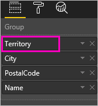

1. Learning how the different drill icons work together can be confusing. Let's filter the treemap to show only two of the smaller territories: **KY** and **TN**. Select the treemap and under **Visual level filters** expand **Territory** and select **KY** and **TN**.

    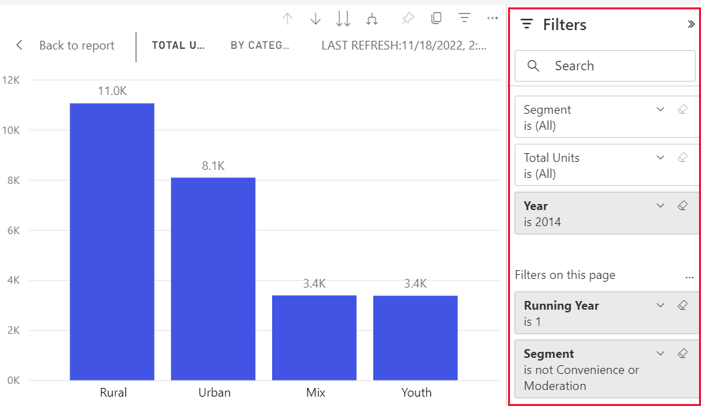

    Now only two territories display in the treemap.

    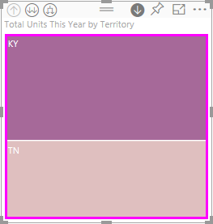

## Three ways to use the drill features

You have several options for accessing the drill down, drill up, and expand features for visualizations that have hierarchies. This article shows you how to use the first option below. Once you learn the basics of drill down and expand, you'll know how to use all three. They all accomplish the same things. Try them out and pick the one that you enjoy the most.

- Hover over a visualization to see and use the icons.  

    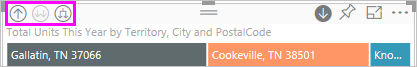

- Right-click a visualization to reveal and use the menu.

    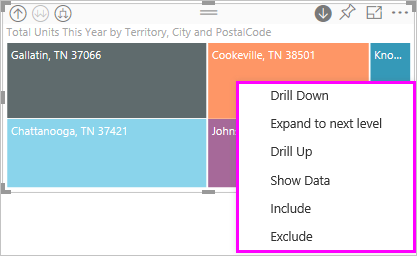

- From the Power BI menu bar, select the **Explore** button.

   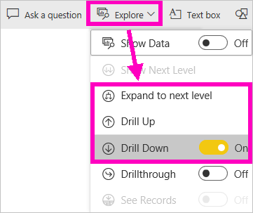

## Drill pathways

### Drill down

You have several ways to drill into your visualization. **Drill down** takes you to the next level in the hierarchy. If you're looking at the **Territory** level, you can drill down to city level then postal code level and, finally, the name level. Each step in the path shows you new information.

### Expand

**Expand** adds an additional hierarchy level to the current view. So if you're looking at the **Territory** level, you can expand and add city, postal code, and name detail to your treemap. Each step in the path shows you the same information and adds on one level of new information.

You can also choose whether to drill down or expand on one field at a time or on all fields at once.

## Drill down all fields at once

1. Start at the top level of the treemap showing data for KY and TN. Widen your treemap by selecting one of the handles and dragging to the right.

    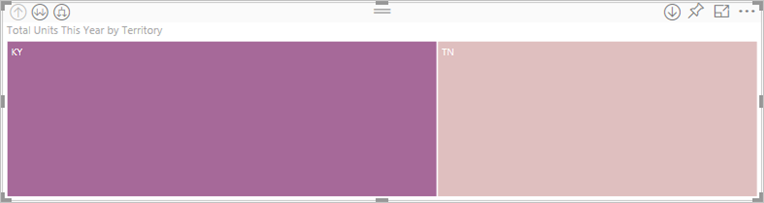

1. To drill down *all fields at once*, select the double arrow in the upper-left corner of the visualization . Your treemap now shows city data for Kentucky and Tennessee.

    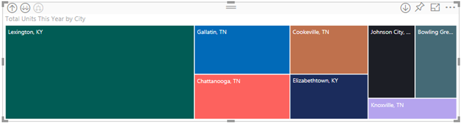

1. Drill down one more time to the postal code level of the hierarchy.

    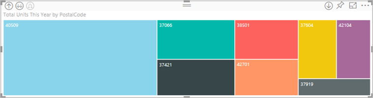

1. To drill back up, select the up arrow in the upper-left corner of the visualization .

## Drill down one field at a time

This method uses the drill-down icon that appears in the top-right corner of the visualization itself.

1. Select the drill-down icon to turn it on .

    Now you have the option of drilling down **one field at a time**.

    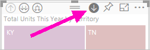

    If you don't turn on drill down, selecting a visualization element (like a bar, bubble, or leaf) won't drill down. Instead, it will cross-filter the other charts on the report page.

1. Select the leaf for **TN**. Your treemap now shows all the cities in Tennessee that have a store.

    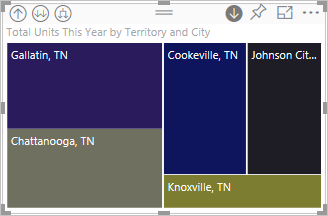

1. At this point, you can:

    1. Continue drilling down for Tennessee.

    1. Drill down for a particular city in Tennessee.

    1. Expand instead (see **Expand all fields at once** below).

    Let's continue to drill down one field at a time.  Select **Knoxville, TN**. Your treemap now shows the postal code for your store in Knoxville.

    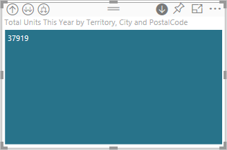

    Notice that the title changes as you drill down and back up again.

## Expand all and expand one field at a time

Having a treemap that shows us only a postal code isn't informative.  So let's expand down one level in the hierarchy.  

1. With the treemap active, select the *expand down* icon . Your treemap now shows two levels of our hierarchy: postal code and store name.

    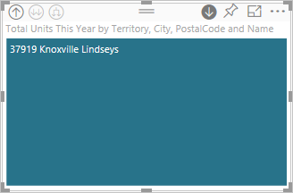

1. To see all four hierarchy levels of data for Tennessee, select the drill up arrow until you reach the second level, **Total units this year by territory and city**, of your treemap.

    

1. Make sure drill down is still turned on,  and select the *expand down* icon . Your treemap now shows some additional detail. Instead of only showing city and state, it now also shows us postal code.

    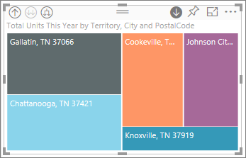

1. Select the *expand down* icon one more time to display all four hierarchy levels of detail for Tennessee on your treemap. Hover over a leaf to see even more detail.

    

## Drilling filters other visuals

As you work in Drill mode, you get to decide how drill down and expanding impacts the other visualizations on the page.

By default, drilling won't filter other visuals in a report. You can enable this feature in Power BI Desktop and the Power BI service.

1. In Desktop, select the **Format** tab and select the checkbox for **Drilling filters other visuals**.

    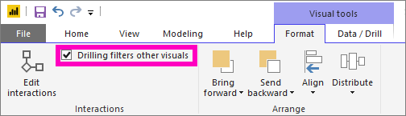

1. Now, when you drill down, drill up, or expand in a visualization with a hierarchy, that action filters the other visuals on the page.

    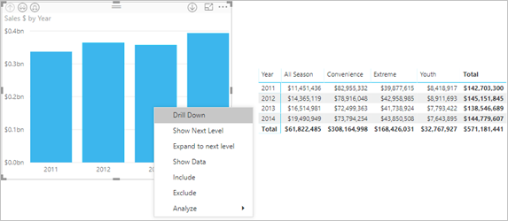

    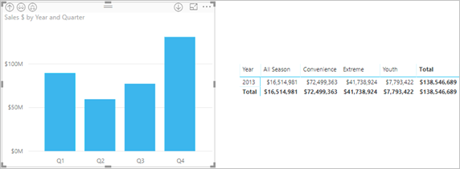

> [!NOTE]
> To enable this in the Power BI service, from the top menu bar, select **Visual interactions** > **Drilling filters other visuals**.
>
> 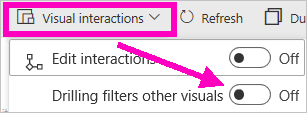

## Learn about the hierarchy axis and hierarchy group

You can think of the hierarchy axis and the hierarchy group as the mechanisms that you can use to increase and decrease the granularity of data you want to view. Any data that you can organize into categories and subcategories qualifies as having a hierarchy including dates and times.

You can create a visualization in Power BI to have a hierarchy by selecting one or more data fields to add to either the **Axis** well or the **Group** well. Then, add the data you want to examine as data fields in the **Values** well. You'll know if your data is hierarchical if *Drill mode* icons appear on the upper-left and upper-right corners of your visualization.

Essentially, it's convenient to think of two types of hierarchical data:

- Date and time data - If you have a data field with a DateTime data type, you already have hierarchical data. Power BI automatically creates a hierarchy for any data field. You can parse the values into a [DateTime](https://msdn.microsoft.com/library/system.datetime.aspx) structure. You only need to add one DateTime field to the **Axis** or **Group** well.

- Categorical data - If Power BI derives your data from collections that contain subcollections, or otherwise has rows of data that share common values, you have hierarchical data.

Power BI lets you expand by one or by all subsets. You can drill down through your data to see a single subset at each level, or you can drill down to see all of the subsets simultaneously at each level. For example, you can drill down for a specific year, or see all of the results for each year as you go down the hierarchy.

You can also drill up in the same manner.

The following sections describe drilling down from the highest view, middle view, and lowest view.

### Hierarchical data and time data

For this example:

1. Follow along with the [Retail Analysis sample](../sample-datasets.md) and create a stacked column chart visualization that looks at:

    | Well | Field |
    | ---- | ----- |
    | Axis | Time \|\_ Month |
    | Values | Sales \|\_ TotalSales |

    Even though the Axis data field is **Month**, it still creates a **Year** category in the **Axis** well. That's because Power BI provides the full DateTime structure for all the values it reads. The top of the hierarchy shows data for the year.

    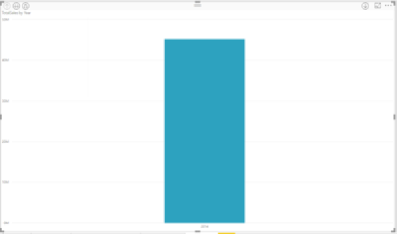

1. With drill-down mode on, select the bar in the chart to go down one level of the hierarchy. You'll see three bars for the data of the quarters available.

1. Then from the upper-left icons, choose **Expand all down one level of the hierarchy**.

1. Do that one more time to get to the lowest level of the hierarchy, that shows results for each month.

    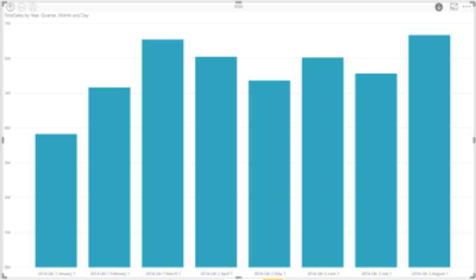

Apart from the visualization, we can see the hierarchy reflected in the data rendered for each report. In the upper-right corner, select the ellipsis then select **Show Data**. The following table shows the results of drilling down from a single month or all months:

|Expand mode|Year|Quarter|Month|Day|
| --- |:---:|:---:|:---:|---|
|Single|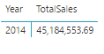|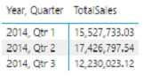|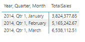|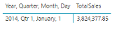|
|All|||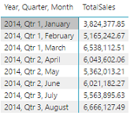|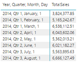|

Notice that the data is the same for **Quarter** and **Year** reports. After you drill down to the level of detail specified for **Values**, you can see how the single report gets more specific and the "all months" report has more data.

### Hierarchical category data

Data that has modeled from collections and subcollections is hierarchical.

A good example is location data. Consider a table in a data source whose columns are Country, State, City, and Zip. Data that shares the same Country, State, and City are hierarchical.

For this example:

1. Follow along with the [Retail Analysis sample](../sample-datasets.md). Create a stacked column chart visualization that looks at:

    | Well | Field |
    | ---- | ----- |
    | Value |Sales \|\_ Total Units This Year |
    | Axis | Store \|\_ Territory \|\_ City - you may need to drag City from the **Legend** well to the **Axis** well. \|\_ Postal Code \|\_ Name |

    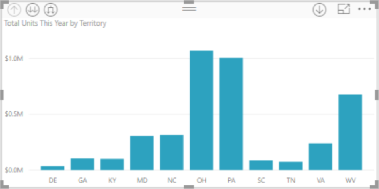

1. With drill-down mode on, from the upper-left icons, choose **Expand all down one level of the hierarchy** three times.

    You'll be at the lowest level of the hierarchy, which shows the results for Territory, City, and Postal Code.

    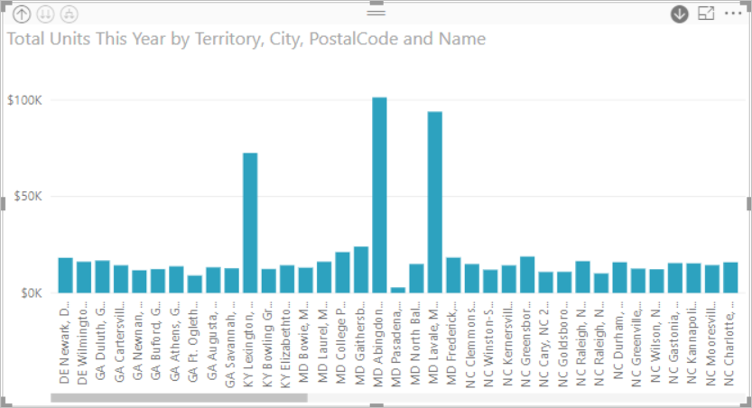

Apart from the visualization, we can see the hierarchy reflected in the data rendered for each report. In the upper-right corner, select the ellipsis then select **Show Data**. The following table shows the results of drilling down for a single territory or all territories.

| Expand mode|Territory|City|Postal|Name|
| ---|:---:|:---:|:---:|---|
|Single|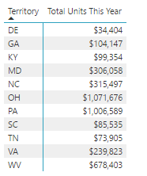|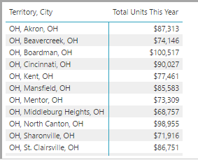|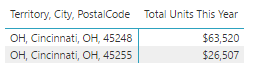|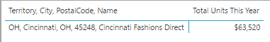|
|All|||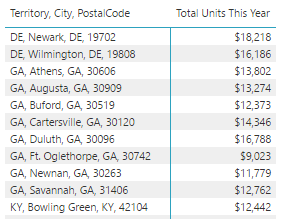|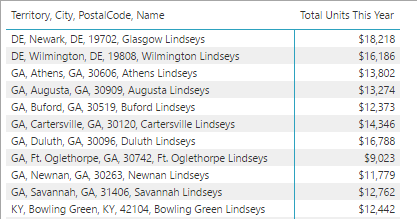|

 As you drill down, you can see how the **Single** report gets more specific and the **All** territories report has more data.

## Considerations and limitations

If adding a date field to a visualization doesn't create a hierarchy, it may be that the date field isn't actually saved as a date. If you own the dataset:

1. Open it in *Data* view in Power BI Desktop.

1. Select the column that has the date.

1. In the **Modeling** tab, change the **Data Type** to **Date** or **Date/Time**.

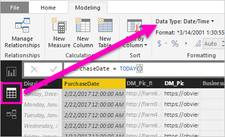

If the report has been shared with you, contact the owner to request the change.

## Next steps

[Visualizations in Power BI reports](../visuals/power-bi-report-visualizations.md)

[Power BI reports](end-user-reports.md)

[Power BI - Basic Concepts](end-user-basic-concepts.md)

More questions? [Try the Power BI Community](http://community.powerbi.com/)
