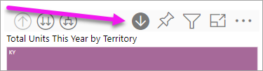

# Drill mode in a visual in Power BI

This article shows how to drill down in a visual in the Microsoft Power BI service. Using drill down and drill up on your data points, you can explore in-depth details about your data. 

## Drill requires a hierarchy

When a visual has a hierarchy, you can drill down to reveal additional details. For example, you might have a visual that looks at Olympic medal count by a hierarchy made up of sport, discipline, and event. By default, the visual would show medal count by sport: gymnastics, skiing, aquatics, and so on. But, because it has a hierarchy, selecting one of the visual elements (like a bar, line, or bubble), would display an increasingly more-detailed picture. Selecting the **aquatics** element would show you data for swimming, diving, and water polo.  Selecting the **diving** element would show you details for springboard, platform, and synchronized diving events.

Dates are a unique type of hierarchy.  Report designers often add date hierarchies to visuals. A common date hierarchy is one that contains year, quarter, month, and day. 

## Figure out which visuals can be drilled
Not sure which Power BI visuals contain a hierarchy? Hover over a visual. If you see a combination of these drill controls at the top, your visual has a hierarchy.

  

## Learn how to drill down and up

In this example we're using a treemap that has a hierarchy made up of territory, city, postal code, and store name. The treemap, before drilling, looks at total units sold this year by territory. 

  

### Two ways to access the drill features

You have two ways for accessing the drill down, drill up, and expand features for visuals that have hierarchies. Try them both, and use the one that you enjoy the most.

- First way: hover over a visual to see and use the icons.  

    

- Second way: right-click a visual to reveal and use the menu.

    

## Drill pathways

### Drill down all fields at once

You have several ways to drill into your visual. Selecting the drill down icon takes you to the next level in the hierarchy. If you're looking at the **Territory** level for Kentucky and Tennessee, you can drill down to city level for both states, then postal code level for both states, and, finally, the store name level for both states. Each step in the path shows you new information.

Select the drill up icon  until you get back to "Total units this year by territory".

### Expand all fields at once

**Expand** adds an additional hierarchy level to the current view. So if you're looking at the **Territory** level, you can expand and add city, postal code, and name detail to your treemap. Each step in the path shows you the same information and adds on one level of new information.

You can also choose to drill down or expand on one field at a time.

### Drill down one field at a time

1. Select the drill down icon to turn it on .

    Now you have the option of drilling down **one field at a time** by selecting a visual element. Examples of visual elements are: bar, bubble, and leaf.

    

    If you don't turn on drill down, selecting a visual element (like a bar, bubble, or leaf) won't drill down. Instead, it will cross-filter the other charts on the report page.

1. Select the leaf for **TN**. Your treemap now shows all the cities and territories in Tennessee that have a store.

    

1. At this point, you can:

    1. Continue drilling down for Tennessee.

    1. Drill down for a particular city in Tennessee.

    1. Expand instead.

    Let's continue to drill down one field at a time.  Select **Knoxville, TN**. Your treemap now shows the postal code for your store in Knoxville.

    

    Notice that the title changes as you drill down and back up again.

### Expand all and expand one field at a time

Having a treemap that shows us only a postal code isn't informative.  So let's *expand* down one level in the hierarchy.  

1. With the treemap active, select the *expand down* icon . Your treemap now shows two levels of our hierarchy: postal code and store name.

    

1. To see all four hierarchy levels of data for Tennessee, select the drill up arrow until you reach the second level, **Total units this year by territory and city**, of your treemap.

    

1. Make sure drill down is still turned on,  and select the *expand down* icon . Your treemap now shows the same number of leaves (boxes), but each leaf has additional detail. Instead of only showing city and state, it now also shows us postal code.

    

1. Select the *expand down* icon one more time to display all four hierarchy levels of detail for Tennessee on your treemap. Hover over a leaf to see even more detail.

    

## Show the data as you drill
Use **Show data** to get a look behind the scenes. Each time you drill or expand, **Show data** displays the data being used to build the visual.  This may help you understand how hierarchies, drill, and expand work together to build visuals. 

In the upper-right corner, select the ellipses (...) then choose **Show Data**. 

The following table shows the results of drilling down all fields at once from territory to store name.  

Notice that the totals are the same for **City**, **PostalCode**, and **Name**. This won't always be the case.  But for this data, there's only one store in each postal code and in each city.  

## Considerations and limitations
By default, drilling won't filter other visuals in a report. However, the report designer can change this default behavior. As you drill, look to see if the other visuals on the page are cross-filtering or cross-highlighting.

## Next steps

[visuals in Power BI reports](../visuals/power-bi-report-visualizations.md)

[Power BI reports](end-user-reports.md)

[Power BI - Basic Concepts](end-user-basic-concepts.md)

More questions? [Try the Power BI Community](http://community.powerbi.com/)
