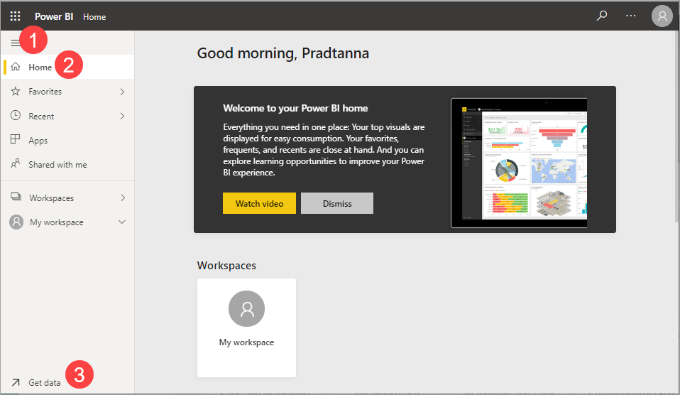
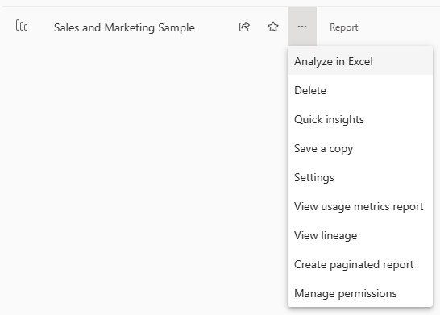
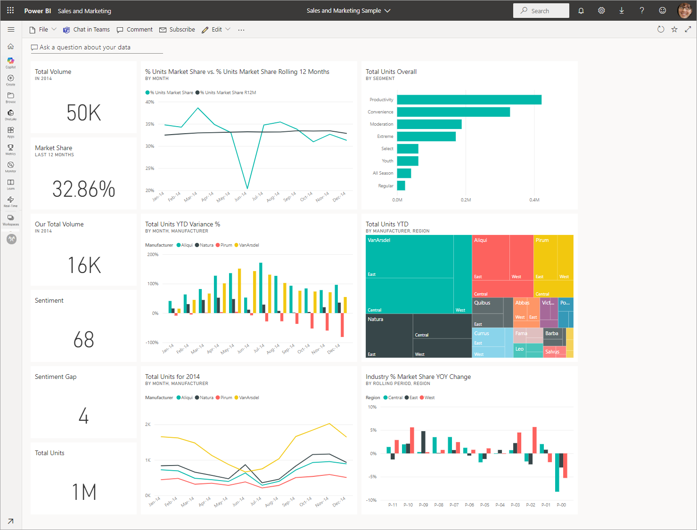
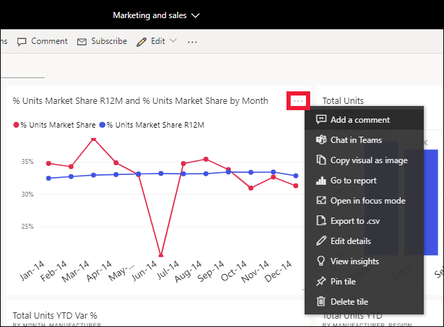
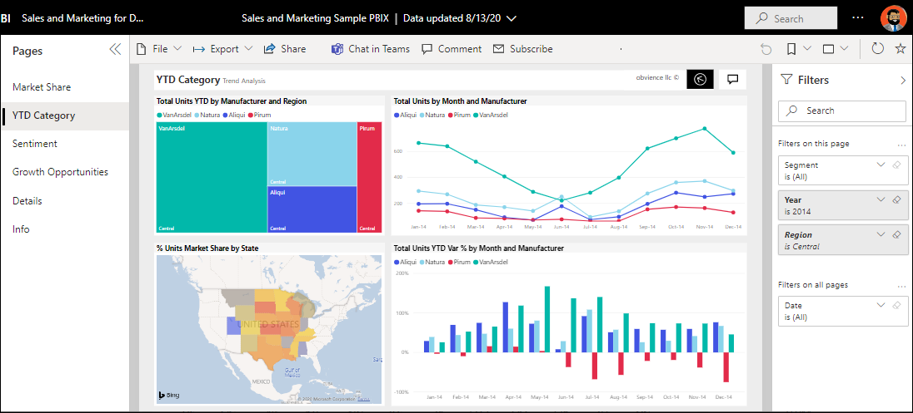
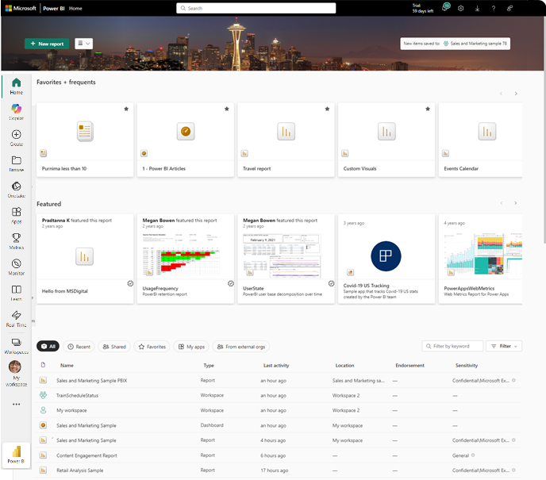

# Tutorial - Getting around in Power BI service

[!INCLUDE[consumer-appliesto-yynn](../includes/consumer-appliesto-yynn.md)]

Now that you know the [basics of Power BI](end-user-basic-concepts.md), let's take a look around the **Power BI service**. As mentioned in the previous article, colleagues on your team might spend all of their time in [Power BI Desktop](https://powerbi.microsoft.com/desktop/), combining data and creating reports, dashboards, and apps for others. They're *designers* and *creators*. You, on the other hand, might spend all of your time in the Power BI service, viewing and interacting with content created by others (**consuming** experience). You're a *business user*. This tutorial is for *business users* of the Power BI service. 

## Prerequisites

- If you're not signed up for Power BI, [sign up for a free trial](https://app.powerbi.com/signupredirect?pbi_source=web) before you begin.

- Read [Power BI service basic concepts.](end-user-basic-concepts.md)

- Viewing Power BI content (reports, dashboards, apps) created by *designers* requires one of two conditions:
    - A Power BI Pro or Premium Per User (PPU) license.
    - Your organization to have a Power BI Premium subscription, and the content to be shared with you from a Premium capacity. 
    [Learn about licenses and subscriptions](end-user-license.md).     

    For the purposes of this tutorial, we aren't requiring either of these conditions to be met. Microsoft has sample content available to you directly from the Power BI service interface. Use this sample content to learn your way around the Power BI service. 

## Open the Power BI service

1. To begin, open the Power BI service (app.powerbi.com), and sign in if you're prompted. 

        

1. Open a Power BI sample. From the navigation pane, select the **Learn** icon :::image type="content" source="media/end-user-experience/power-bi-learn-icon.png" alt-text="Screenshot of the Learn icon."::: and in the **Learning center**, scroll down to **Sample reports**. Select the right arrow until you get to **Sales and Marketing Sample**. Select the sample to open it.  

   :::image type="content" source="media/end-user-experience/power-bi-samples-list.png" alt-text="Screenshot shows the sample reports on the Learn page.":::

1. The Power BI service installs the sample in **My workspace**, your private sandbox for learning and experimenting. Only you can see your workspace. Select **My workspace** to see details about this sample.

    :::image type="content" source="./media/end-user-experience/power-bi-my-workspace-file.png" alt-text="Screenshot shows the Power BI screen with a red border around My workspace.":::

    The sample includes one report, one dashboard, and one semantic model. Most content shared with business users doesn't include direct access to the underlying semantic models, but the samples, which are designed for all users, include semantic models.

## View workspace content
The sample content is organized within the context of a workspace named **My workspace.** **My workspace** stores all of the content that you own and create. Think of it as your personal sandbox or work area for your own content. Any sample data that you download from the Power BI Learning Center is saved in your **My workspace**.

You acquire more workspaces when designers share content with you. For example, if designers assign you access permissions to one of their workspaces, that workspace shows up in your Power BI site.

**My workspace**  

Workspaces are more than storage locations. From a workspace you can learn a lot about the included dashboards, reports, and semantic models. Workspace owners assign permissions to content in a workspace. Your permissions may allow you to take **More actions (...)** on the content in a workspace. Since we're using sample content that is saved in your **My workspace**, you have owner-level permissions by default.

From a workspace, you can open a dashboard or report by selecting it from the list. You can favorite a dashboard or report by hovering and selecting the star icon. If a workspace *owner* gave you [sharing permissions](../collaborate-share/end-user-shared-with-me.md), you can share from here as well. 

Learn more about [Workspaces](end-user-workspaces.md).

## Open a dashboard and a report
A dashboard is a single page that shows visualizations of the most important elements from one or more reports. 

1. The Sales and marketing sample has one dashboard. To open the dashboard, select it. 

    :::image type="content" source="media/end-user-experience/power-bi-related.png" alt-text="Screenshot of the Related content window.":::

1. The dashboard opens in the Power BI service. Dashboards are something that differentiates the Power BI service from Power BI Desktop. [Learn about dashboards](end-user-dashboards.md).

    

2. The actions you can take on a dashboard are displayed in the top menu bar. Select **More options (...)** to see the complete list.   

    :::image type="content" source="./media/end-user-experience/power-bi-top-menu-items.png" alt-text="Screenshot of the top portion of the Power BI service.":::

3. The visuals on the dashboard are arranged as *tiles*. Hover over a dashboard tile and select **More options (...)** to see the options you have for interacting with that tile.

    

4. Select a dashboard tile to open the report that was used to create that tile. The report opens to the page that contains the visual that is on the tile. In this example, selecting the dashboard tile with the treemap opens the **YTD Category** report page.

    

    A report is made up of one or more pages. In most cases, each page is designed to tell a story and that story is told with visualizations, text, shapes, and images. 

    Reports have several sections. On the left is the clickable list of report pages. Across the top, is the menu bar containing actions you can take with the report. The options available depend on the role and permission the report *designer* assigned to you. On the right side is the **Filters** pane. And the center canvas contains the report itself. Similar to the dashboard, there are actions that you can take for the entire report, for individual visuals, and also for a single report page. 

    Learn more about [Power BI reports](end-user-reports.md).

## Using the left navigation pane (nav pane)
The nav pane becomes more useful as colleagues share content with you. In this section of the tutorial, we look at the Power BI service for a *business user* who works with colleagues who share lots of reports, dashboards, and apps. 

:::image type="content" source="media/end-user-experience/power-bi-home-icon.png" alt-text="Screenshot of the Home icon."::: 

The top icon in the nav pane is your Power BI **Home**. It's the default landing page when you log in to the Power BI service. **Home** is a great starting point for viewing and navigating to your content. **Home** bring together the searching and sorting tools, the nav pane, and a canvas with *cards* that you can select to open content. At first, you might not have many cards on your Home canvas, but that changes as you start to use Power BI with your colleagues.

To learn more, see [Power BI Home.](end-user-home.md)

## Browse

:::image type="content" source="media/end-user-experience/power-bi-browse-icon.png" alt-text="Screenshot of the Browse folder icon."::: 

See your full list of favorites, recent, and shared content by selecting **Browse** on the nav pane. Here you find content lists that provide details about reports, apps, and dashboards.

:::image type="content" source="./media/end-user-experience/power-bi-browses.png" alt-text="Screenshot of the Browse page on the navigation pane.":::

*Recent* content is the last reports, dashboards, apps, and other Power BI content that you've visited. For more information about tagging content as a *favorite*, see [Favorites](end-user-favorite.md) and for more information about how content is shared by colleagues, see [Shared with me](../collaborate-share/end-user-shared-with-me.md).

## Open Apps

:::image type="content" source="./media/end-user-experience/power-bi-apps-icon.png" alt-text="Screenshot of the Apps icon on the navigation pane.":::

Go directly to your apps by selecting **Apps** on the navigation pane. You might not have any apps yet. The **Apps** pane contains apps that are shared with you or that you install.

For more information, see [Apps in Power BI](end-user-apps.md).

## Open the Learning center

:::image type="content" source="./media/end-user-experience/power-bi-learn-icon.png" alt-text="Screenshot of the icon for the Learning center.":::

For new users, the Learning center is especially helpful, with getting started content, samples, and links to videos.

### Search and sort content
:::image type="icon" source="./media/end-user-experience/power-bi-search-icon.png":::

When you're new to the Power BI service, you only have a few pieces of content. But as colleagues begin sharing data with you and you begin downloading apps, you might end up with long lists of content. That's when you find searching and sorting helpful.

Search is available from almost every part of the Power BI service. Just look for the search box or search magnifying glass icon.  

In the Search field, type all or part of the name of a dashboard, report, workbook, app, or owner. Power BI searches all of your content.

:::image type="content" source="./media/end-user-experience/power-bi-search-field.png" alt-text="Screenshot showing text in the search bar.":::

There are also many ways to sort content. Hover over column headers and look for arrows indicating that the column can be sorted. Not all columns can be sorted.

:::image type="content" source="./media/end-user-experience/power-bi-sort-icon.png" alt-text="Screenshot shows arrow next to Type column heading.":::

Or, look for the search **Filters** near the upper right corner of your content lists. Find content quickly by filtering categories, like type of content or owner.  

:::image type="content" source="./media/end-user-experience/power-bi-filters.png" alt-text="Screenshot showing a search filter for content lists.":::

For more information, see [Navigation for Power BI business users: global search](end-user-search-sort.md).

## Find the owner

Let's end this tutorial with a helpful tip. If you have questions about a dashboard, report, app, or other content--you can look up the owner or contact email. With the content open, select the title menu to display the owner's contact link. The owner or contact may be a person or a group.

:::image type="content" source="./media/end-user-experience/power-bi-owners.png" alt-text="Screenshot showing the title menu where contact information is.":::

## Clean up resources
You can now delete the sample report, dashboard, and semantic model from your **My workspace** if you wish.   

1. Open the Power BI service (app.powerbi.com) and select **My workspace**.  

3. Hover over the report and select **More options (...)** > **Delete**. Repeat to remove the dashboard and semantic model.

   :::image type="content" source="./media/end-user-experience/power-bi-deletes.png" alt-text="Screenshot showing the more options dropdown on the My workspace page.":::

## Related content

> [!div class="nextstepaction"]
> [Learn about the Power BI capabilities for business users](end-user-reading-view.md)