# Quickstart - Getting around in Power BI service

[!INCLUDE [power-bi-service-new-look-include](../includes/power-bi-service-new-look-include.md)]

Now that you know the [basics of Power BI](end-user-basic-concepts.md), let's take a look around the **Power BI service**. As mentioned in the previous article, colleagues on your team might spend all of their time in **Power BI Desktop**, combining data and creating reports, dashboards, and apps for others. They're *designers*. You, on the other hand, might spend all of your time in the Power BI service, viewing and interacting with content created by others (**consuming** experience). You're a *business user*. This quickstart is for *business users*. 

   
 
## Prerequisites

- If you're not signed up for Power BI, [sign up for a free trial](https://app.powerbi.com/signupredirect?pbi_source=web) before you begin.

- Read [Power BI service basic concepts](end-user-basic-concepts.md)

- Viewing Power BI content (reports, dashboards, apps) created by *designers* requires one of two conditions:
    - a Power BI Pro license
    - Your organization to have a Power BI Premium subscription, and the content to be shared with you from Premium capacity.    
    [Learn about licenses and subscriptions](end-user-license.md).     

    For the purposes of this quickstart, we aren't requiring either of these conditions to be met. Microsoft has made sample content available to you directly from the Power BI service interface. We'll use this sample content to learn our way around the Power BI service. 

## Open the Power BI service

To begin, open the Power BI service (app.powerbi.com). 
1. If the left navigation pane is collapsed, select the nav pane icon  to expand it. 

1. From the lower left corner, select **Get data**. We'll grab some sample data to use for our tour of the Power BI service. There are all types of sample data provided for you to explore, and this time we'll use the data about marketing and sales. 

   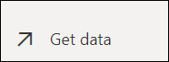

1. After the **Get data** screen opens, select **Samples**.

   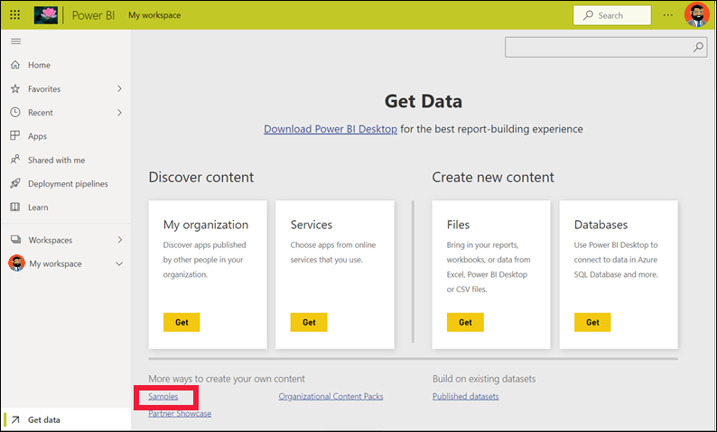

1. Select **Sales and Marketing** > **Connect**. 

   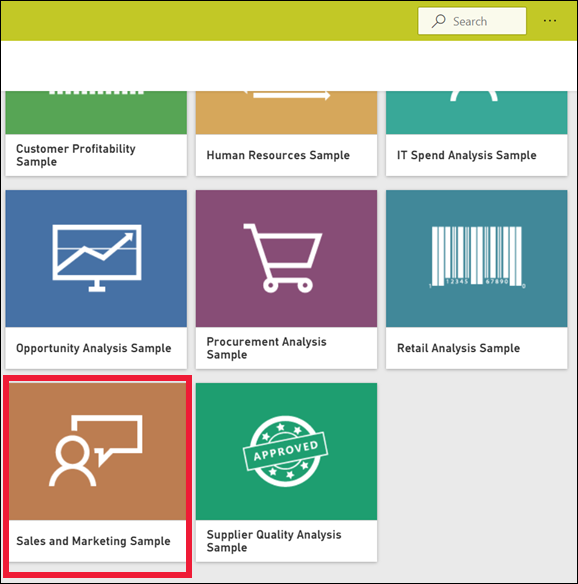

5. The Power BI service installs the sample in your **My workspace**.  **My workspace** is your private sandbox for learning and experimenting.  Only you can see the content in **My workspace**. The sample includes one dashboard, one report, and one dataset. Typically, *business users* won't receive datasets, but this sample is designed for all users and it does include one.

    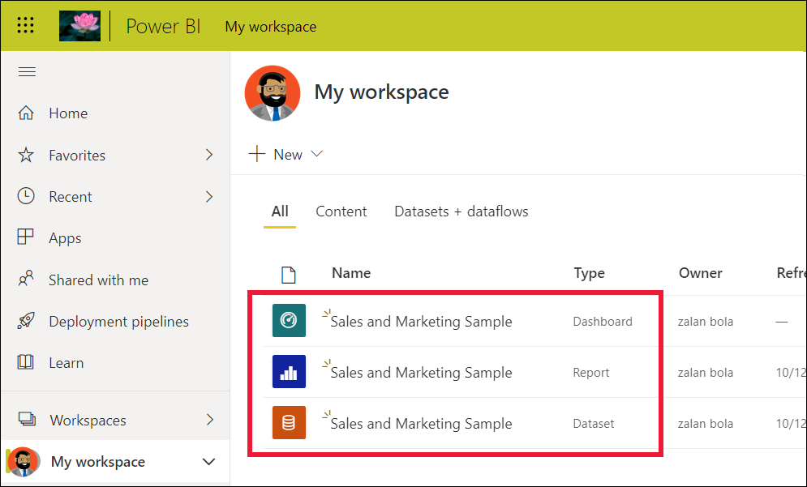

    As a *business user*, most content that is shared with you won't include direct access to the underlying datasets. Because the Power BI samples are created for all Power BI customers, datasets are included.   

    To learn more about samples, see [Get samples for Power BI](../create-reports/sample-datasets.md).

## View content (dashboards and reports)
Content is organized within the context of a workspace. Every business user has at least one workspace, and it's called **My workspace**. When *designer* colleagues share content with you, you may end up with additional workspaces.  For example, if a *designer* assigns you access permissions to one of their workspaces, that workspace will show up in your Power BI site.  

**My Workspace** stores all the content that you own and create. Think of it as your personal sandbox or work area for your own content. For many Power BI *business user*, **My workspace** remains empty because your job doesn't involve creating new content.  *Business users*, by definition, consume data created by others and use that data to make business decisions. If you find that you are creating content, consider reading the [Power BI articles for *report creators*](../index.yml) instead.

A workspace is much more than a simple listing of content. On this page, you can learn a lot about the workspace's dashboards and reports. Take a few minutes to identify the content owner, last refreshed date, data sensitivity, and endorsements, if any. Select **More actions (...)** to display a list of actions for the dashboard and report.   

To learn more, see [Workspaces](end-user-workspaces.md).

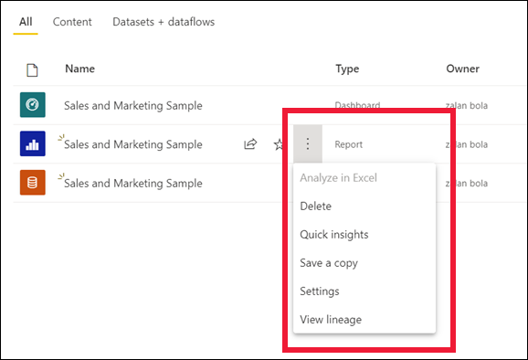

A workspace is also one of the paths into your data. From a workspace you can open a dashboard or report by selecting it from the list.  You can favorite a dashboard or report by hovering and selecting the star icon. If the *designer* gave you [sharing permissions](end-user-shared-with-me.md), you can share from here as well. 

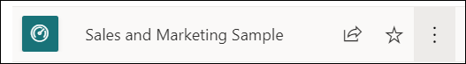

1. Select the name of the dashboard to open it. Dashboards are something that differentiates the Power BI service from Power BI Desktop. [Learn about dashboards](end-user-dashboards.md)

    

2. The actions you can take on a dashboard are displayed in the top menu bar.    

    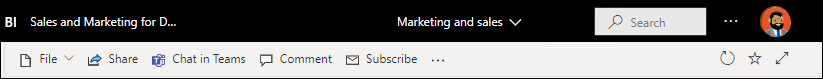

3. Hover over a dashboard tile and select **More options (...)** to see the options you have for interacting with that tile.

    

4. Select a dashboard tile to open the report that was used to create that tile. The report opens to the page that contains the visual that is on the tile. Here, I've selected the dashboard tile with the treemap. The Power BI service opens the **YTD Category** report page.

    

    Reports have several sections. On the left is the clickable list of report pages. Across the top is the menu bar containing actions you can take with the report.  The options available will depend on the role and permission the report *designer* assigned to you. On the right side is the **Filters** pane. And the center canvas contains the report itself. Similar to the dashboard, there are actions that you can take for the entire report, for individual visuals, and also for a single report page. 

    Learn about reports [Power BI reports](end-user-reports.md).

## Using the left navigation pane
The nav pane will become more useful as colleagues share content with you. In this section of the Quickstart, we'll put the *Sales and marketing* sample aside, and look at a dashboard and report that belong to a Power BI *business user* who has a lot of shared content.

1. **Home** is the default landing page when you log in to the Power BI service. Home is a great jumping off point and alternate way to navigate your content. Content on Home is organized by favorite, recent, frequent, and featured. Home also displays your most recent workspaces and apps. Just select an item to open it.

    Home brings together the searching and sorting tools, the nav pane, and a canvas with *cards* that you can select to open your dashboards, reports, and apps. At first, you might not have many cards on your Home canvas, but that will change as you start to use Power BI with your colleagues. Your Home canvas also updates with recommended content and learning resources.

   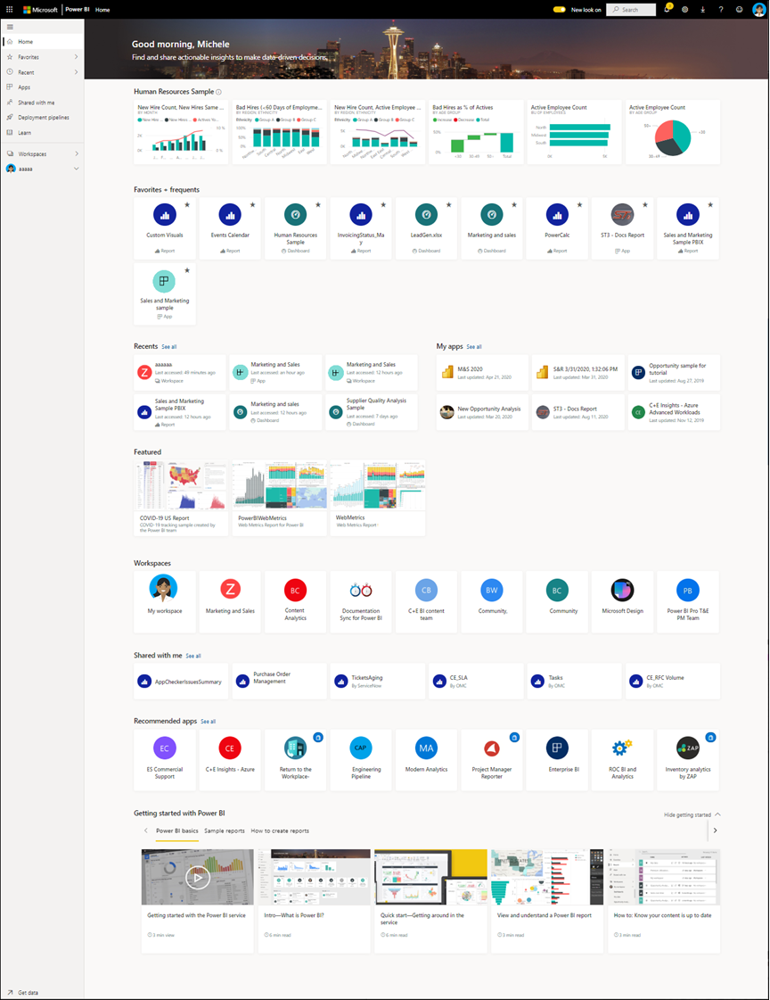

    To learn more, see [Power BI Home](end-user-home.md)

2. **Favorites** and **Recent** both have arrows. Select an arrow to quickly see the top five favorites or five most recently visited content. From the flyout, select content to open it. 

   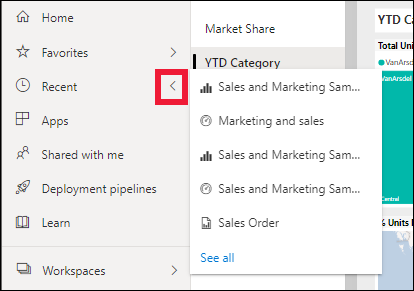

    To see your full list of favorites or recents, select the word or icon. These content lists provide additional details about the reports, apps, and dashboards.

    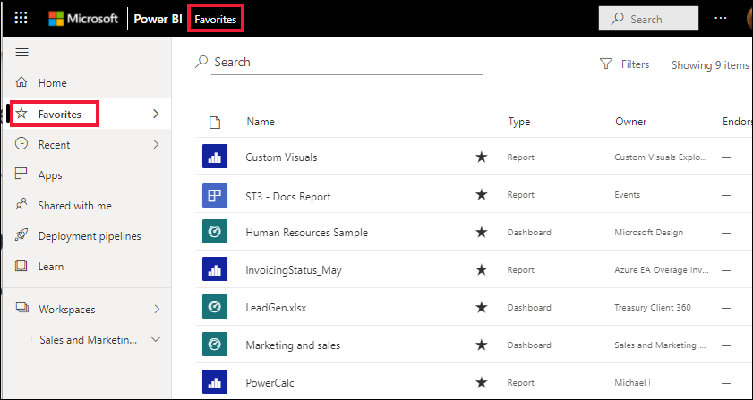

    To learn more, see [Recents in Power BI](end-user-recent.md) and [Favorites in Power BI](end-user-recent.md).

4. Select **Apps** to display all apps that have been shared with you or that you have installed. And select **Shared with me** to see dashboards and reports that have been shared with you. Since you're just starting out with the Power BI service, these content areas will be empty. 

    Learn about [Apps](end-user-apps.md) and [Shared with me](end-user-shared-with-me.md).

### Search and sort content
When you're new to the Power BI service, you'll have only a few pieces of content. But as colleagues begin sharing content with you and you begin downloading apps, you may end up with long lists of content. That's when you'll find searching and sorting extremely helpful.

Search is available from almost every part of the Power BI service. Just look for the search box or search magnifying glass icon.    

In the Search field, type all or part of the name of a dashboard, report, workbook, app, or owner. Power BI searches all of your content.

There are also many ways to sort content. Hover over column headers and look for arrows indicating that the column can be sorted. Not all columns can be sorted. 

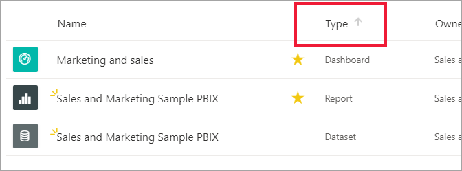

Or, look for the Search **Filters** near the upper right corner of your content lists. Find content quickly by selecting from the type of content, owner, or any other available field.

To learn more, see [Power BI navigation: search and sort](end-user-search-sort.md)

## Find the owner
And we'll end this quickstart with a helpful tip. If you have questions about a dashboard, report, or app -- you can look up the owner. With the content open, select the title dropdown to display the owner. The owner may be a person or a group.

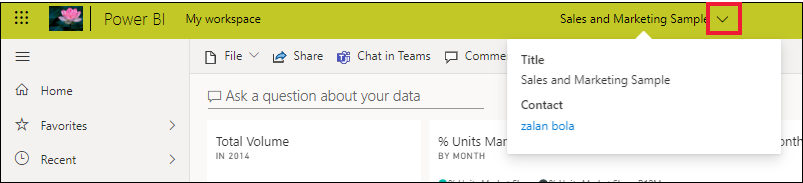

## Clean up resources
After you finish this quickstart, you can delete the sample dashboard, report, and dataset, if you wish.

1. Open the Power BI service (app.powerbi.com) and sign in.    
2. Open Power BI Home, scroll down and select **My workspace**.      

3. Hover over the dashboard, report, or dataset and select **More options (...)** > **Delete**. Repeat until all three are removed.

    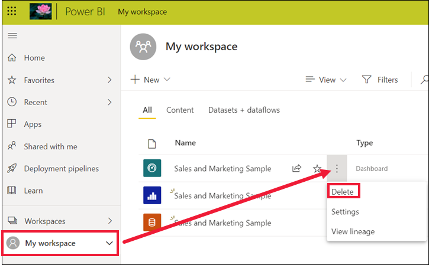

## Next steps

> [!div class="nextstepaction"]
> [Reading view in Power BI service](end-user-reading-view.md)
