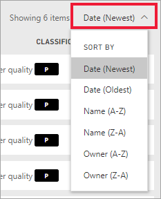

# Quickstart - Getting around in Power BI service

[!INCLUDE [power-bi-service-new-look-include](../includes/power-bi-service-new-look-include.md)]

Now that you know the basics of Power BI, let's take a look around the **Power BI service**. As mentioned earlier, someone on your team might spend all of their time in **Power BI Desktop**, combining data and creating reports for others. But you, on the other hand, might spend all of your time in the Power BI service, viewing and interacting with content created by others (**consuming** experience). In this quickstart you'll be importing sample data and using that data to learn your way around Power BI service. 
 
## Prerequisites

- If you're not signed up for Power BI, [sign up for a free trial](https://app.powerbi.com/signupredirect?pbi_source=web) before you begin.

- Read [Power BI service basic concepts](end-user-basic-concepts.md)

- Download and install sample data. To follow along, [install the sample Sales and Marketing app](end-user-app-marketing.md)

## Open the Power BI service

To begin, open the Power BI service (app.powerbi.com) and navigate to **Home**. 
1. If the left navigation bar is collapsed, select the nav pane icon  to expand it. 

1. Select **Home** if it's not already open. 

1. Select **Apps**. 

   

## Get sample data
We'll grab some sample data to use for our tour of Power BI service. There are all types of sample data we provide for you to explore, and this time we'll use the data about marketing and sales. 

To follow along, follow these instructions to install the [Sales and marketing sample app](end-user-app-marketing.md).

1. On the **Apps** screen, select the **Sales and Marketing sample** app.

    

2. Select **Explore app**.

    

3. The Power BI service opens the app's dashboard. Dashboards are something that differentiates the Power BI service from Power BI Desktop. The sample also includes a report and a dataset, which we'll visit later.

    

## View content (dashboards, reports, workbooks, datasets)
Let's start by looking at how the basic content (dashboards, reports, datasets, workbooks) is organized. Content is displayed within the context of a workspace. Every consumer has at least one workspace, and it's called **My workspace**. Each time you install an app, a workspace is created for that app.  Since we installed the Sales and Marketing sample app, we now have two workspaces. 

Check it out for yourself by selecting **Workspaces** from the left nav. 

**My Workspace** stores all the content that you own and create. Think of it as your personal sandbox or work area for your own content. For many Power BI *consumers*, **My workspace** remains empty because your job doesn't involve creating new content.  *Consumers*, by definition, consume data created by others and use that data to make business decisions. If you find that you are creating content, consider reading the [Power BI articles for report *designers*](../power-bi-creator-landing.md) instead.

**App workspaces** contain all the content for the specific app.  When a *designer* creates an app, they bundle together all the content that is necessary for that app to be utilized.  Select the Sales and Marketing workspace to see what the *designer* bundled into the app. 

The Sales and Marketing app workspace contains one dashboard, one report, and one dataset. Not every app will contain these 3 pieces of content. An app may contain only one dashboard, or three of each content type, or even twenty reports. It all depends on what the *designer* includes in the app. Since the Sales and marketing data is a sample, it does include a dataset. But, more commonly, app workspaces for *consumers* won't include any datasets. 

A workspace is much more than a simple listing of content. On this page, you can learn a lot about the workspace's dashboards and reports. Take a few minutes to identify the content owner, last refreshed date, related content, and endorsements. If the workspace has a description, that description may help you gain a better understanding of the workspace's goals and how you might go about using it for your business purposes. IF the workspace has a lot of content, use the search and sort options to find what you need, quickly.

A workspace is also one of the paths into your data. Open a dashboard or report by selecting it from the list.  Favorite a dashboard or report by hovering and selecting the star icon. If the *designer* gave you [sharing permissions](end-user-shared-with-me.md), hovering will display that action as well. 

Open the dashboard by selecting the dashboard name.

## Favorite a dashboard and a report
**Favorites** lets you quickly access content that is most important to you. You just learned how to favorite a dashboard from a workspace. You can also create favorites directly from a dashboard or report.

1. With the dashboard open, select **Favorite** from the menu bar.
   
   
   
   **Favorite** changes to **Unfavorite** and the star icon becomes yellow.
   
   

2. To display a list of all the content that you have added as favorites, from the nav pane, select the arrow to the right of **Favorites**. Because the nav pane is a permanent feature of Power BI service, you have access to this list from anywhere in Power BI service.
   
    
   
    We have four favorites so far. Favorites can be dashboards, reports, or apps.  

To learn more, see [Favorites](end-user-favorite.md)

## Locate your most recent content

1. Similar to Favorites, quickly see your most recently accessed content from anywhere in Power BI service by selecting the arrow next to **Recent** in the nav pane.

   

    From the flyout, select content to open it.

2. Sometimes you don't want to simply open recent content, but want to view information or take other action, such as viewing Insights, or exporting to Excel. In cases like these, open the **Recents** pane by selecting **Recent** or its icon from the nav pane. If you had more than one workspace, this list would include content from all of your workspaces.

   

To learn more, see [Recents in Power BI](end-user-recent.md)

### Search and sort content
When you're new to the Power BI service, you'll have only a few pieces of content. But as colleagues begin sharing content with you and you begin downloading apps, you may end up with long lists of content. That's when you'll find searching and sorting extremely helpful.

Search is available from almost every part of the Power BI service. Just look for the search box or search icon magnifying glass icon.    

In the Search field, type all or part of the name of a dashboard, report, workbook, app, or owner. Power BI searches all of your content.

There are also many ways to sort content. Hover over column headers and look for arrows indicating that the column can be sorted. Not all columns can be sorted.  

Or, look for the sort control near the upper right corner of your canvas. Select whether to sort ascending or descenging by date, name, or owner.  

To learn more, see [Power BI navigation: search and sort](end-user-search-sort.md)

## Power BI Home
Not sure where to start? Power BI **Home** is always a good option. **Home** brings together the searching and sorting tools, the nav pane, and a canvas with *cards* that you can select to open your dashboards, reports, and apps. At first, you might not have many cards on your Home canvas, but that will change as you start to use Power BI with your colleagues. Your Home canvas also updates with recommended content and learning resources.

The Home canvas displays and organizes your favorite and most recent content, along with recommended content and learning resources. Each piece of content displays as a card, with a title and icon. Selecting a card opens that content.

Along the left side, is a navigation pane, referred to as the nav pane. On this pane, your same content is organized a little differently, by Favorites, Recent, Apps, and Shared with me. From here, you can view lists of content and select the one to open.

In the upper right corner, the global search box lets you search for content by title, name, or keyword.
The following topics review each of these options for finding and viewing content.

For more information, see [Power BI Home](end-user-home.md)

## Clean up resources
After you finish this quickstart, you can delete the sample dashboard, report, and dataset, if you wish.

1. Open the Power BI service (app.powerbi.com) and sign in.    
2. Open Power BI Home, scroll down to **Workspaces** and select *Sales and marketing*.      

3. Hover over the dashboard, report, or dataset and select **More options (...)** > **Delete**. Repeat until all three are removed.

    

## Next steps

> [!div class="nextstepaction"]
> [Reading view in Power BI service](end-user-reading-view.md)
