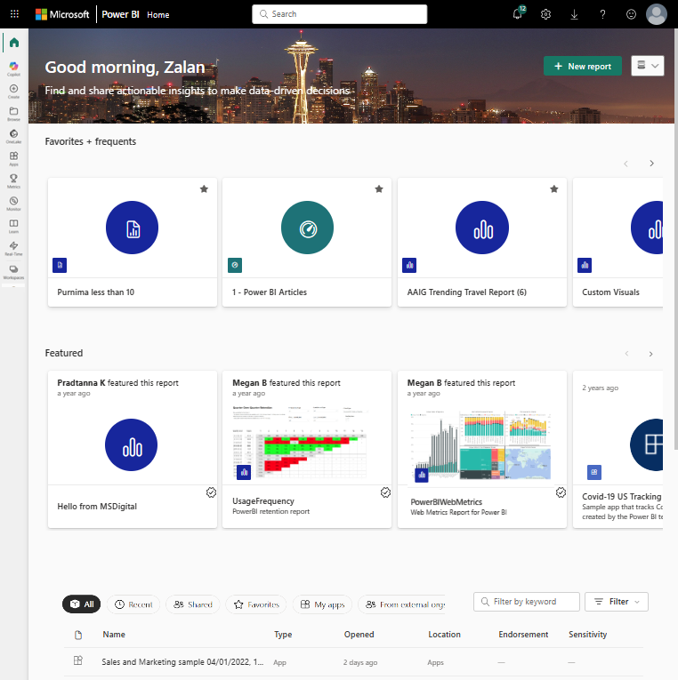

# Get around in the Power BI service

> [!NOTE]
> This article is an overview (not a step-by-step tutorial) of the navigation experience for business users (consumers). If you're looking for a creation walkthrough, see [Tutorial: Get started creating in the Power BI service](../fundamentals/service-get-started.md). For a deeper list of end-user interaction capabilities (filtering, focus mode, exporting, Q&A, alerts, subscriptions, etc.), see [Interact with reports and dashboards](end-user-reading-view.md).

Now that you know the [basics of the Power BI service](../fundamentals/service-basic-concepts.md), let's take a look around the **Power BI service**. As mentioned in the previous article, colleagues on your team might spend all of their time in [Power BI Desktop](https://powerbi.microsoft.com/desktop/), combining data and creating reports, dashboards, and apps for others. They're *designers* and *creators*. You, on the other hand, might spend all of your time in the Power BI service, viewing and interacting with content created by others (**consuming** experience). You're a *business user*. This overview is for *business users* of the Power BI service.

## Prerequisites

- If you're not signed up for Power BI, [sign up for a free trial](https://app.powerbi.com/signupredirect?pbi_source=web) before you begin.

- Read [Basics of the Power BI service](../fundamentals/service-basic-concepts.md)
- Viewing Power BI content (reports, dashboards, apps) created by *designers* requires one of two conditions:
    - A Power BI Pro or Premium Per User (PPU) license.
    - Your organization to have a Power BI Premium subscription, and the content to be shared with you from a Premium capacity.
    [Learn about licenses and subscriptions](end-user-license.md).

    For the purposes of this overview, we aren't requiring either of these conditions to be met. Microsoft has sample content available to you directly from the Power BI service interface. Use this sample content to learn your way around the Power BI service.

## Open the Power BI service

1. To begin, open the Power BI service (app.powerbi.com), and sign in if you're prompted.

    

1. Open a Power BI sample. From the navigation pane, select the **Learn** icon :::image type="content" source="media/end-user-experience/power-bi-learn-icon.png" alt-text="Screenshot of the Learn icon."::: and in the **Learning center**, scroll down to **Sample reports**. Select the right arrow until you get to **Sales and Marketing Sample**. Select the sample to open it.  

   :::image type="content" source="media/end-user-experience/power-bi-samples-list.png" alt-text="Screenshot shows the sample reports on the Learn page.":::

1. The Power BI service installs the sample in **My workspace**, your private sandbox for learning and experimenting. Only you can see your workspace. Select **My workspace** to see details about this sample.

    :::image type="content" source="./media/end-user-experience/power-bi-my-workspace-file.png" alt-text="Screenshot shows the Power BI screen with a red border around My workspace.":::

    The sample includes one report, one dashboard, and one semantic model. Most content shared with business users doesn't include direct access to the underlying semantic models, but the samples, which are designed for all users, include semantic models.

## View workspace content

The sample content is organized within the context of a workspace named **My workspace.** **My workspace** stores all of the content that you own and create. Think of it as your personal sandbox or work area for your own content. Any sample data that you download from the Power BI Learning Center is saved in your **My workspace**.

You acquire more workspaces when designers share content with you. For example, if designers assign you access permissions to one of their workspaces, that workspace shows up in your Power BI site.

### My workspace

Workspaces are more than storage locations. From a workspace you can learn a lot about the included dashboards, reports, and semantic models. Workspace owners assign permissions to content in a workspace. Your permissions may allow you to take **More actions (...)** on the content in a workspace. Since we're using sample content that is saved in your **My workspace**, you have owner-level permissions by default.

From a workspace, you can open a dashboard or report by selecting it from the list. You can favorite a dashboard or report by hovering and selecting the star icon. If a workspace *owner* gave you [sharing permissions](../collaborate-share/end-user-shared-with-me.md), you can share from here as well. 

Learn more about [Workspaces](end-user-workspaces.md).

## Open a dashboard and a report

A dashboard is a single page that shows visualizations of the most important elements from one or more reports.

1. The Sales and marketing sample has one dashboard. To open the dashboard, select it.

    :::image type="content" source="media/end-user-experience/power-bi-related.png" alt-text="Screenshot of the Related content window.":::

   > [!NOTE]
    > If the dashboard doesn't appear in the list right away, it could be because the sample file is large. Check back in a few minutes.

1. The dashboard opens in the Power BI service. Dashboards are something that differentiates the Power BI service from Power BI Desktop. [Learn about dashboards](end-user-dashboards.md).

    

1. The actions you can take on a dashboard are displayed in the top menu bar. Select **More options (...)** to see the complete list.

    :::image type="content" source="./media/end-user-experience/power-bi-top-menu-items.png" alt-text="Screenshot of the top portion of the Power BI service.":::

1. The visuals on the dashboard are arranged as *tiles*. Hover over a dashboard tile and select **More options (...)** to see the options you have for interacting with that tile.

    

1. Select a dashboard tile to open the report that was used to create that tile. The report opens to the page that contains the visual that is on the tile. In this example, selecting the dashboard tile with the treemap opens the **YTD Category** report page.

    

    A report is made up of one or more pages. In most cases, each page is designed to tell a story and that story is told with visualizations, text, shapes, and images. 

    Reports have several sections. On the left is the clickable list of report pages. Across the top, is the menu bar containing actions you can take with the report. The options available depend on the role and permission the report *designer* assigned to you. On the right side is the **Filters** pane. And the center canvas contains the report itself. Similar to the dashboard, there are actions that you can take for the entire report, for individual visuals, and also for a single report page. 

    Learn more about [Power BI reports](end-user-reports.md).

## Use the left navigation pane (nav pane)

The nav pane becomes more useful as colleagues share content with you. In this section of the overview, we look at the Power BI service for a *business user* who works with colleagues who share lots of reports, dashboards, and apps.

The top icon in the nav pane is your Power BI **Home**. It's the default landing page when you log in to the Power BI service. **Home** brings together search, sorting tools, the nav pane, and a canvas with *cards* that you can select to open content. At first, you might not have many cards, but that changes as content is shared with you.

To learn more, see [Power BI Home.](end-user-home.md)

## Browse

See your full list of favorites, recent, and shared content by selecting **Browse** on the nav pane. Here you find content lists that provide details about reports, apps, and dashboards.

:::image type="content" source="./media/end-user-experience/power-bi-browses.png" alt-text="Screenshot of the Browse page on the navigation pane.":::

*Recent* content is the last reports, dashboards, apps, and other Power BI content that you've visited. For more information about tagging content as a *favorite*, see [Favorites](end-user-favorite.md) and for more information about how content is shared by colleagues, see [Shared with me](../collaborate-share/end-user-shared-with-me.md).

## Open apps

Go directly to your apps by selecting **Apps** on the navigation pane. You might not have any apps yet. The **Apps** pane contains apps that are shared with you or that you install.

For more information, see [Apps in Power BI](end-user-apps.md).

## Open the Learning center

For new users, the **Learning center** (select **Learn**) is especially helpful, with getting started content, samples, and videos.

## Use Home to find content

The Home canvas plus the nav pane and global search give you three complementary ways to locate content:

- **Canvas cards and lists**: Recommended, Recent, Favorites, Shared, My apps, and (preview) From external orgs. These adapt as your usage changes.
- **Nav pane**: Persistent, list-based access (Browse, Data hub, Apps, Learn, Workspaces). Efficient when you know the type of item you're opening.
- **Global search**: Fastest route when you remember part of a name or owner.

### Simplified vs expanded layout

Home supports two layouts:

- **Simplified** (default): High-value cards (Recommended, recent, favorites) with tabs for quick switching.
- **Expanded**: Adds richer list detail and workspace emphasis. Switch layout from the Home **View** menu; your choice persists.

### Key sections

- **Favorites + frequents**: Items you visit often or star. Manage favorites inline; see [Favorites](end-user-favorite.md).
- **Featured**: Content promoted by workspace contributors or admins; surfaces org-critical items. See [Feature content on Home](../collaborate-share/service-featured-content.md).
- **Tabbed lists**: Consolidated (All) plus Recent, Shared, Favorites, My apps, From external orgs (preview). Use column sort, filters, and search refinements for large lists.
- **Getting started** (new users): Introductory learning; hide when no longer needed (Learning content always available under **Learn**).

### Tips

- Prefer search when you recall partial titles or owners.
- Use **Browse > Shared with me** to discover newly shared artifacts you haven't opened yet.
- Star (favorite) items you open daily; they rise automatically in Recommendations.

### Search, sort, and filter

- Use the global search box (top bar) or local list search boxes to match on title, type, or owner.
- Sort by clicking column headers (where enabled); re-click to toggle ascending/descending.
- Apply **Filters** (list toolbar) to narrow by type (dashboard, report, app) or owner when lists grow large.

Learn more: [Global search](end-user-search-sort.md).

## Find the owner

Need to know who owns a dashboard, report, app, or semantic model? With the item open, select the title menu to display the owner/contact. The contact may be an individual or a group.

:::image type="content" source="./media/end-user-experience/power-bi-owners.png" alt-text="Screenshot showing the title menu where contact information is.":::

## Clean up the sample

Finished exploring the sample? In **My workspace**, use **More options (...) > Delete** on the sample report, dashboard, and semantic model.

## Related content

- [Learn about the Power BI capabilities for business users](end-user-reading-view.md)
