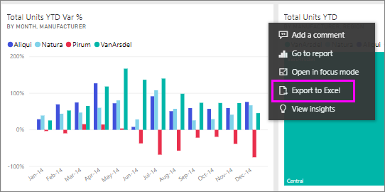
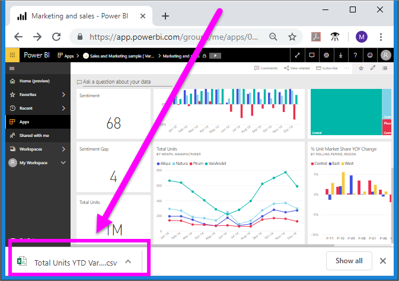
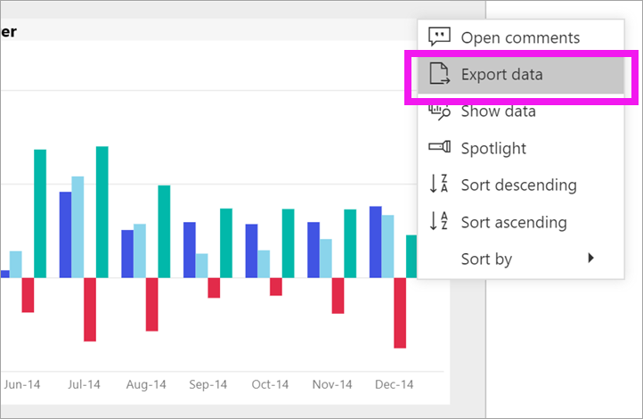
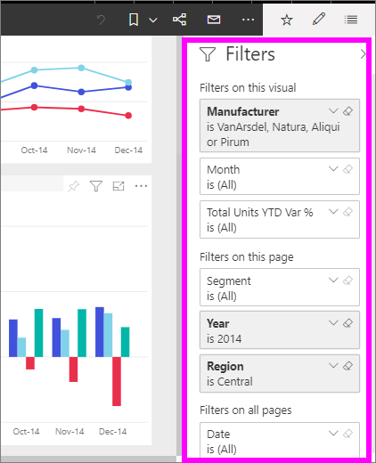
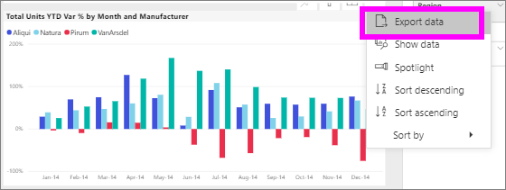
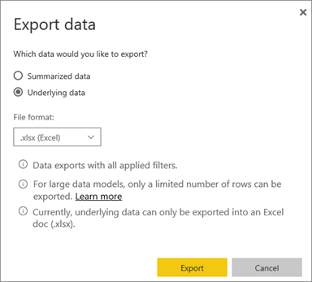
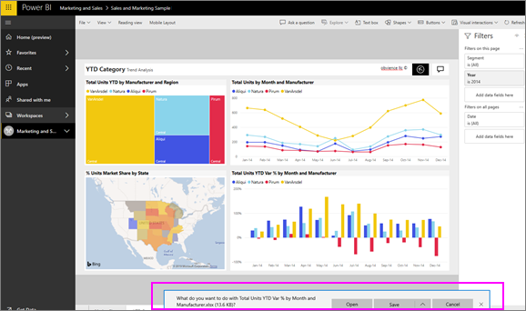

# Export data from visual
If you'd like to see the data that is used to create a visual, [you can display that data in Power BI](end-user-show-data.md) or export that data to Excel. The option to export the data requires a certain type or license and edit permissions to the content. If you cannot export, check with your Power BI administrator. 

## From a visual on a Power BI dashboard

1. Start on a Power BI dashboard. Here we're using the dashboard from the ***Marketing and sales sample*** app. You can [download this app from AppSource.com](https://appsource.microsoft.com/en-us/product/power-bi/microsoft-retail-analysis-sample.salesandmarketingsample-preview?flightCodes=e2b06c7a-a438-4d99-9eb6-4324ce87f282).

    

2. Hover over a visual to reveal the ellipses (...) and click to display the action menu.

    

3. Select  **Export to Excel**.

4. What happens next depends on which browser you are using. You may be prompted to save the file or your may see a link to the exported file at the bottom of the browser. 

    

5. Open the file in Excel.  

    

## From a visual in a report
You can export data from a visual in a report as .csv or .xlsx (Excel) format. 

1. On a dashboard, select a tile to open the underlying report.  In this example, we're selecting the same visual as above, *Total Units YTD Var %*. 

    

    Since this tile was created from the *Sales and Marketing Sample* report, that is the report that opens. And, it opens to the page that contains the selected tile visual. 

2. Select the tile in the report. Notice the **Filters** pane to the right. This visual has filters applied. To learn more about filters, see [Use filters in a report](end-user-report-filter.md).

    

3. Select the ellipses in the top right corner of the visualization. Choose **Export data**.

    

4. You'll see options to export Summarized data or Underlying data. If you're using the *Sales and marketing sample* app, **Underlying data** will be disabled. But you may encounter reports where both options are enabled. Here's an explanation of the difference.

    **Summarized data**: select this option if you want to export data for what you see in the visual.  This type of export shows you only the data that was used to create the visual. If the visual has filters applied, then the data you export will also be filtered. For example, for this visual, your export will include only data for 2014 and the central region, and only data for four of the manufacturers: VanArsdel, Natura, Aliqui, and Prirum.
  

    **Underlying data**: select this option if you want to export data for what you see in the visual **plus** additional data from the underlying dataset.  This may include data that is contained in the dataset but not used in the visual. 

    

5. What happens next depends on which browser you are using. You may be prompted to save the file or your may see a link to the exported file at the bottom of the browser. 

    

7. Open the file in Excel. Compare the amount of data exported to the data we exported from the same visual on the dashboard. The difference is that this export includes **Underlying data**. 

    

