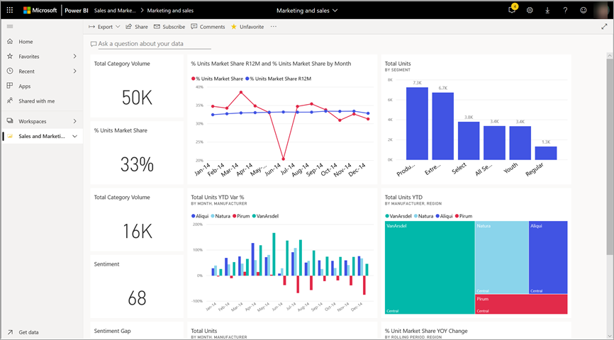
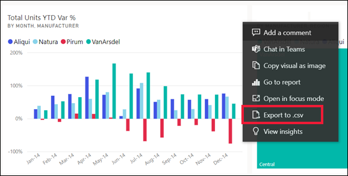
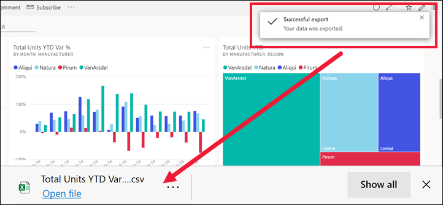
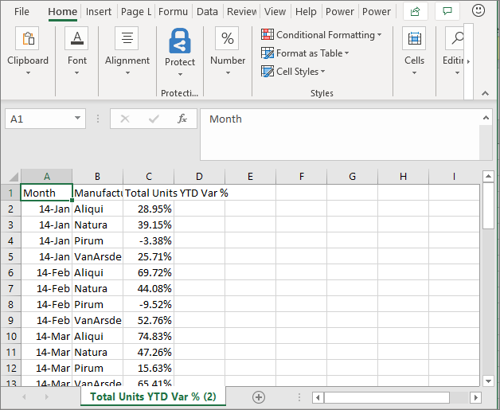
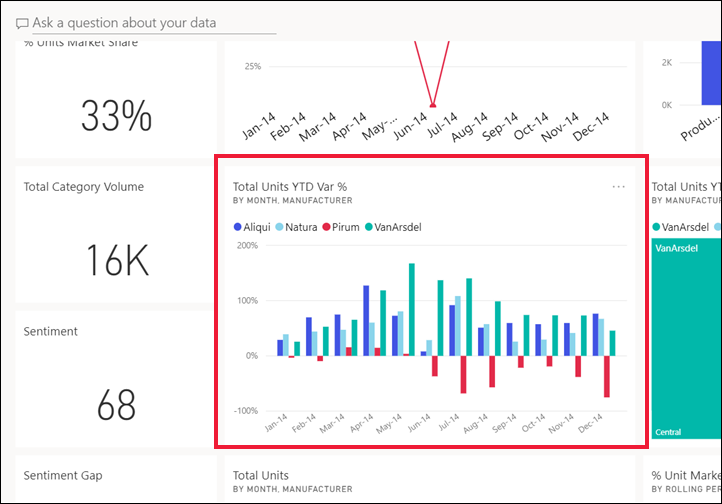
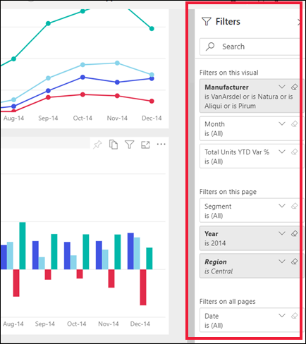
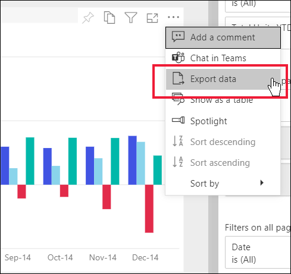
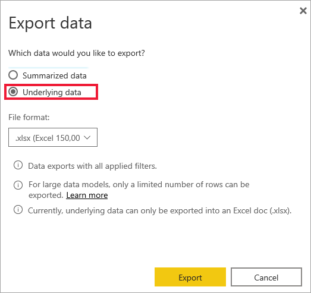
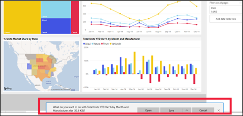
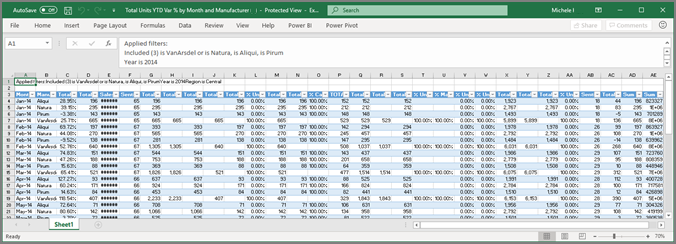

# Export data from a visual

[!INCLUDE[consumer-appliesto-yyny](../includes/consumer-appliesto-yyny.md)]

To see the data that's used to create a visual, [you can display that data in Power BI](end-user-show-data.md), or export it to Excel. This article shows you how to export to Excel.

Exporting data to Excel requires a Power BI Pro license, or for the dashboard or report to be shared with you using Premium capacity. To learn more, see [Which license do I have?](end-user-license.md). 

> [!IMPORTANT]
> If you are unable to export to Excel, it's possible that the report author or your Power BI administrator has disabled this feature. This is often done to protect private data.

## Export data from a visual on a dashboard

1. Start on a Power BI dashboard. Here we're using the dashboard from the ***Marketing and sales sample*** app. You can [download this app from AppSource.com](https://appsource.microsoft.com/en-us/product/power-bi/microsoft-retail-analysis-sample.salesandmarketingsample).

    

2. Hover over a visual to reveal **More options** (...) and click to display the action menu.

    

3. Select  **Export to .csv**.

4. What happens next depends on which browser you're using. You may be prompted to save the file or you may see a link to the exported file at the bottom of the browser. By default, your export is saved to your local Downloads folder. 

    

5. Open the file in Excel. 

    > [!NOTE]
    > If you don't have permissions to the data, you won't be able to export or open in Excel. Contact the dashboard owner or your Power BI administrator to request export permissions. 

    

## Export data from a visual in a report
You can export data from a visual in a report as .csv or .xlsx (Excel) format. 

1. On a dashboard, select a tile to open the underlying report.  In this example, we're selecting the same visual as above, *Total Units YTD Var %*. 

    

    Since this tile was created from the *Sales and Marketing Sample* report, that is the report that opens. And, it opens to the page that contains the selected tile visual. 

2. Select the visual in the report. Notice the **Filters** pane to the right. This visual has filters applied. To learn more about filters, see [Use filters in a report](end-user-report-filter.md).

    

3. Select **More options (...)** from the upper right corner of the visualization. Choose **Export data**.

    

4. You'll see options to export either summarized data or underlying data. If you're using the *Sales and marketing sample* app, **Underlying data** will be disabled. Additional permissions are required to see more data than is displayed in the visual (underlying data). These permissions protect the data from being inappropriately viewed, re-used, or shared with anyone other than the intended audience.

    **Summarized data**: select this option if you want to export data for what you currently see in the visual.  This type of export shows you only the data that was used to create the current state of the visual. If the visual has filters applied, then the data you export will also be filtered. For example, for this visual, your export will include only data for 2014 and the central region, and only data for four of the manufacturers: VanArsdel, Natura, Aliqui, and Pirum. If your visual has aggregates (sum, average, and so on), the export will also be aggregated. 
  

    **Underlying data**: select this option if you want to export data for what you see in the visual **plus** additional data from the underlying dataset.  This may include data that is contained in the dataset but not used in the visual. If the visual has filters applied, then the data you export will also be filtered.  If your visual has aggregates (sum, average, etc.), the export will remove the aggregation; essentially flattening the data. 

    

5. What happens next depends on which browser you're using. You might be prompted to save the file or you might see a link to the exported file at the bottom of the browser. If you're using the Power BI app in Microsoft Teams, your exported file is saved in your local Downloads folder. 

    

    > [!NOTE]
    > If you don't have permissions to the data, you won't be able to export or open in Excel. Contact the report owner or your Power BI administrator to request export permissions. 

6. Open the file in Excel. Compare the amount of data exported to what we exported from the same visual on the dashboard. The difference is that this export includes **Underlying data**. 

    

## Considerations and troubleshooting
There are many considerations related to exporting to Excel. This is one of those features that report designers and Power BI administrators may disable for individuals or even for an entire organization. They do this to ensure that private data isn't exposed to the wrong audience. 

If you find that you are unable to use this feature, reach out to the report owner and your administrator to understand why you are unable to export data from a particular visual or from all visuals. It may be that this feature has been purposely disabled and perhaps they can  enable it for you.  Other times, there may be particular reasons an export does not work.  It could be related to permissions, data contents, data type, visual type, how the designer named the fields, and more. When contacting the report owner or administrator, refer them to these articles: 
[Admin tenant settings](../guidance/admin-tenant-settings.md), [Row level security](../admin/service-admin-rls.md), and [Data protection](../admin/service-security-data-protection-overview.md).

- There is a limit to the number of rows that can be exported to Excel.  For .xlsx files, the limit is 150,000 rows.  For .csv files, the limit is 30,000 rows. 

- The dataset may have RLS (role level security) applied to the data. This means that some data may be hidden from you because it is not appropriate for you to see it.  For example, if you are a people manager, the HR dataset may have RLS applied that only allows you to see data for employees who report directly to you. 

- Certain types of visuals are not supported. These include custom visuals, R visuals, and more. 

## Next steps

[Display the data used to create a visual](end-user-show-data.md)