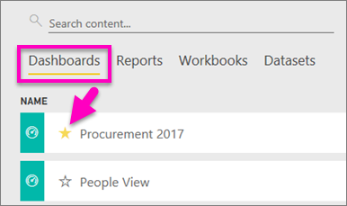
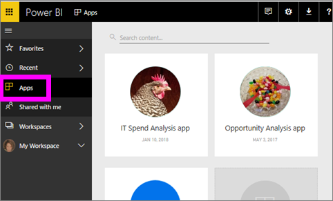
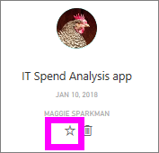
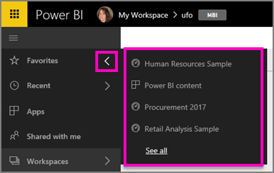
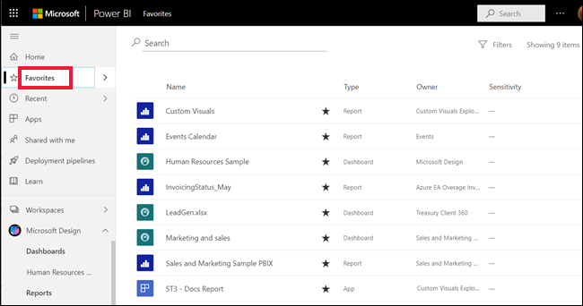
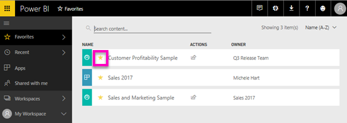

# Favorite dashboards, reports, and apps in Power BI service
When you make content a *favorite*,  you'll be able to access it from all of your workspaces.  Favorites are typically the content that you visit most often.

> [!NOTE]
> This topic applies to Power BI service, and not to Power BI Desktop.
> 
> 

You can also select a single dashboard as a [featured dashboard](end-user-featured.md) in Power BI service.

## Add a dashboard or report as a *favorite*
Watch Amanda add favorites to her workspace, then follow the step-by-step instructions below the video to try it out yourself.

<iframe width="560" height="315" src="https://www.youtube.com/embed/G26dr2PsEpk" frameborder="0" allowfullscreen></iframe>

1. Open a dashboard or report that you use often. Even content that has been shared with you can be a *favorite*.
2. From the upper right corner of Power BI service, select **Favorite** or the star   icon.
   
   
   
   You can also favorite a dashboard or report from your workspace **Dashboards** or **Reports** content view tab.
   
   

## Add an app as a *favorite*

1. From the left navpane, select **Apps**.

   

2. Hover over an app to display more detail.  Select the star   icon to set as a favorite.
   
   

## Working with *favorites*
1. To acccess your favorites, from any workspace, select the flyout arrow to the right of **Favorites**.  From here you can select a favorite to open it. Only five favorites are listed (alphabetically). If you have more than five, select **See all** to open the favorites screen (see #2, below). 
   
   
2. To see **all** the content that you have added as favorites, in the left navpane, select **Favorites** or the Favorites   icon.  
   
    
   
   From here you can take action: open, identify owners, and even share with your  colleagues.

## Unfavorite content
No longer use a report as often as you used to?  You can unfavorite it. When you unfavorite content, it is removed from your Favorites list but not from Power BI.

1. In the left navigation pane, select **Favorites** to open the **Favorites** screen.
   
   
2. Select the yellow star next to the content to unfavorite.

> **NOTE**: You can also unfavorite a dashboard, report, or app itself. Just open and de-select the yellow icon.   
> 
> 

## Next steps
[What is Power BI?](../power-bi-overview.md)

[Power BI - Basic Concepts](end-user-basic-concepts.md)

More questions? [Try the Power BI Community](http://community.powerbi.com/)

