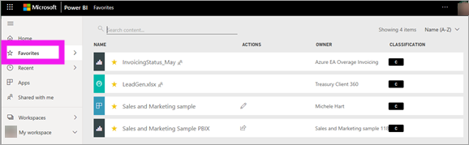

# Favorite dashboards, reports, and apps in the Power BI service
When you make content a *favorite*, you can access it quickly from the **Favorites** content list and from Power BI **Home** > **Favorites + frequents**. Favorites are typically content that you visit most often and are identified with a yellow star.

   

   

You can also select a single dashboard as a [Featured dashboard](end-user-featured.md) in the Power BI service.

## Add a dashboard or report as a favorite

1. Open a dashboard or report that you use often. Even content that has been shared with you can be a favorite.

2. From the upper menu bar of the Power BI service, select **Favorite** or the star  icon.
   
   
   
   You can also favorite a dashboard or report from anywhere you see the star icon, such as Home, Recent, Apps, and Shared with me. 
   
   

## Add an app as a favorite

1. From the nav pane, select **Apps**.

   

2. Hover over an app to display more detail. Select the star  icon to set as a favorite.
   
   

## Work with favorites
1. To access your favorites, select the flyout arrow to the right of **Favorites**. From here, you can select a favorite to open it. Up to five favorites are listed alphabetically. If you have more than five, select **See all** to open the favorites content list. 
   
   
2. To see all the content that you've added as favorites, in the nav pane, select **Favorites** or the Favorites  icon. 
   
    
   
   From here, you can take action. You can open a favorite, identify owners, and even share favorites with your colleagues.

## Unfavorite content
If you no longer use a report as often as you used to, you can unfavorite it. When you unfavorite content, it's removed from your Favorites list but not from Power BI.

1. In the nav pane, select **Favorites** to open the **Favorites** screen.
   
   
2. Select the yellow star next to the content you want to unfavorite.

> [!NOTE]
> You can also unfavorite a dashboard, a report, or an app. Just open and deselect the yellow icon. 
> 
> 
## Limitations and considerations
At the current time, you can favorite an app and this automatically favorites all the reports and dashboards for that app. It isn't possible to favorite individual app reports or dashboards. 

## Next steps
- [Power BI: Basic concepts](end-user-basic-concepts.md)
- More questions? Try the [Power BI Community](https://community.powerbi.com/).

