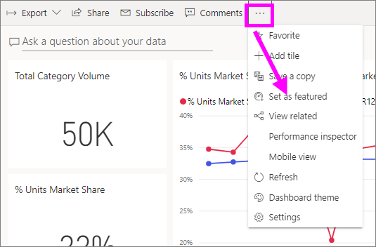
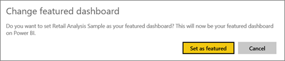
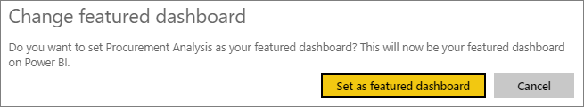
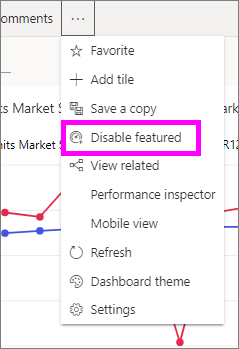

# Featured dashboards in Power BI service
## Create a Featured dashboard
Many of us have one dashboard that we visit more than any others.  It might be the dashboard we use to run our business, or it might be a dashboard that contains an aggregation of tiles from many different dashboards and reports.

When you select a dashboard as *featured*, each time you open the Power BI service, it will open with that dashboard displayed.  

You can also select a few dashboards and set them as *favorites*. See [Dashboard favorites](end-user-favorite.md).

If you haven't yet set a featured dashboard, Power BI will open to the last dashboard you used or to [Power BI Home](end-user-home.md).  

### To set a dashboard as **featured**
Watch Amanda create a featured dashboard and then follow the instructions below the video to try it out yourself.

<iframe width="560" height="315" src="https://www.youtube.com/embed/G26dr2PsEpk" frameborder="0" allowfullscreen></iframe>

1. Open the dashboard that you'd like to set as *Featured*. 
2. In the top menubar, select the ellipses (...) and choose **Set as featured**.  
   
    
3. Confirm your selection.
   
    

## Change the featured dashboard
Of course, if you change your mind later you can set a new dashboard as the featured dashboard.

1. Follow steps 1 and 2 from above.
   
    
2. Select **Set as featured**. Un-featuring a dashboard does not remove it from your workspace.  
   
    

## Remove the featured dashboard
If you decide that you don't want any dashboard to be designated as featured, here's how to un-feature a dashboard.

1. Open the currently-featured dashboard.
2. In the top menubar, select the ellipses (...) and choose  **Disable featured**.

    
   
## Next steps
[Favorite a dashboard](end-user-favorite.md)

More questions? [Try the Power BI Community](http://community.powerbi.com/)

