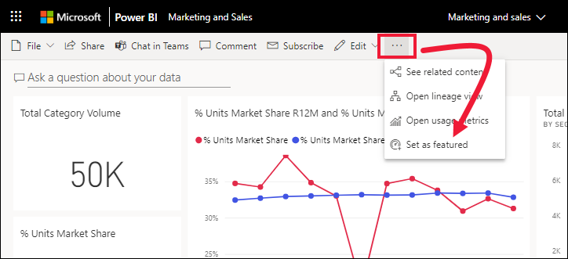
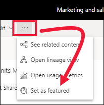
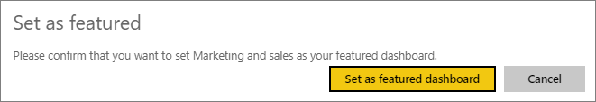
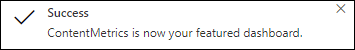
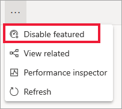

# Featured dashboards in the Power BI service

Many of us have one dashboard that we visit more than any others. It might be the dashboard we use to run our business. Or, it might be a dashboard that contains an aggregation of tiles from many different dashboards and reports.

This article addresses how to select your one featured dashboard. Power BI automatically displays your featured dashboard each time you open the Power BI service. For information about a different functionality (that has a similar name), *featured content on Home*, please read [Explore Power BI Home](end-user-home.md)

## Create a featured dashboard
When you set a dashboard as *featured*, each time you open the Power BI service from your browser (app.powerbi.com), it opens with that dashboard displayed. If you're opening Power BI from an email link, or any other shared URL, Power BI will open to the dashboard or report selected by the content owner.  

You can also select a few dashboards and set them as favorites. See [Dashboard favorites](end-user-favorite.md).

If you haven't set a featured dashboard, Power BI opens to the last dashboard you used or to Power BI **Home**. 

### Set a dashboard as featured

1. Open the dashboard that you want to set as featured. 
2. On the top menu bar, select **More options** (...) and select **Set as featured**. 
   
    
3. Confirm your selection.
   
    

## Change the featured dashboard
If you change your mind later, you can set a new dashboard as the featured dashboard. Unfeaturing a dashboard doesn't remove it from Power BI. 

1. Follow the previous steps 1 and 2.
   
2. Select **Set as featured dashboard**. 
   
    

## Remove the featured dashboard
If you decide that you don't want any dashboard to be designated as featured, here's how to unfeature a dashboard.

1. Open the currently featured dashboard.
2. On the top menu bar, select **More options** (...) and select **Disable featured**.

    
   
## Next steps
- [Favorite a dashboard](end-user-favorite.md)    
- More questions? Try the [Power BI Community](https://community.powerbi.com/).

