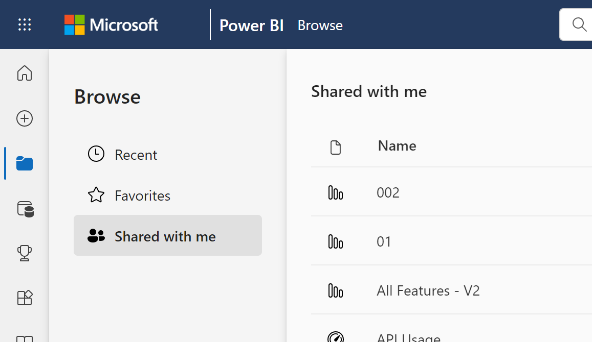

# Interact with the Power BI service as a *Free user*

[!INCLUDE[consumer-appliesto-ynnn](../includes/consumer-appliesto-ynnn.md)]

As a Power BI service user with a free license, you explore content (such as reports, apps, scorecards, dashboards, and more) in order to make business decisions. That content is created by *designers* who have Power BI Pro or Premium Per User (PPU) licenses. In order to share it with users with free licenses, designers need to publish that content to a group workspace backed by a Premium capacity. Premium capacity provides the benefit of unlimited content sharing. Sometimes, designers share content by sending you links to content such as a Power BI app [Apps in the Power BI service](end-user-apps.md), and sometimes the [content automatically installs](end-user-apps.md) and appears in Power BI under **Apps** or **Browse** > **Shared with me**.

There are many different ways designers can share content. But this article is for Power BI users with a free license, and therefore only describes how "free users" receive and interact with content. For more information on other ways to share content, see [Ways to share your work in Power BI](../collaborate-share/service-how-to-collaborate-distribute-dashboards-reports.md).

In the [previous article](end-user-license.md), you learned that what you can do with dashboards, reports, and apps (content) in the Power BI service depends on three things: your licenses, your [roles](../collaborate-share/service-roles-new-workspaces.md) and [permissions](../connect-data/service-datasets-permissions.md), and where content is stored.

This article lists which features in the Power BI service are available to users with Free licenses. 

> [!NOTE]
> In sovereign cloud environments with Power BI Premium capacity, all users can view content without needing an assigned license.  

## Quick review of terminology

Let's review some Power BI concepts before we get to the list. This will be a quick review and if you need more details, visit [Licenses for consumers](end-user-license.md) or [Power BI basic concepts](end-user-basic-concepts.md).

### Workspaces and roles

Collaborating and sharing in workspaces requires that workspace owners, who have Pro or Premium Per User (PPU) licenses, assign you a *role* in that [workspace](../collaborate-share/service-roles-new-workspaces.md).

Roles determine who can do what in that workspace. Free users are assigned the **Viewer** role. Being assigned any other role requires that a free user upgrade to Pro or PPU. 

### Premium capacity

When an organization has a Premium capacity subscription, admins and Pro users can assign workspaces to the Premium capacity. Content in workspaces hosted in Premium capacity can be accessed by users with any Power BI license as long as they have appropriate permissions to access the content.

### Licenses

Each Power BI service user has at least one of the following: a free license, a Power BI Pro license, a Premium Per user license. As long as your colleagues use Premium capacity workspaces to share content, free users can view and interact with that content.

To find out what type of license is assigned to your account, select your profile picture from the page header in [Power BI service](https://app.powerbi.com). If **Pro account** or **Premium Per User account** is displayed, you can share content with other users. When **Free** is shown, you can only create content in My Workspace and consume content that is hosted in a Premium workspace. Select **View account** to see more details about your account.

   :::image type="content" source="media/end-user-features/power-bi-licenses.png" alt-text="Screenshot showing license type displayed with account profile.":::

## Power BI feature list for users with a free license

The following chart identifies which tasks can be performed by a user with a **free** license interacting with content in their own **My Workspace** or in **Premium** capacity.

The first column represents a free user only working with content in **My workspace**. This user cannot collaborate with colleagues in the Power BI service. Colleagues cannot directly share content with this user, and this user cannot share from **My workspace**.

The second column represents a free user working with content in a workspace that is saved in Premium capacity.  This free user:

- has a free user license type
- is part of an organization that has a Premium capacity subscription
- gets content (apps, dashboards, reports, etc.) from Pro or PPU users who share that content using group workspaces in Premium capacity.
- is assigned the **Viewer** role to those app workspaces.

> [!NOTE]
> Content hosted in a PPU workspace can only be used by users with PPU licenses.  

### Legend

  feature is available in the current scenario    
  feature is not available in the current scenario    
 **** feature availability is limited to **My workspace**. Content in **My workspace** is for the owner's personal use and cannot be viewed by anyone else in Power BI.    
 \*  access to this feature can be turned on or off by a Pro user or an admin.    
   

### Feature list

|Features   | Scenario 1: Power BI Free user who has no access to content hosted in Premium capacity.    | Scenario 2: Power BI Free user with **Viewer** permissions to content stored in Premium capacity.  |
|---|---|---|
|**Apps** 
|Installs automatically |  | *| 
|Open |  |   | 
|Favorite |  |   |
 |Edit, update, republish |  |   |
 |Create new app |  |   |
 |AppSource: download and open |   | | 
|Organization store: download and open|  |  |
| Reshare an app |   |   |
 |**Workspaces in Premium capacity**
| Create, edit, or delete workspace or content  |   | |
|Add endorsements |   | | 
|Open and view  |   |    | 
| Read data stored in workspace dataflows | ||
|**Dashboards**
|Receive, view, and interact with dashboards from colleagues |  |    | 
| Add alerts to tiles  |   |    | 
| View and respond to comments from others: add your own comments  |   |  *  | 
| Save a copy |  | | 
|Copy visual as an image? | ||
|Create, edit, update, delete |  | | 
|Export tile to .csv | | |
|Favorite || |
|Full screen and focus modes | | |
|Global search |* |* |
|Insights on tiles |     | *|
|  Q&A: use on dashboard  |* |* |
|Q&A: add featured and saved questions |   | |
|Q&A: review asked questions |   | |  
|Pin tiles from Q&A or reports |  | | 
|Print |* |* |
|Refresh |  | | 
|Reshare |   | | 
|Subscribe yourself |* |*  |
|Subscribe others |   | | 
|View dashboards that have been embedded into PowerApps or SharePoint pages |  |    | 
|**Datasets**
|  Add, delete, edit  |    |   |   
| Create a report in another workspace based on a dataset in this workspace |   | |      
|  Insights on datasets  |   || 
|Schedule refresh |  ||
|Analyze in Excel |  |*|
|Create a report |  ||
|Create a paginated report |  ||
|Share |  ||
|Manage permissions |  ||
|Save a copy |  ||
|Create from template |  || 
|**Reports**
|Receive reports from colleagues |  |    | 
| Analyze report in Excel  |*  |*  | 
| View bookmarks created by others, and add your own bookmarks  | |  |
| View and respond to comments from others: add new comments  | |  |
|Change display dimensions   |  |   | 
| Save a copy | |  
|Copy visual as an image* |
| Cross-highlight and cross-filter report visuals   | |  |
|  Drill   |  |  |
| Drillthrough |* |* |
|  Embed (publish to web, public) | * | |  
|  Export summarized data from report visuals*  | | |
|Export underlying data from report visuals* |  |  | 
|  Favorite the report  | | |
|  Filters: change types  |* |* |
|  Filters: interact   || |
|  Filters: persistent  |* |* |
| Search on the filter pane |* |* |
| Full screen and focus modes   | | |
|  Insights on reports1  |   || 
| Lineage view  | | |
|Export to PDF* | |  |
|Performance Inspector || |
| Export to PowerPoint*   | | |
|  Promote content to Home  |   | | 
| Print report pages* | | |
|Interact with Q&A visual | | |
|QR Code | | |
|  Refresh  | | |
|  Share content with external users  |   | | 
| Share: allow others to reshare items |   | | 
|Show as table (show data)| | |
|  Slicers: add or delete  | | |
| Interact with slicers | | |
|  Sort report visuals  | | |
|  Subscribe yourself to reports* | | |
|  Subscribe others to reports  |   | | 
|  View related | | |
|View reports that have been embedded into PowerApps or SharePoint pages |  |    |
|  Visuals: change types in reports  |* |* |
|  Change visual interactions  |  | |
|  Visuals: add new  |  | |
|  Visuals: add new fields  |   | |
|Visuals: change type |  | |
| Visuals: hover to reveal details and tooltips  |  | |

## Related content

- [Power BI for *business users*](end-user-consumer.md)    
