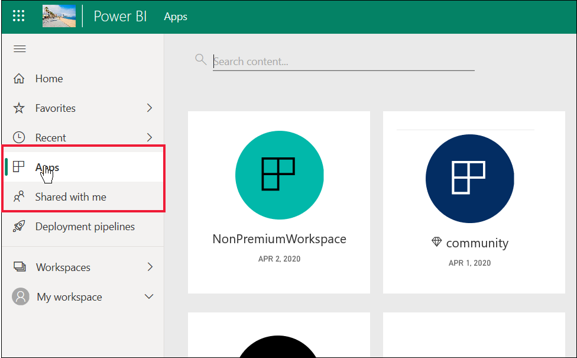

# Power BI feature list for *business users* and others with free licenses

[!INCLUDE[consumer-appliesto-ynnn](../includes/consumer-appliesto-ynnn.md)]

As a *business user*, you use the Power BI service to explore reports and dashboards in order to make business decisions. Those reports and dashboards are created by *designers* who have Power BI *Pro* or Premium Per User (PPU) licenses. Pro and PPU users have the ability to share content with their colleagues and to control what their colleagues can and can't do with that content. Sometimes, designers share content by sending you links, and sometimes the content automatically installs and appears in Power BI under **Apps** or **Shared with me**.

There are many different ways designers can share content. But this article is for Power BI *business users*, and therefore only describes how *business users* receive and interact with content. For more information on other ways to share content, see [Ways to share your work in Power BI](../collaborate-share/service-how-to-collaborate-distribute-dashboards-reports.md).

In the [previous article](end-user-license.md), you learned that what you can do with dashboards, reports, and apps (content) in the Power BI service depends on three things: your licenses, your roles and permissions, and where content is stored.

This article lists which features in the Power BI service are available to *business users* like you. By definition, *business users* have a free license to work in the Power BI service (not Power BI Desktop) and are members of organizations that have content stored in Premium capacity.

## Quick review of terminology
Let's review some Power BI concepts before we get to the list. This will be a quick review and if you need more details, visit [Licenses for consumers](end-user-license.md) or [Power BI basic concepts](end-user-basic-concepts.md).

### Workspaces and roles
There are two types of workspaces: **My workspace** and app workspaces. Only you have access to your own **My workspace**. Collaborating and sharing requires the content *designers*, who have Pro or Premium Per User (PPU) licenses, to use an app workspace. 

Within app workspaces, *roles* are assigned by the designers to manage who can do what in that workspace. *Business users* are often assigned the **Viewer** role. 

### Premium capacity
When an organization has a Premium capacity subscription, admins and Pro users can assign workspaces to a *capacity*. A workspace in a capacity is a space where Pro users can share and collaborate with free users -- without requiring the free users to have Pro or Premium Per User (PPU) licenses. Within those workspaces, free users have elevated permissions (see list, below). 

### Licenses 

Each Power BI service user has a free license, a Power BI Pro license, or a Premium Per user license. *Business users* in an organization are typically assigned free licenses. Anyone who signs up for the Power BI service as an individual and wants to try out the [Power BI service in standalone mode](../fundamentals/service-self-service-signup-for-power-bi.md) will start with a free license. For free users, being a member of an organization that has Premium capacity is what gives you super powers. As long as your colleagues use Premium capacity workspaces to share content, free users can view and collaborate with that content.  In this way, the free user gains the ability to consume content created by others. 

To find out what type of license is assigned to your account, select your profile picture from the page header in [Power BI service](https://app.powerbi.com). If **Pro account** or **Premium Per User account** is displayed, you can share content with other users. When **Free** is shown, you can only create content in My Workspace and consume content that is shared to a Premium workspace. Select **View account** to see more details about your account.

   :::image type="content" source="media/end-user-features/license-type.png" alt-text="Screen capture showing license type displayed with account profile.":::

## Power BI feature list for *business users* and free users
The following chart identifies which tasks can be performed by a *business user* interacting with content in Premium capacity.    

The first column represents a free user working with content in **My workspace**. This user cannot collaborate with colleagues in the Power BI service. Colleagues cannot directly share content with this user, and this user cannot share from **My workspace**. 

The second column represents a *business user*.  A business user:

- has a free user license
- is part of an organization that has a Premium capacity subscription
- gets content (apps, dashboards, reports) from Pro or PPU users who share that content using app workspaces in Premium capacity.
- is assigned the **Viewer** role to those app workspaces. 

> [!NOTE]
> Users with PPU subscriptions cannot share content with users who have a Pro or free license.

### Legend
  feature is available in the current scenario    
  feature is not available in the current scenario    
 **** feature availability is limited to **My workspace**. Content in **My workspace** is for the owner's personal use and cannot be shared or viewed by anyone else in Power BI.    
 \*  access to this feature can be turned on or off by a Pro user or an admin.    
   

### Feature list

|Features   | Scenario 1: Power BI free user who has no access to content hosted in a capacity.    | Scenario 2: Power BI free user with **Viewer** permissions to content stored in a capacity. This person is a Power BI *business user*. |
|---|---|---|
|**Apps** 
|Installs automatically |  | *| 
|Open |  |   | 
|Favorite |  |   |
 |Edit, update, reshare, republish |  |   |
 |Create new app |  |   |
 |AppSource: download and open |   | | 
|Organization store: download and open|  |  |
 |**App workspaces**
| Create, edit, or delete workspace or content  |   | |
|Add endorsements |   | | 
|Open and view  |   |    | 
| Read data stored in workspace dataflows | ||
|**Dashboards**
|Receive, view, and interact with dashboards from colleagues |  |    | 
| Add alerts to tiles  |   |    | 
| View and respond to comments from others: add your own comments  |   |  *  | 
| Save a copy |  | | 
|Copy visual as an image? | ||
|Create, edit, update, delete |  | | 
|Export tile to Excel | | |
|Favorite || |
|Feature | ||
|Full screen and focus modes | | |
|Global search |* |* |
|Insights on tiles |     | *|
|  Q&A: use on dashboard  |* |* |
|Q&A: add featured and saved questions |   | |
|Q&A: review asked questions |   | |  
|Performance inspector |  | |
|Pin tiles from Q&A or reports |  | | 
|Print |* |* |
|Refresh |  | | 
|Reshare |   | | 
|Subscribe yourself |* |*  |
|Subscribe others |   | | 
|**Datasets**
|  Add, delete, edit  |    |   |   
| Create a report in another workspace based on a dataset in this workspace |   | |  
|  Insights on datasets  |   || 
|Schedule refresh |  ||
|Analyze in Excel |  ||
|Create report, with Build permission on the dataset |  ||
|Create paginated report, with Build permission on the dataset |  ||
|Share |  ||
|Manage permissions |  ||
|Save a copy |  ||
|Create from template |  || 
|**Reports**
|Receive reports from colleagues |  |    | 
| Collaborate with colleagues on the same version of a report | |    | 
| Analyze report in Excel  |*  |*  | 
| View bookmarks created by others, and add your own bookmarks  | |  |
| View and respond to comments from others: add new comments  | |  |
|Change display dimensions   |  |   | 
| Save a copy | |  
|Copy visual as an image* |
| Cross-highlight and cross-filter report visuals   | |  |
|  Drill   |  |  |
| Drillthrough |* |* |
|  Embed (publish to web, public) | * | |  
|  Export summarized data from report visuals*  | | |
|Export underlying data from report visuals* |  |  | 
|  Favorite the report  | | |
|  Filters: change types  |* |* |
|  Filters: interact   || |
|  Filters: persistent  |* |* |
| Search on the filter pane |* |* |
| Full screen and focus modes   | | |
|  Insights on reports1  |   || 
| Lineage view  | | |
|Export to PDF* | |  |
|Performance Inspector || |
| Export to PowerPoint*   | | |
|  Promote content to Home  |   | | 
| Print report pages* | | |
|Interact with Q&A visual | | |
|QR Code | | |
|  Refresh  | | |
|  Share content with external users  |   | | 
| Share: allow others to reshare items |   | | 
|Show as table (show data)| | |
|  Slicers: add or delete  | | |
| Interact with slicers | | |
|  Sort report visuals  | | |
|  Subscribe yourself to reports* | | |
|  Subscribe others to reports  |   | | 
|  View related | | |
|  Visuals: change types in reports  |* |* |
|  Change visual interactions  |  | |
|  Visuals: add new  |  | |
|  Visuals: add new fields  |   | |
|Visuals: change type |  | |
| Visuals: hover to reveal details and tooltips  |  | |

## Next steps
[Power BI for *business users*](end-user-consumer.md)    
