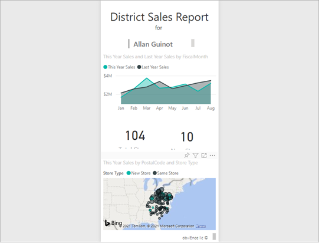

# Display content in more detail: focus mode and full screen mode

[!INCLUDE [consumer-appliesto-yynn](../includes/consumer-appliesto-yynn.md)]

You want your reports, dashboards, visuals, and tiles to display a certain way. Power BI offers you many options to get it just right. Two of those options: the **View** menu and **Focus mode** are discussed in this article. Used together, you can achieve the display that you want. And these display options aren't just for viewing, you can interact with the reports, dashboards, and visuals in all of these display modes. Most of these display options are also available in Power BI Desktop. 

>
> [!TIP] 
> Reports can be navigated using [keyboard shortcuts.](../create-reports/desktop-accessibility-consuming-tools.md) 

## Focus mode versus full screen mode

Focus mode and full screen mode are two different ways to see more detail in your visuals, reports, and dashboards. Full screen mode is applied to the current contents of a report canvas or dashboard. It removes all the panes surrounding your content. Focus mode is applied to individual report visuals or dashboard tiles. It enlarges the tile or visual along with filters, menus, and navigation panes. Let's take a closer look at the similarities and differences.  

|Content    | Focus mode  |Full screen mode  |
|---------|---------|----------------------|
|Dashboard     |   No    | Yes |
|Report page   | No   | Yes|
|Report visual | Yes    | Yes, if it's already in focus mode and therefore the only visual on the report canvas. |
|Dashboard tile | Yes    | No |
|Windows 10 mobile | No  | Yes |

In the following example, we started with a report (1), opened one of the visuals in focus mode (2) and then opened that same visual in full screen mode (3). 

:::image type="content" source="media/end-user-focus/power-bi-reports.png" alt-text="Individual screenshots of a report view, focus mode, and full screen mode." Lightbox="media/end-user-focus/power-bi-reports.png":::
>>>>>>> 0c503460d027dc8fd874b257f9554b0d6c46955a

## When to use full screen mode

:::image type="content" source="media/end-user-focus/power-bi-dashboard-focus.png" alt-text="Screenshot of a dashboard in full screen mode and default mode." lightbox="media/end-user-focus/power-bi-dashboard-focus.png":::

Display your Power BI service content (dashboards, report pages, and visuals) without the distraction of menus and nav panes. You get an unadulterated, full view of your content at a glance, all the time. This view is sometimes referred to as TV mode.

Use full screen mode to:

* Present your dashboard, visual, or report at a meeting or conference.
* Display in an office on a dedicated large screen or projector.
* View on a small screen.
* Review in locked mode--you can touch the screen or mouse over tiles without opening the underlying report or dashboard.

## When to use focus mode

***Focus*** mode lets you expand (pop out) a visual or tile to see more detail. Maybe you have a dashboard or report that is a little crowded and you want to zoom in on only one visual. This function is a perfect use of focus mode.  

:::image type="content" source="media/end-user-focus/power-bi-compare.png" alt-text="Screenshot of a dashboard tile in default mode and then focus mode." lightbox="media/end-user-focus/power-bi-compare.png":::

While in focus mode, you can interact with any filters that were applied when this visual was created.  

## Work in full screen mode

Full screen mode is available for dashboards and report pages. 

- To open a dashboard in full screen mode, select the full screen icon :::image type="icon" source="media/end-user-focus/power-bi-full-screen-icon.png"::: from the top menu bar. 

- To open a report page in full screen mode, select the View icon and choose **Full screen**.

    :::image type="content" source="media/end-user-focus/power-bi-view.png" alt-text="Screenshot showing Full screen selected in the View menu.":::

- To see a visual in full screen mode, first open it in focus mode so that it's the only visual on the report page. Then open that report page in full screen mode.  

Your selected content fills the entire screen. When you're in full screen mode, navigate using the menu bar at the bottom. If you don't see menu options for a dashboard, move your cursor, and the menu appears. Because full screen is available for such a wide variety of content, the navigation options vary. Some of the options are: 

  * Select the **Back**, **Go back**, or **Back to report** button  to navigate to the previous page in your browser. If the previous page was a Power BI page, it too displays in full screen mode. Full screen mode persists until you exit out.

  * :::image type="icon" source="media/end-user-focus/power-bi-fit-to-screen-icon.png":::
  :::image type="icon" source="media/end-user-focus/power-bi-fit-to-screen.png":::  
    Use the **Fit to page** or **Fit to screen** option to display your selected content at the largest size possible without resorting to scrollbars.  

    

  * :::image type="icon" source="media/end-user-focus/power-bi-fit-width.png"::: :::image type="icon" source="media/end-user-focus/power-bi-menu.png":::   
    Sometimes you don't care about scrollbars, but you want the dashboard to fill the entire width of the available space. Select the **Fit to width** button.    

    :::image type="content" source="media/end-user-focus/power-bi-fit-screen.png" alt-text="Screenshot showing how fit to screen appears.":::

  * :::image type="icon" source="media/end-user-focus/power-bi-report-nav2.png":::       
    In full screen reports, use these arrows to move between the pages in the report. Each page displays in full screen mode. Full screen mode persists until you exit full screen mode.   
  * :::image type="icon" source="media/end-user-focus/exit-fullscreen-new.png":::     
  To exit full screen mode, select the **Exit full screen** icon.

## Work in focus mode

Focus mode is available for dashboard tiles and report visuals. 

- To open a dashboard tile in focus mode, hover over a tile, select **More options** (...) and choose **Open in focus mode**.

    :::image type="content" source="media/end-user-focus/power-bi-focus-dashboard.png" alt-text="Screenshot showing the More options menu for a tile with Open in focus mode outlined.":::

- To open a report visual in focus mode, hover over the visual and select the **Focus mode** icon. :::image type="icon" source="media/end-user-focus/pbi_popout.jpg":::

   :::image type="content" source="media/end-user-focus/power-bi-hover-focus.png" alt-text="Screenshot showing the Focus mode icon for a tile.":::

The visual opens and fills the entire canvas. Notice that your report canvas still has a **Filters** pane that you can use to interact with the visual. The **Filters** pane can be collapsed.

:::image type="content" source="media/end-user-focus/power-bi-filter.png" alt-text="Screenshot showing that the tile fills report canvas."  lightbox="media/end-user-focus/power-bi-filter.png":::

:::image type="content" source="media/end-user-focus/power-bi-filter-collapse.png" alt-text="Screenshot showing that the tile fills the report canvas with the Filters pane collapsed." lightbox="media/end-user-focus/power-bi-filter-collapse.png"::: 

Explore further by [modifying the filters](end-user-report-filter.md) and looking for interesting discoveries in your data. In [reading view](end-user-reading-view.md), you can't add new filters, change the fields being used in the visuals, or create new visuals. However, you can interact with the existing filters, cross-filter, pin, subscribe, comment, and much more. 

For a dashboard tile, your changes can't be saved. For a report visual, any modifications you make to the existing filters are saved when you exit Power BI. If you don't want Power BI to remember your modifications, select the **Reset to default** button. :::image type="icon" source="media/end-user-focus/power-bi-resets.png":::

Leave focus mode and return to the dashboard or report by selecting either **Exit focus mode**  or **Back to report** (in the upper left corner of the visual).

:::image type="content" source="media/end-user-focus/power-bi-exit.png" alt-text="Screenshot showing the Exit focus mode button.":::

:::image type="content" source="media/end-user-focus/power-bi-back-to-report.png" alt-text="Screenshot showing the Back to report button.":::

## Considerations and troubleshooting

* When using focus mode with a visual in a report, you can view and interact with all filters: Visual level, Page level, Drillthrough, and Report level.    
* When using focus mode with a visual on a dashboard, you can view and interact with only the Visual level filter.

## Related content

- [Change the View settings for reports](end-user-report-view.md)