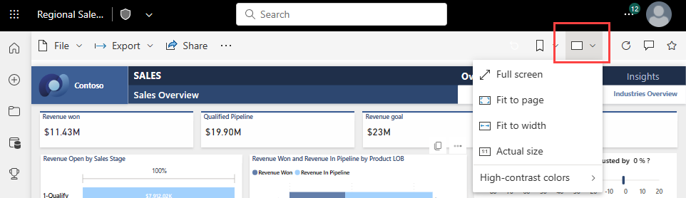
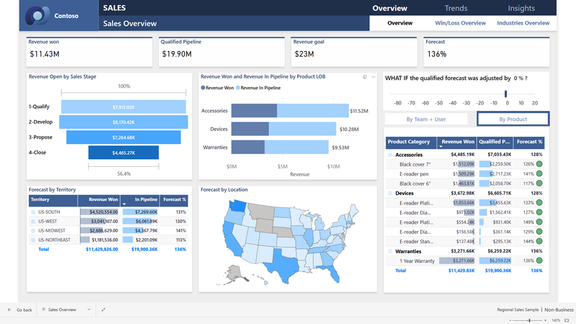
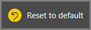

# Display content in more detail: focus mode and full screen mode

[!INCLUDE [consumer-appliesto-yynn](../includes/consumer-appliesto-yynn.md)]

> [!NOTE]  
> This video might use earlier versions of Power BI Desktop or the Power BI service.

<iframe width="560" height="315" src="https://www.youtube.com/embed/dtdLul6otYE" frameborder="0" allowfullscreen></iframe>

You want your reports, dashboards, visuals, and tiles to display a certain way. Power BI offers you many options to get it just right. Two of those options: the **View** menu and **Focus mode**, are discussed in this article. Used together, you can achieve the display that you want. And these display options aren't just for viewing, you can interact with the reports, dashboards, and visuals in all of these display modes. Most of these display options are also available in Power BI Desktop. 

## Report View settings

The **View** menu dropdown provides several tools for displaying your reports. Pictured below and on the left are the **View** options for the Power BI service. On the right are the **Page View** options for Power BI Desktop. Desktop does not offer a **Full screen** mode.

:::image type="content" source="media/end-user-reading-view/power-bi-menus.png" alt-text="Screenshot of the View menu selected."::: 
-
Let's look at the differences when applied to a Power BI report.

## Page view options for reports
The options for page view are: full screen (the Power BI service only), fit to page, fit to width, and actual size.

### Full screen mode
Full screen mode expands whatever is currently displayed on the report canvas to fit the entire screen. 

**For reports**, only the report canvas (and sometimes the **Filters** pane) display in full screen mode. Other panes such as menu bars, browser headings, **Pages** and **Bookmarks** do not appear in full screen mode.  

**Visuals** can also be displayed in full screen mode. First, open a visual in **Focus mode** to make it the only object on the report canvas.  Then, open the report page in full screen mode.  

:::image type="content" source="media/end-user-focus/power-bi-full-screen-map.png" alt-text="Screenshot of a map visual in full screen mode.":::

To display a **Dashboard** in full screen mode, from the upper right corner, select the full screen icon. Your dashboard fills the entire screen.

:::image type="content" source="media/end-user-focus/power-bi-full-screen-dash.png" alt-text="{alt-text}":::

 You can continue interacting with your content in full screen mode. And you can continue tweaking your display until you get the look that you like. From a full screen dashboard, you can continue to tweak your display by switching to one of the other Page view options such as **Fit to width** and **Fit to screen**.  From a full screen report, you can navigate to different report pages all while remaining in full screen mode.    

When you're done working in full screen mode, look for the on screen menu option to return to the default view. There is one menu for dashboard content and another option for report content. 

**Menu for report content**

:::image type="content" source="media/end-user-focus/power-bi-full-screen-nav.png" alt-text="Screenshot showing the navigation pane for reports in full screen mode.":::

**Menu for dashboard content**

:::image type="content" source="media/end-user-focus/power-bi-dashboard-navigation.png" alt-text="Screenshot showing the navigation pane for dashboards in full screen mode.":::

### Fit to page mode
If you don't want scroll bars, but you do want to make the best use of your screen size, select **Fit to page** from the **View** menu.  **Fit to page** displays your report page or dashboard at the largest size possible without resorting to scrollbars. At this point you can resize your browser to eliminate white space.

:::image type="content" source="media/end-user-focus/power-bi-fit-to-page.png" alt-text="Screenshot showing a report page in fit to page mode.":::

### Fit to width mode
Sometimes you don't care about scrollbars, but want the dashboard to fill the entire width of the available space. Select **Fit to width**.

:::image type="content" source="media/end-user-focus/power-bi-fit-to-width.png" alt-text="Screenshot showing a report page in fit to width mode.":::

### Actual size
If you view a report on a small device, it might be hard to see titles and legends. Select **Actual size**. Use the scroll bars to move around the report canvas. 

:::image type="content" source="media/end-user-focus/power-bi-actual-size.png" alt-text="Screenshot showing a report page in actual size mode.":::

## Focus mode

Focus mode and full screen mode are two different ways to see more detail in your reports and dashboards. Focus mode is used with dashboard tiles and report visuals. And, while full screen removes most of the panes surrounding your content, focus mode simply enlarges your visual or tile within the current framework of Power BI and browser panes and navigation. Let's take a closer look at the use cases.  

|Content    | Focus mode  |Full screen mode  |
|---------|---------|----------------------|
|Dashboard     |   Not possible     | yes |
|Report page   | Not possible  | yes|
|Report visual | yes    | yes |
|Dashboard tile | yes    | Not possible |
|Windows 10 mobile | Not possible | yes |

### Report visual in focus mode

To open a report visual in focus mode, hover over the visual and select the icon for **Focus mode**.

:::image type="content" source="media/end-user-focus/power-bi-hover-visuals.png" alt-text="Screenshot showing the menu that appears when you hover over a visual in a report.":::

The report visual opens in focus mode. Notice the differences in focus mode versus full screen mode for this particular visual. (see image earlier in this article.)

:::image type="content" source="media/end-user-focus/power-bi-focus-visual.png" alt-text="Screenshot showing a report page in fit to width mode.":::

## Dashboard tile in focus mode
To open a dashboard tile in focus mode, select **More options (...)** and choose **Open in focus mode**. 

:::image type="content" source="media/end-user-focus/power-bi-focus-menu.png" alt-text="Screenshot of a dashboard menu for more options.":::

The dashboard tile opens in focus mode. Focus mode includes open panes, Power BI navigation and menus, and browser controls. 

:::image type="content" source="media/end-user-focus/power-bi-tile.png" alt-text="Screenshot of a dashboard tile in focus mode."::: 

## When to use full screen mode

Display your Power BI service content (dashboards, report pages, and visuals) without the distraction of menus and nav panes.  You get an unadulterated, full view of your content at a glance, all the time. This is sometimes referred to as TV mode.   

If you're using Power BI mobile, [full screen is available for Windows 10 mobile apps](./mobile/mobile-windows-10-app-presentation-mode.md). 

Some uses for full screen mode are:

* presenting your dashboard, visual, or report at a meeting or conference
* displaying in an office on a dedicated large screen or projector
* viewing on a small screen
* reviewing in locked mode -- you can touch the screen or mouse over tiles without opening the underlying report or dashboard

## When to use focus mode?

***Focus*** mode lets you expand (pop out) a visual or tile to see more detail.  Maybe you have a dashboard or report that is a little crowded and you want to zoom in on only one visual.  This is a perfect use of focus mode.  

While in focus mode, a Power BI *business user* can interact with any filters that were applied when this visual was created.  In the Power BI service, you can use focus mode on a dashboard tile or report visual.

## Making and saving changes
  
Explore content in these new views to discover interesting insights in your data. Where available, use the filters to [modify reports](end-user-report-filter.md). As a *business user*, you can't add new filters, change the fields being used in the visuals, or create new visuals.  However, you can interact with the existing filters and save your changes. If you don't want Power BI to remember your modifications, select the **Reset to default** button.   

## Considerations and troubleshooting

* When using focus mode with a visual in a report, you'll be able to view and interact with all filters: Visual level, Page level, Drillthrough, and Report level.    
* When using focus mode with a visual on a dashboard, you'll be able to view and interact with only the Visual level filter.

## Next steps

[View settings for reports](end-user-report-view.md)