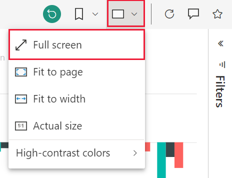
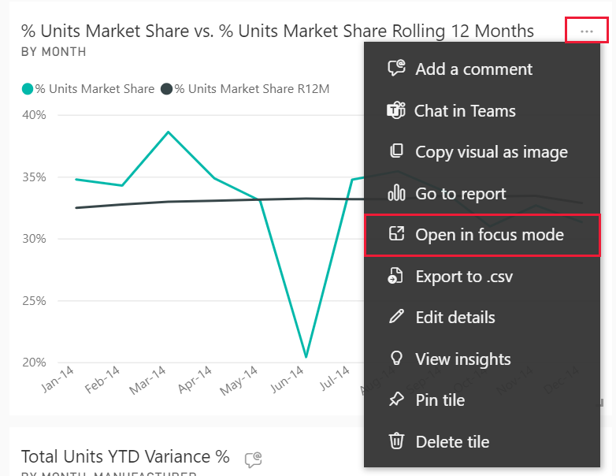
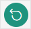

# Display content in more detail: focus, full screen, and canvas zoom

[!INCLUDE [consumer-appliesto-yynn](../includes/consumer-appliesto-yynn.md)]

Focus, full screen, and canvas zoom are all different ways to see more detail in your visuals, reports, and dashboards. Used with navigation controls and **View** menu options, you have full control over how your content displays.

:::image type="content" source="media/end-user-focus/power-bi-zoom-four.png" alt-text="Screenshot showing same visual in full screen, focus, and zoom.":::

In this example above, we started with a report that displays three visuals on the report canvas (1), opened one of the visuals in focus mode (2), opened that same visual in full screen mode (3), and then zoomed in to that same visual on a report. 

## Canvas zoom

Canvas zoom (number 4 above) is applied to the Power BI report canvas, regardless of what the canvas is displaying. For example, you can zoom in and out of the canvas whether it is displaying an entire report or a single visual. Canvas zoom is even available when using focus mode or full screen mode.

For report readers, canvas zoom is especially important for improving readability. For report creators, canvas zoom magnifies the canvas to make pixel perfect tweaks. The zoom level is not saved with the report.

:::image type="content" source="media/end-user-focus/power-bi-slider-zoom.png" alt-text="Screenshot showing canvas  zoom.":::

You will find the zoom controls in the lower right corner of the Power BI report canvas. Drag the slider to set the zoom level or select the zoom % to enter a custom input. And, when you're ready to return to the default view, select the **Fit to page** icon .

## Focus mode and full screen mode
Focus mode (number 2 above) allows you to fill your report canvas with a single image. Full screen (number 3 above) is similar, except that it also removes all the panes surrounding your report canvas. Full screen is often referred to as "TV mode" because it displays your content without the distraction of menus and nav panes.

If you're using Power BI mobile, [full screen is available for Windows 10 mobile apps](./mobile/mobile-windows-10-app-presentation-mode.md). 

## Compare canvas zoom, full screen, and focus mode

Let's take a closer look at the similarities and differences.  

|Content    | Focus mode  |Full screen mode  | Canvas zoom |
|---------|---------|----------------------|--------|
|Dashboard     |   Not possible     | yes | Not possible |
|Report page   | Not possible  | yes| yes  |
|Report visual | yes    | yes |  yes  |
|Dashboard tile | yes    | Not possible |  Not possible  |
|Windows 10 mobile | Not possible | Yes | Not possible |

## When to use full screen mode

Some uses for full screen mode are:

* presenting your dashboard, visual, or report at a meeting or conference
* displaying in an office on a dedicated large screen or projector
* viewing on a small screen
* reviewing in locked mode -- you can touch the screen or mouse over tiles without opening the underlying report or dashboard

## Working in full screen mode

Full screen mode is available for dashboards, reports, and report visuals. 

- To open a dashboard in full screen mode, select the full screen icon  from the top menu bar. 

- To open a report page in full screen mode, select **View** > **Full screen**.

    

- To see a visual in full screen mode, first open it in focus mode and then select **View** > **Full screen**.  

Your selected content fills the entire screen. Once you're in full screen mode, navigate using the menu bars at the top and bottom. 

:::image type="content" source="media/end-user-focus/power-bi-full-menu.png" alt-text="Screenshot showing bottom menu options.":::

Power BI maintains full screen mode until you exit out by selecting **Esc** or the **Exit full screen icon** . 

> [!NOTE]
> Because full screen is available for such a wide variety of content, the navigation options vary.

## When to use focus mode?

***Focus*** mode lets you expand (pop out) a visual or tile to see more detail.  Maybe you have a dashboard or report that is a little crowded and you want to zoom in on only one visual.  This is a perfect use of focus mode.  

While in focus mode, you can interact with any filters that were applied when this visual was created.  

## Working in focus mode

Focus mode is available for dashboards tiles and report visuals. 

- To open a dashboard tile in focus mode, hover over a dashboard tile, select **More options** (...), and choose **Open in focus mode**.

    

- To open a report visual in focus mode, hover over the visual and select the **focus mode** icon .  

   

The visual opens and fills the entire canvas. Notice that you still have a **Filters** pane that you can use to interact with the visual. The **Filters** pane can be collapsed.

   

     

Explore further by [modifying the filters](end-user-report-filter.md) and looking for interesting discoveries in your data. As a *business user*, you can't add new filters, change the fields being used in the visuals, or create new visuals.  However, you can interact with the existing filters. 

For a dashboard tile, your changes can't be saved. For a report visual, any modifications you make to the existing filters are saved when you exit Power BI. If  you don't want Power BI to remember your modifications, select the **Reset to default** button.   

Leave focus mode and return to the dashboard or report by selecting either **Exit focus mode**,  or **Back to report**.

    

  

## Considerations and troubleshooting

* When using focus mode with a visual in a report, you'll be able to view and interact with all filters: Visual level, Page level, Drillthrough, and Report level.    
* When using focus mode with a visual on a dashboard, you'll be able to view and interact with only the Visual level filter.

## Next steps

[View settings for reports](end-user-report-view.md)