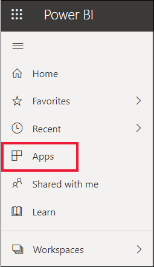
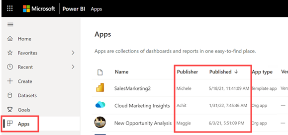
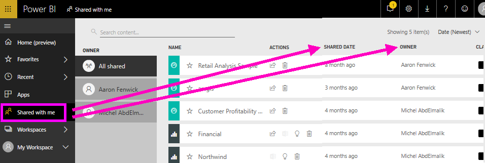
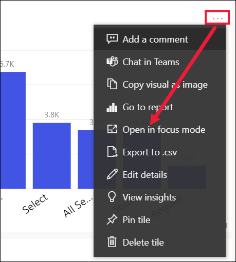
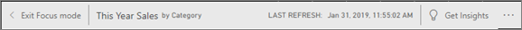
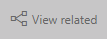

# Your content is up-to-date
As a *consumer*, you interact with content that is created by *designers* and shared with you. You might wonder if that content is up-to-date or maybe you just want to know when that content was last refreshed. Knowing that you are working with the freshest content gives you confidence.  
 

Making sure you’re using the latest data is often critical in making the right decisions. What can you do to ensure you're using the latest content? In most cases, you don’t need to do anything at all. Apps that have been shared with you are automatically refreshed and updated on a schedule set by the app designer. Same goes for dashboards and reports that have been shared with you -- the designer either manually, or using an automated refresh schedule, ensures that the content is fresh.  

If you have questions about the data freshness, contact the designer.

## How to locate the name of the designer

### Apps

The app screen shows you both the name of the designer as well as the date the app was created.  

1. From the left nav pane, select **Apps**.

    

    For each app, you'll see a title and date created. 

2. Hover over the app to also display the name of the designer. 

    

### Shared with me
The **Shared with me** screen shows you the name of the content owner, as well as the date the content was shared with you.

 

## How to look up the last refresh date
If interested, you can look up the last refreshed date for most content. 

### Dashboard tiles
For dashboard tiles, view the tile in Focus mode to see the Last refresh timestamp.

1. On a dashboard tile, select the ellipses (...) and choose **Open in Focus mode**.

    

2. The last refresh date displays in the upper right corner. If you don't see it, expand your browser to make it wider. 

    

### From dashboards and reports
Another way to look up a last refreshed date is by using **View related**.  **View related** is available from the Power BI upper menu bar.

The **Related content** pane displays the last refresh infromation for the dashboard's or report's underlying dataset.

## What happens if an app is deleted by the designer

If a designer deletes an app, the dashboards and reports associated with that app are automatically removed from your Power BI workspace as well. They're no longer available, and the app doesn't appear in the Navigation Pane.

## Subscribe to see changes
Another way to stay up-to-date, is to subscribe to a report or dashboard. Instead of having to log in and open a report or dashboard, you tell Power BI to send you a snapshot on a schedule you set.  For more information, see [subscribe to dashboards and reports](end-user-subscribe.md).

## Set data alerts
Want to be notified if data changes above or beyond a limit you set? [Create a data alert](end-user-alerts.md).  It's easy to stay up-to-date using data alerts. With data alerts, you tell Power BI to send you an email if a value in a report passes a specific threshhold.  For example, if inventory falls below 25 units or if sales exceed goals.  

## Next steps
[Create a data alert](end-user-alerts.md)    
[subscribe to dashboards and reports](end-user-subscribe.md)    
[View related content](end-user-related.md)    
