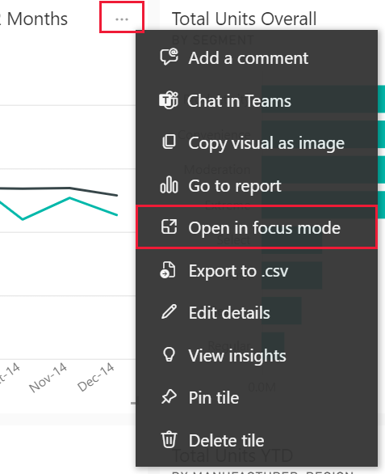

# How to determine that content is up to date

[!INCLUDE[consumer-appliesto-yynn](../includes/consumer-appliesto-yynn.md)]

This article shows you how to determine when your content was last updated or refreshed and also provides some suggestions for ways to stay in sync with your most important data. 

## Timestamps in the Power BI service
As a *business user*, you interact with content that is created by *designers* and made available to you in different ways. This content contains timestamps to help you know when it was published or shared, as well as when it was last updated.  Knowing that you are working with the freshest content gives you confidence and is often critical in making the right decisions. 

What can you do to ensure you're using the latest content? In most cases, you don’t need to do anything at all. Apps that have been shared with you are automatically refreshed and updated on a schedule set by the app designer. Same goes for things like dashboards, scorecards, and reports -- the designer either manually, or using an automated refresh schedule, ensures that the content is fresh.  

If you ever have questions about content freshness, contact the designer. In the examples below we'll include information on identifying and contacting the owner for your content. 

Let's take a look at several different ways to ensure that you're working with the freshest content.

:::image type="content" source="media/end-user-fresh/power-bi-owner.png" alt-text="Overlapping image showing three ways to check freshness.":::

### The different types of timestamps
Power BI adds date and time information when content is published, shared, updated, and refreshed. For example, apps have a **Published** date and the content within an app has an **Updated** date. Other types of content have **Shared** and  **Refreshed** dates. 

It's less helpful to know which type of timestamp goes where, and more helpful to know where to find a timestamp. Here are some general guidelines to help you determine the freshness of your content. 

### Content lists 

When you open a list of content in the Power BI service, you'll see a column that identifies the owner and a column with a timestamp.  The examples below are from  **Apps**, **Shared with me**, and a workspace. Notice the different types of timestamps: **Published**, **Shared**, **Refreshed**, and **Next refresh**. 

:::image type="content" source="media/end-user-fresh/power-bi-app.png" alt-text="List of apps showing Published date.":::

 

:::image type="content" source="media/end-user-fresh/power-bi-app-workspace-list.png" alt-text="Workspace open to content list.":::

The *designer* sets up the refresh schedule for content. Some content updates continually while other content may refresh daily, weekly, or not at all. Not all content is scheduled for refreshing, so you may see empty entries. If the refresh encounters an error, you'll see an error icon. 

### Viewing reports
When you open and view a report, you'll notice a dropdown arrow in the center of the menu bar. Select the arrow to display contact information and a timestamp. Dashboards, worksheets, and scorecards display the owner but not a timestamp. Select the **Owner** or **Contact** link if you have questions or suggestions for the owner of the report.

:::image type="content" source="media/end-user-fresh/power-bi-owners.png" alt-text="Report with title dropdown displayed.":::

### Viewing dashboards
The dashboard title dropdown displays a **Contact**, but not a timestamp.  However, you can look up the last refresh date for individual dashboard tiles and for the  underlying dataset. 

:::image type="content" source="media/end-user-fresh/power-bi-dashboard-menu.png" alt-text="Marketing and sales dashboard dropdown":::

View a tile in Focus mode to see the Last refresh timestamp.
On a dashboard tile, select **More options** (...) and choose **Open in Focus mode**.

The last refresh date displays in the upper right corner. If you don't see it, expand your browser to make it wider. 

Return to the dashboard and select **More actions (...)** > **See related content** from the Power BI upper menu bar.

The **Related content** pane displays the last refresh information for the dashboard's or report's underlying dataset.

## Stay in sync with your content
There are a couple of built in Power BI features that can help you stay up-to-date with your most important content. 

## Set data alerts
Want to be notified if data changes above or beyond a limit you set? [Create a data alert](end-user-alerts.md) for a dashboard.  It's easy to stay up-to-date using data alerts. With data alerts, you tell Power BI to send you an email if a value on a dashboard passes a specific threshold.  For example, if inventory falls below 25 units or if sales exceed goals.  

## Subscribe to see changes
Another way to stay up-to-date is to subscribe to a report or dashboard. Instead of having to log in and open a report or dashboard, you tell Power BI to send you a snapshot on a schedule you set.  For more information, see [subscribe to dashboards and reports](/power-bi/collaborate-share/end-user-subscribe).

## Considerations and limitations

- Within an app, each piece of content will have its own **Date updated** and/or **Owner** that may be different than the app published date and app owner.  

## Next steps
[Create a data alert](end-user-alerts.md)    
[Subscribe to dashboards and reports](/power-bi/collaborate-share/end-user-subscribe)    
[View related content](end-user-related.md)