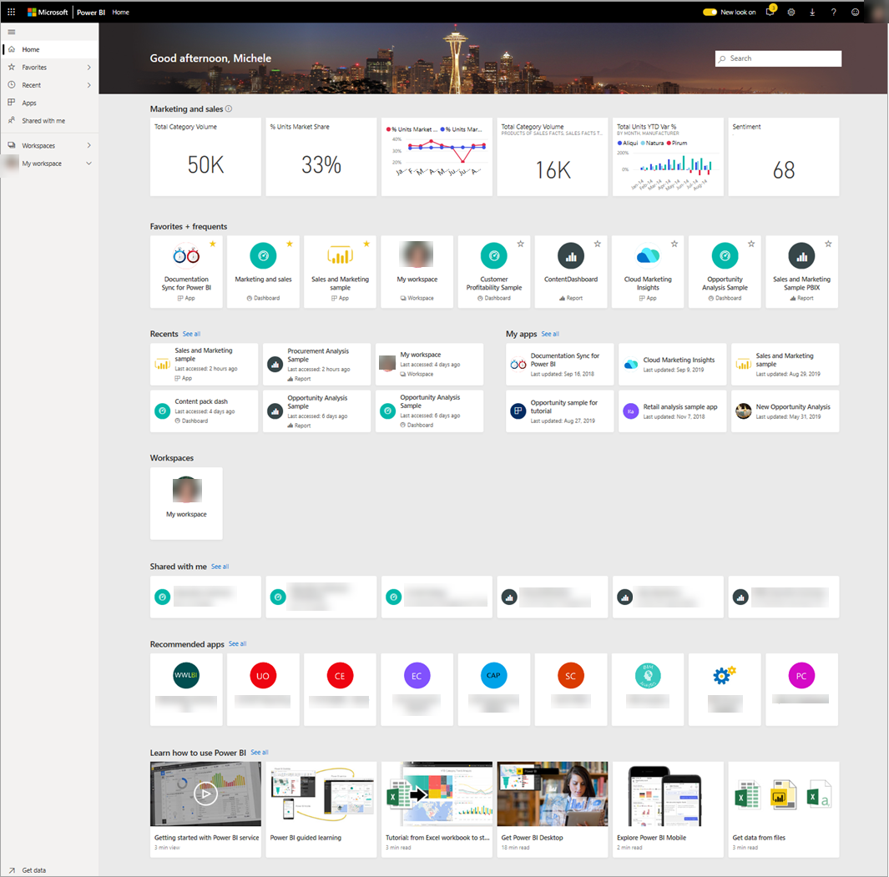
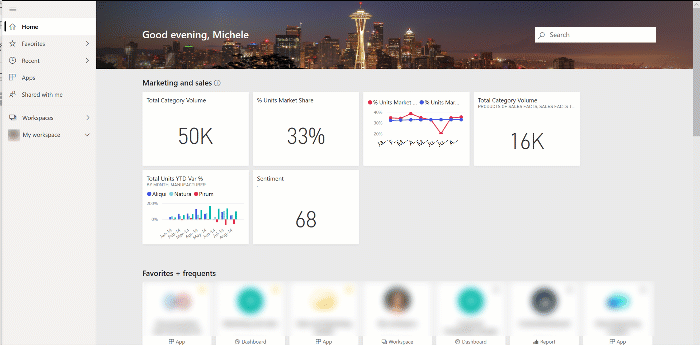
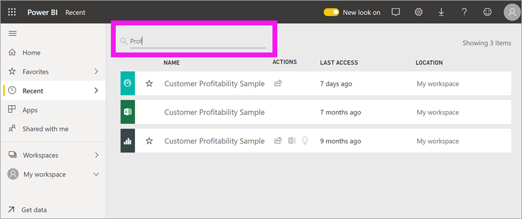

# Find your dashboards, reports, and apps
In Power BI, the term *content* refers to apps, dashboards, and reports. Content is created by Power BI *designers*, who share it with colleagues like you. Your content is accessible and viewable in the Power BI service, and the best place to start working in Power BI is from your home landing page.

## Explore Power BI Home
When you sign in, Power BI opens and displays your Home canvas, as shown in the following figure.
 

Power BI Home offers three different ways of locating and viewing your content. All three access the same pool of content, they’re merely different ways of getting to that content. Occasionally, searching will be the easiest and quickest way to find something, while other times, selecting a *card* on the Home canvas will be your best option.
1.	The Home canvas displays and organizes your favorite and most recent content, along with recommended content and learning resources. Each piece of content displays as a *card*, with a title and icon. Selecting a card opens that content.
2.	Along the left side, is a navigation pane, referred to as the nav bar. On this pane, your same content is organized a little differently, by Favorites, Recent, Apps, and Shared with me. From here, you can view lists of content and select the one to open.
3.	In the upper right corner, the global search box lets you search for content by title, name, or keyword.

The following topics review each of these options for finding and viewing content.

## Home canvas
On the Home canvas, you can view all the content that you have permission to use. At first, you might not have much content on your Home canvas (see image above), but that will change as you start to use Power BI with your colleagues.

Your Home canvas also updates with recommended content and learning resources. 
 
As you work in the Power BI service, you’ll receive dashboards, reports, and apps from colleagues, and then your Home page will eventually fill in. Over time, it might resemble the following Home page.

 
The next few topics take a closer look at this Home page, from top to bottom.

## Most important content at your fingertips

### Favorites and frequents
This top section contains links to the content that you visit most often or that you’ve tagged as [featured or favorite](end-user-favorite.md). Notice that several cards have yellow stars; those two apps and that dashboard have been tagged as favorites.
 
### Recents and My apps
The next section displays the content you’ve visited most recently. Notice the timestamp on each card. The **My apps** section lists apps that have been shared with you or that you've [downloaded from AppSource](end-user-apps.md); the most recent apps are listed here. You can select **See all** to display a list of all apps that are shared with you.

### Workspaces
As a Power BI *consumer*, you typically have only one workspace, **My workspace**. 

### Shared with me
Colleagues share apps with you, but they can also share individual dashboards and reports. In the **Shared with me** section, notice that there are three dashboards and three reports that your colleagues have shared with you.

### Recommended apps
Based on your activity and account settings, Power BI displays a set of recommended apps. Selecting an app card opens the app.
 
### Learning resources
At the bottom of the Home canvas is a set of learning resources. The exact resources that appear depend on your activity and settings and Power BI administrator. 
 
## Explore the navigation pane (nav bar)

Use the left navigation pane (nav bar) to locate and move between dashboards, reports, and apps. Occasionally, using the nav bar will be the quickest way to get to content.
The nav bar is there when you open your Home landing page, and remains static as you open other areas of the Power BI service.
  
The nav bar organizes your content into containers that are similar to what you’ve already seen on the Home canvas: Favorites, Recent, Apps, and Shared with me. Using the flyouts, you can view just the most-recent content in each of these containers, or you can navigate to content lists to see all content for each container category.
 
- To open one of these content sections and display a list of all items, select the heading.
- To see the most recent in each container, select the flyout (**>**)

    

 
The nav bar is another way for you to find the content you want, quickly. Content is organized in a manner similar to the Home canvas, but shown in lists instead of cards. 

## Search all of your content
Sometimes, the fastest way to find your content is to search for it. For example, perhaps you’ve discovered that a dashboard you haven’t used in a while isn’t showing up on your Home canvas. Or, perhaps you remember that your colleague, Aaron, shared it with you, but you don’t remember what he called it or what type of content he shared, whether it was a dashboard or a report.
 
You can enter the full or partial name of that dashboard and search for it. Additionally, you can enter your colleague’s name and search for content that he has shared with you. The search is scoped to look for matches in all the content that you own or have access to.

## Next steps
Overview of the [Power BI basic concepts](end-user-basic-concepts.md)