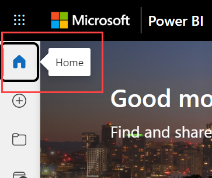

# Find your dashboards, reports, and apps

[!INCLUDE[consumer-appliesto-yynn](../includes/consumer-appliesto-yynn.md)]

In Power BI, the term *content* refers to apps, dashboards, reports, and more. Content is created by Power BI designers who share it with their colleagues. Your content is accessible and viewable in the Power BI service. The best place to start working in the Power BI service is from Power BI **Home**.

## Explore Power BI Home

After you sign in to the Power BI service, select **Home** from the navigation pane.

Power BI displays your Home canvas. The layout and content on Home is different for every user. New users have less content, but that changes as they use Power BI more often. Only content that you can access appears on your Home. For example, if you don't have permissions to a report, that report doesn't appear on Home.

## Simplified layout and Expanded layout

Your Home view also depends on the layout you select. The **Simplified** view is the default. This view shows **Recommended** content at the top with tabs for **Recent**, **Favorites**, and **My apps** below. **Recommended** content might include content that:

- you've marked as a favorite
- you visit often
- is visited often by colleagues in your organization
- has been featured on Home
- is used frequently by your closest colleagues
- is Getting started content

The example below shows a **Simplified** layout for a new user:

:::image type="content" source="media/end-user-home/power-bi-home.png" alt-text="Screenshot of Simplified view for a new user.":::

The next example shows a **Simplified** layout for an experienced user:

:::image type="content" source="media/end-user-home/power-bi-simplified-user.png" alt-text="Screenshot showing Power BI Home of an experienced user with the Simplified toggle selected.":::

The **Expanded** layout includes a different set of information. Once you select the **Expanded** toggle, the expanded layout becomes your default Home layout. The example below shows the **Expanded** view for a new user.

:::image type="content" source="media/end-user-home/power-bi-user-home.png" alt-text="Screenshot of Expanded view for a new user.":::

The next example shows the **Expanded** view for an experienced user.

:::image type="content" source="media/end-user-home/power-bi-expanded-user.png" alt-text="Screenshot showing the Power BI service Home of an experienced user with the Expanded toggle selected.":::

## Locating content from your Home canvas

Power BI Home offers three different ways of locating and viewing your content. All three routes access the same pool of content in different ways. Occasionally, searching is the easiest and quickest way to find something, while other times, selecting a card on the Home canvas is your best option.

- The Home canvas shows your favorite, frequent, recent, recommended, apps and workspaces. If you're new to the Power BI service, you also have Getting started content. Select a card, or an item in a list, to open it.
- Along the left side, is a navigation pane, referred to as the nav pane. On the nav pane, your same content is organized differently. Select **Browse** to see your recent, favorite, and shared content. Select **Data hub** to see data available to you from across your organization. Select **Apps** to see a list of apps available to you. And select **Knowledge center** to see learning materials, sample reports, and training.
- At the top, the global search box lets you search for content by title, name, or keyword.

The following topics review these options for finding and viewing content.

## Home canvas

On the Home canvas, you can view all the content that you have permission to use. Your Home canvas also updates the getting started content, samples, and learning resources. At first, you might not have much content on your Home canvas, but that changes as you start to use Power BI with your colleagues.

As you work in the Power BI service, you receive dashboards, reports, and apps from colleagues, and Power BI Home fills in with content. Over time, it might resemble the following Expanded layout example.

:::image type="content" source="media/end-user-home/power-bi-full-new.png" alt-text="A screenshot of the Welcome screen for the Power BI service.":::

The next few topics take a closer look at each section of Home. Your Home landing page might look different. Power BI optimizes Home based on your usage, settings, and the layout you select.

## Most important content at your fingertips

### Favorites and frequents

This section contains links to the content that you visit most often or that you've tagged as [a favorite](end-user-favorite.md). These cards have black stars because they've been tagged as favorites.

### Featured

The **Featured** section contains content that your administrator or colleagues have *promoted* to your Home. Typically, this is content that is important or helpful for you to do your job. In this example, the featured content includes metrics to track success. Unless it's been disabled by your administrator, any user with Administrator, Member, or Contributor permissions to a workspace can feature content on Home. For more information about featuring content on Home, see [Feature content on colleagues' Power BI Home](../collaborate-share/service-featured-content.md)

### Recents and My apps

The next section is two (or more) tabbed lists.

- **Recent** is the content you've visited most recently. Notice the timestamp for each item.

- The **My apps** section lists [apps that have been shared with you](end-user-apps.md) or that you've [downloaded from AppSource](end-user-apps.md). The most recent apps are listed here.

- In some scenarios, you have a tab for content that you've tagged as [**Favorites**](end-user-favorite.md).

### Getting started learning resources

The exact resources that appear depend on your activity, settings, and Power BI administrator. If you're a new user, Getting started content is under **Recommended** in the **Simplified** layout. A **Getting started with Power BI** section is in the **Expanded** layout. If you want to remove the Getting started tabs in the **Expanded** layout, select **Hide getting started**.

## Explore the nav pane

The nav pane classifies your content in ways that help you find what you need quickly.  

Use the nav pane to locate and move between dashboards, reports, and apps. Occasionally, using the nav pane is the quickest way to get to content. The nav pane is there when you open your Home landing page and remains there as you open other areas of the Power BI service. It can be collapsed by selecting this icon  .
  
The nav pane organizes your content into containers that are similar to what you've already seen on the Home canvas, like Favorites, Recent, Apps, Datasets, Metrics, Shared with me, and workspaces. Some containers have flyouts that offer you the option of viewing the most recent content in a container. Otherwise, select a container to see all the content.

- To open one of these content sections and show a list of all items, select the heading.
- To see the most recent in either the **Favorites** or **Recent** container, select the flyout (**>**).

    

The nav pane is a way for you to find the content you want quickly. Content is organized in a manner similar to the Home canvas, but shown in lists instead of cards.

### Workspaces

Every Power BI service user has one **My workspace**. **My workspace** only contains content if you download Microsoft samples or create your own dashboards, reports, or apps. For many business users, **My workspace** is empty and remains empty. If you're a brand new user, you only have one workspace, **My workspace**.

And if you select that one workspace, it's empty.

If someone in your organization adds you to a workspace, it's in your list of workspaces. Over time, you might have more than one workspace. For example, your coworkers can add you to a workspace by giving you a role, such as Member, Contributor, or Viewer. If you [download a template app](end-user-app-marketing.md) from outside your organization, you get an app and a new workspace. You can also create workspaces if you have a Power BI Pro or Premium Per User license. To open a workspace, select it from the nav pane.

The workspace opens on your canvas, and the name of the workspace is listed on your nav pane. When you open a workspace, you can view its content. This includes content such as dashboards, reports, worksheets, and dataflows. In the following example, the **Supplier Quality Analysis** workspace is open and it contains one report, one dashboard, and one dataset.

## Search all of your content

Sometimes, the fastest way to find your content is to search for it. For example, perhaps you've discovered that a dashboard you haven't used in a while isn't showing up on your Home canvas. Or, perhaps you remember that your colleague, Aaron, shared something with you, but you don't remember what he called it or what type of content he shared. Or you may have so much content that it's easier to search than to scroll or sort.

The search field is located in the upper right section of the Home menu bar. You can enter the full or partial name of that dashboard and search for it. You can also enter your colleague's name and search for content that they've shared with you. The search is scoped to look for matches in all the content that you own or have access to.

## Considerations and limitations

The ability to hide items on Power BI Home is deprecated. If you previously hid items, they will remain hidden. To manage your hidden items, select **Settings** > **Settings** > **General** > **Hidden items**.

:::image type="content" source="media/end-user-home/power-bi-hidden.png" alt-text="Screenshot of the General tab showing Hidden items option selected":::

## Next steps

Overview of the [Power BI basic concepts](end-user-basic-concepts.md)
