# Find your dashboards, reports, and apps

[!INCLUDE[consumer-appliesto-yynn](../includes/consumer-appliesto-yynn.md)]
In Power BI, the term *content* refers to apps, dashboards, and reports. Content is created by Power BI *designers*, who share it with colleagues like you. Your content is accessible and viewable in the Power BI service, and the best place to start working in Power BI is from Power BI **Home**.

## Explore Power BI Home
After you sign in to the Power BI service, select **Home** from the navigation pane. 

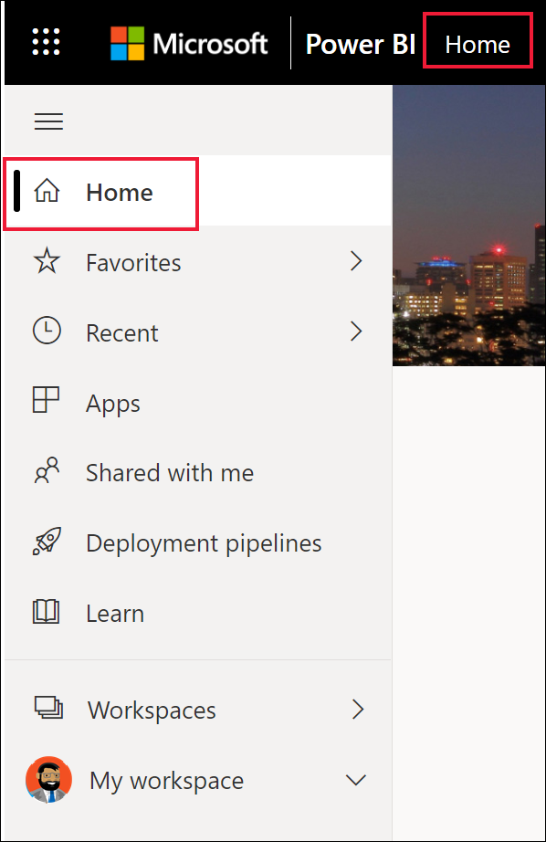

Power BI displays your Home canvas, as shown in the following image. The layout and content on Home is different for every user. Later in this article, we'll see Home for a brand new user and for a very experienced user. 
 
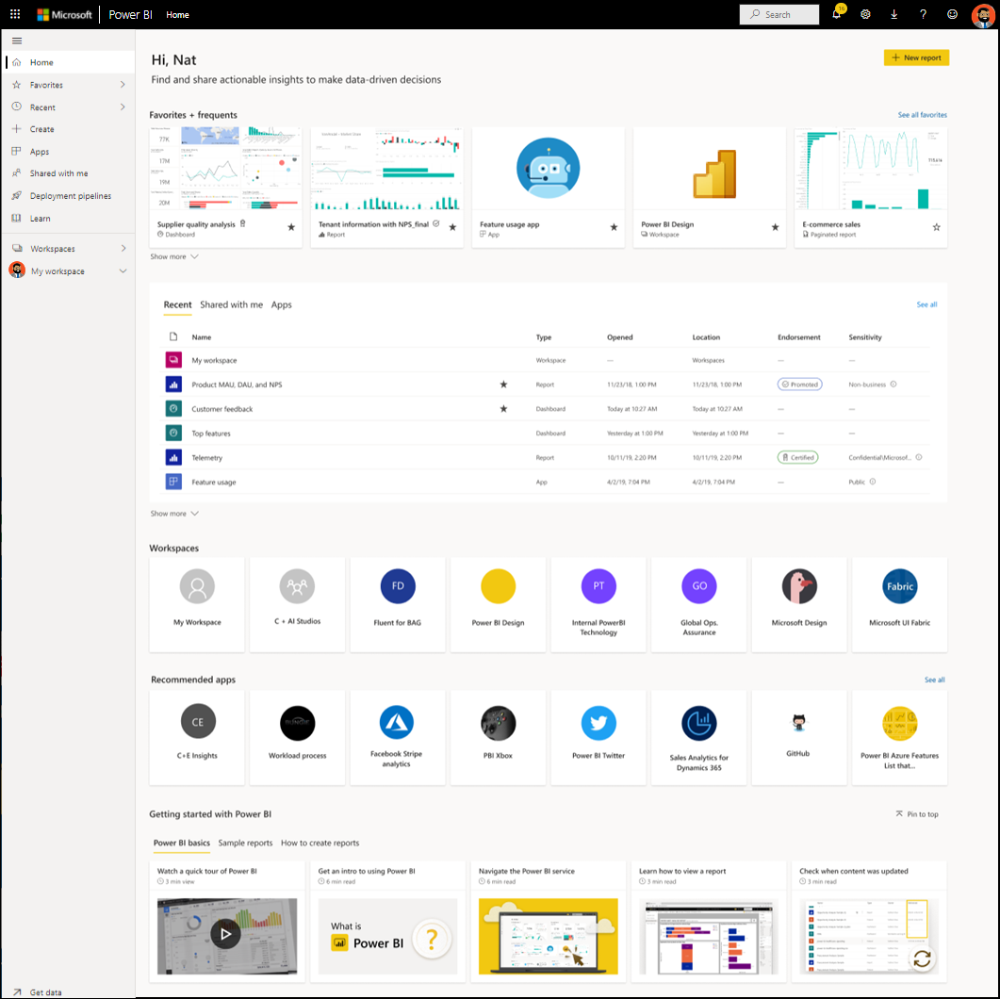

Power BI Home offers three different ways of locating and viewing your content. All three access the same pool of content, they're merely different ways of getting to that content. Occasionally, searching will be the easiest and quickest way to find something, while other times, selecting a *card* on the Home canvas will be your best option.

- The Home canvas displays and organizes your favorite, frequent, recent, and recommended content, along with apps and workspaces.  If you're new to the Power BI service, you'll also have a Getting started section. Select a card, or an item in a list, to open it.
- Along the left side, is a navigation pane, referred to as the nav pane. Select  to expand the nav pane. On the nav pane, your same content is organized a little differently, by Favorites, Recent, Apps, and Shared with me. From here, you can view lists of content and select the one to open.
- In the upper right corner, the global search box lets you search for content by title, name, or keyword.

The following topics review each of these options for finding and viewing content.

## Home canvas
On the Home canvas, you can view all the content that you have permission to use. Your Home canvas also updates with recommended content and learning resources. At first, you might not have much content on your Home canvas, but that will change as you start to use Power BI with your colleagues.

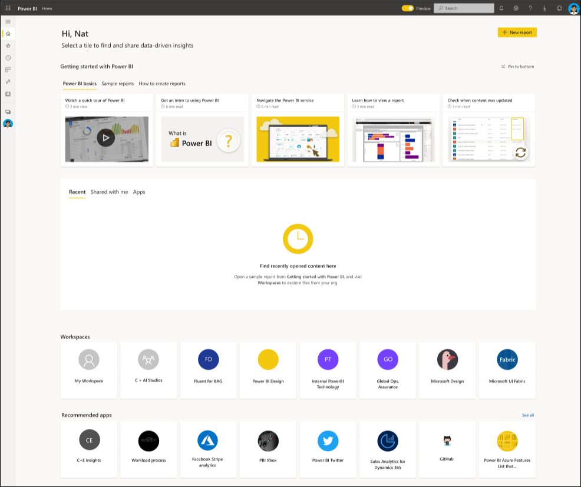

 
As you work in the Power BI service, you'll receive dashboards, reports, and apps from colleagues, and then Power BI Home will eventually fill in. Over time, it might resemble the following.

 
The next few topics take a closer look at Home for an experienced user, from top to bottom. Your Home landing page may look different. Power BI optimizes Home based on your usage and settings.

## Most important content at your fingertips

### Favorite dashboards
This top section will display tiles from your favorite dashboard. The Power BI service selects from dashboards that you use the most and have marked as [a favorite](end-user-favorite.md).

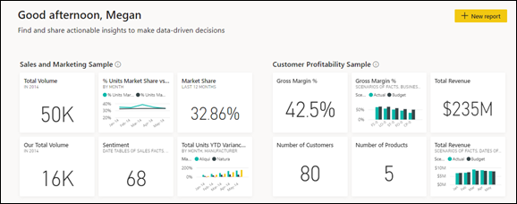

Alternately, you can decide yourself which dashboard to display here. Open a dashboard and tag it as [featured](end-user-featured.md). Pick the one dashboard that you expect to view most often, and set it as your *featured* content. Each time you open the Power BI service, your featured dashboard will display first. 

### Favorites and frequents
This next section contains links to the content that you visit most often or that you've tagged as [a favorite](end-user-favorite.md). Notice that several cards have black stars; they've been tagged as favorites. 

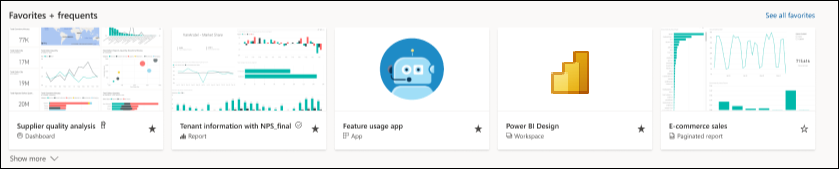

### Featured
The **Featured** section contains content that your administrator has *promoted* to your Home. Typically, this is content that is important or helpful for you to do your job. In this example, the featured content includes metrics to track success.

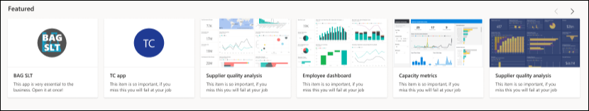

### Recents and My apps
The next section is two (or more) tabbed lists. 
- **Recent** is the content you've visited most recently. Notice the timestamp for each item. 

- The **My apps** section lists [apps that have been shared with you](end-user-apps.md) or that you've [downloaded from AppSource](end-user-apps.md); the most recent apps are listed here. 

- In some scenarios, you'll also see a tab for **Favorites**. 

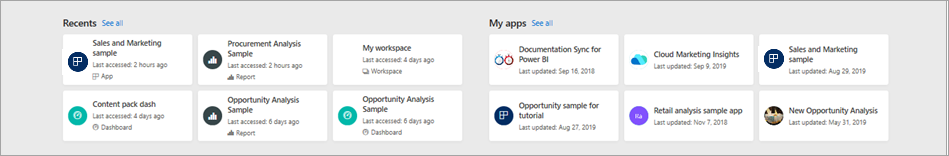

### Recommended
Based on your activity and account settings, Power BI displays a set of recommended apps. Selecting an app card opens the app. Apps with the blue icon are [template apps](../connect-data/service-template-apps-overview.md).

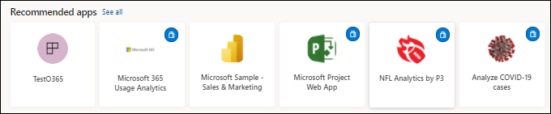
 
### Getting started learning resources
The exact resources that appear depend on your activity, settings, and Power BI administrator. If you're a new user, the Getting started section displays at the top of Home. If you're a new user, and you no longer want to see Getting started at the top of Home, select **Pin to bottom**. When you no longer need to see the Getting started tabs, select **Hide getting started**.

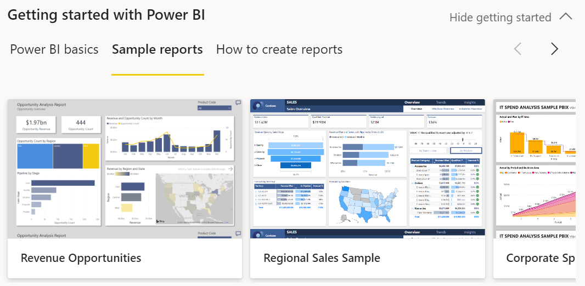

### Hide items on Power BI Home

You can hide items from the different sections of your Home canvas: Favorites + frequents, Featured, Recents, Shared with me, and My apps. Even if you hide them on the Home canvas, you can still access the items from the left nav and from Search. You can add them back to Home at any time.

## Explore the nav pane

The nav pane classifies your content in ways that help you find what you need, quickly.  

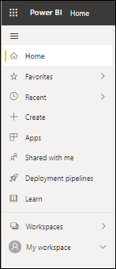

Use the nav pane to locate and move between dashboards, reports, and apps. Occasionally, using the nav pane will be the quickest way to get to content. The nav pane is there when you open your Home landing page, and remains there as you open other areas of the Power BI service. It can be collapsed by selecting the Hide icon  .
  
The nav pane organizes your content into containers that are similar to what you've already seen on the Home canvas: Favorites, Recent, Apps, Datasets, Shared with me, and workspaces. Some containers have flyouts that offer you the option of viewing just the most-recent content in a container. Otherwise, select a container to see all content.
 
- To open one of these content sections and display a list of all items, select the heading.
- To see the most recent in either the **Favorites** or **Recent** container, select the flyout (**>**).

    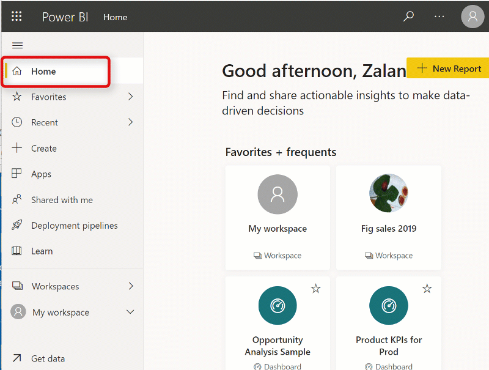

 
The nav pane is another way for you to find the content you want, quickly. Content is organized in a manner similar to the Home canvas, but shown in lists instead of cards. Even if you hide content from the Home canvas, you can still access it from the nav pane.

### Workspaces
Every Power BI service user has one **My workspace**. **My workspace** will only contain content if you've downloaded Microsoft samples or created your own dashboards, reports, or apps. For many *business users*, **My workspace** will be empty and will remain empty. If you're a brand new user, you will only have one workspace, **My workspace**.

And if you select that one workspace, you'll find it empty.

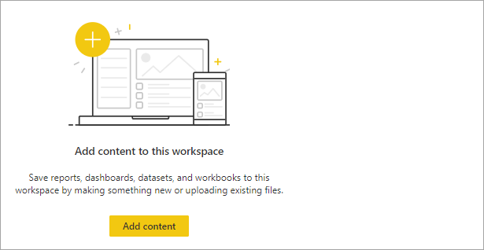

If someone in your organization adds you to a workspace, you'll see it in your list of workspaces. Over time, you'll have more than one workspace. For example, your coworkers can add you to a workspace by giving you a role, such as Member, Contributor, or Viewer. If you [download a template](end-user-app-marketing.md) from outside your organization, you get the combination of an app and a new workspace. You can also create workspaces, if you have a Power BI Pro or Premium Per User license. To open a *workspace*, select it from the nav pane. 

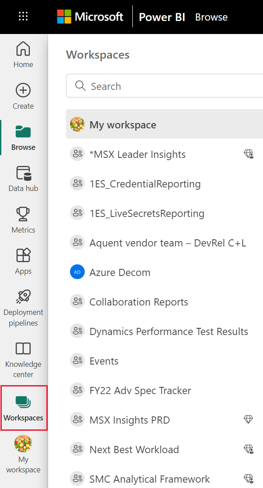

The workspace opens on your canvas and you can see the name of the workspace listed on your nav pane. Within workspaces, you see your dashboards and reports. In some cases, you'll also have workbooks and datasets. You'll see this organization when you select a workspace. In this example, the **Supplier Quality Analysis** workspace contains one report, one dashboard, and one dataset.

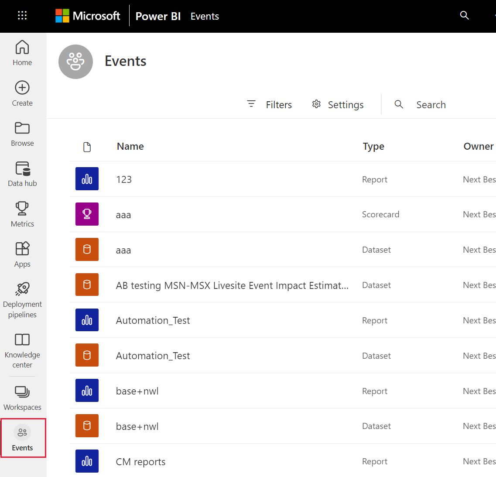

## Search all of your content
Sometimes, the fastest way to find your content is to search for it. For example, perhaps you've discovered that a dashboard you haven't used in a while isn't showing up on your Home canvas. Or, perhaps you remember that your colleague, Aaron, shared something with you, but you don't remember what he called it or what type of content he shared, whether it was a dashboard or a report. Or you may have so much content that it's easier to search than it is to scroll or sort. 
 
The search field is located in the upper right section of the Home menu bar. You can enter the full or partial name of that dashboard and search for it. Additionally, you can enter your colleague's name and search for content that they have shared with you. The search is scoped to look for matches in all the content that you own or have access to.

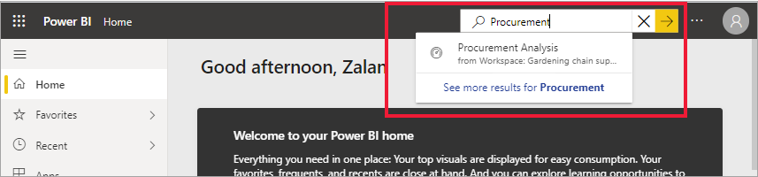

## Next steps
Overview of the [Power BI basic concepts](end-user-basic-concepts.md)

