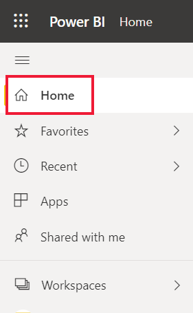
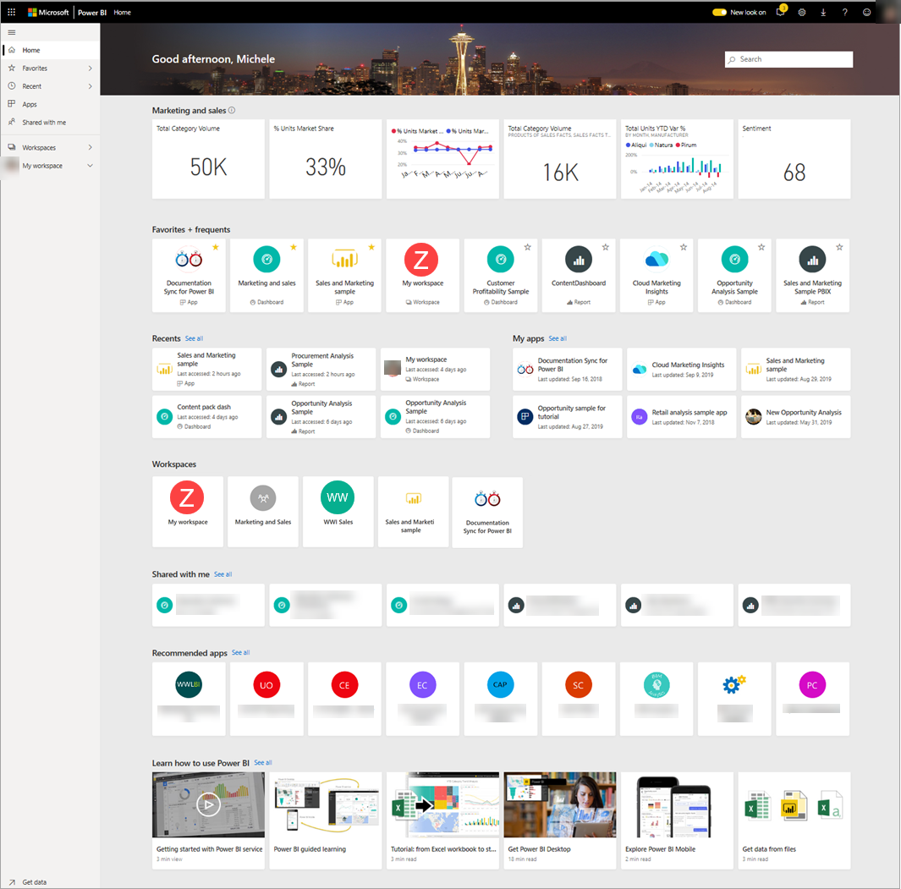
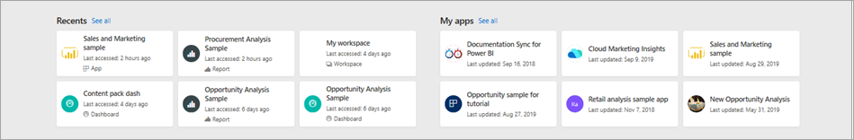
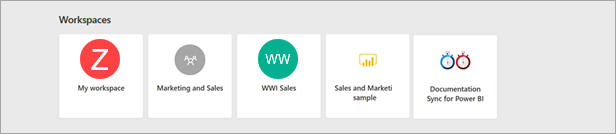
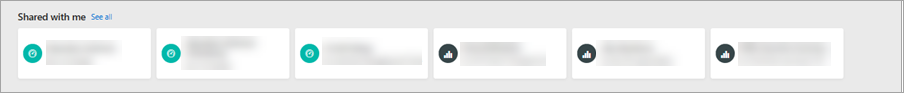
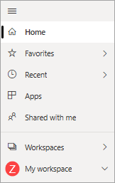

# Find your dashboards, reports, and apps
In Power BI, the term *content* refers to apps, dashboards, and reports. Content is created by Power BI *designers*, who share it with colleagues like you. Your content is accessible and viewable in the Power BI service, and the best place to start working in Power BI is from Power BI **Home**.

## Explore Power BI Home
After you sign in to the Power BI service, select **Home** from the navigation pane. 

Power BI displays your Home canvas, as shown in the following figure.
 

Power BI Home offers three different ways of locating and viewing your content. All three access the same pool of content, they’re merely different ways of getting to that content. Occasionally, searching will be the easiest and quickest way to find something, while other times, selecting a *card* on the Home canvas will be your best option.

- The Home canvas displays and organizes your favorite and most recent content, along with recommended content and learning resources. Each piece of content displays as a *card*, with a title and icon. Selecting a card opens that content.
- Along the left side, is a navigation pane, referred to as the nav pane. On this pane, your same content is organized a little differently, by Favorites, Recent, Apps, and Shared with me. From here, you can view lists of content and select the one to open.
- In the upper right corner, the global search box lets you search for content by title, name, or keyword.

The following topics review each of these options for finding and viewing content.

## Home canvas
On the Home canvas, you can view all the content that you have permission to use. At first, you might not have much content on your Home canvas (see image above), but that will change as you start to use Power BI with your colleagues.

Your Home canvas also updates with recommended content and learning resources. 
 
As you work in the Power BI service, you’ll receive dashboards, reports, and apps from colleagues, and then Power BI Home will eventually fill in. Over time, it might resemble the following.

 
The next few topics take a closer look at this Home canvas, from top to bottom.

## Most important content at your fingertips

### Favorites and frequents
This top section contains links to the content that you visit most often or that you’ve tagged as [featured or favorite](end-user-favorite.md). Notice that several cards have yellow stars; those two apps and that dashboard have been tagged as favorites. 

Additionally, you can tag content as [featured](end-user-featured.md). Pick the one dashboard or report that you expect to view most often, and set it as your *featured* content. Each time you open the Power BI service, your featured dashboard will display first. 

### Recents and My apps
The next section displays the content you’ve visited most recently. Notice the timestamp on each card. The **My apps** section lists apps that have been shared with you or that you've [downloaded from AppSource](end-user-apps.md); the most recent apps are listed here. You can select **See all** to display a list of all apps that are shared with you.

### Workspaces
Every Power BI service consumer has one **My workspace**. **My workspace** will only contain content if you've downloaded Microsoft samples or created your own dashboards, reports, or apps. For many *consumers*, **My workspace** will be empty and will remain empty.  

Each time you [download an app](end-user-app-marketing.md), or an [app is shared with you](end-user-apps.md), a new workspace is created.  To open an *app workspace*, select it on your Home canvas. 

The app opens on your canvas and you can see the name of the workspace listed on your nav pane. Within workspaces, the Power BI service separates your content by type: dashboards and reports. In some cases, you'll also have workbooks and datasets. You'll see this organization when you select a workspace. In this example, the **Gardening chain** workspace contains four dashboards and two reports.

### Shared with me
Colleagues share apps with you, but they can also share individual dashboards and reports. In the **Shared with me** section, notice that there are three dashboards and three reports that your colleagues have shared with you.

### Recommended apps
Based on your activity and account settings, Power BI displays a set of recommended apps. Selecting an app card opens the app.
 
### Learning resources
At the bottom of the Home canvas is a set of learning resources. The exact resources that appear depend on your activity, settings, and Power BI administrator. 
 
## Explore the nav pane

The nav pane classifies your content in ways that help you find what you need, quickly.  

Use the nav pane to locate and move between dashboards, reports, and apps. Occasionally, using the nav pane will be the quickest way to get to content. The nav pane is there when you open your Home landing page, and remains there as you open other areas of the Power BI service. It can be collapsed by selecting the Hide icon  .
  
The nav pane organizes your content into containers that are similar to what you’ve already seen on the Home canvas: Favorites, Recent, Apps, Shared with me, and workspaces. Using the flyouts, you can view just the most-recent content in each of these containers, or you can navigate to content lists to see all content for each container category.
 
- To open one of these content sections and display a list of all items, select the heading.
- To see the most recent in each container, select the flyout (**>**).

    

 
The nav pane is another way for you to find the content you want, quickly. Content is organized in a manner similar to the Home canvas, but shown in lists instead of cards. 

## Search all of your content
Sometimes, the fastest way to find your content is to search for it. For example, perhaps you’ve discovered that a dashboard you haven’t used in a while isn’t showing up on your Home canvas. Or, perhaps you remember that your colleague, Aaron, shared something with you, but you don’t remember what he called it or what type of content he shared, whether it was a dashboard or a report. Or you may have so much content that it's easier to search than it is to scroll or sort. 
 
The search field is located in the upper right section of the Home menu bar. You can enter the full or partial name of that dashboard and search for it. Additionally, you can enter your colleague’s name and search for content that he has shared with you. The search is scoped to look for matches in all the content that you own or have access to.

## Next steps
Overview of the [Power BI basic concepts](end-user-basic-concepts.md)
