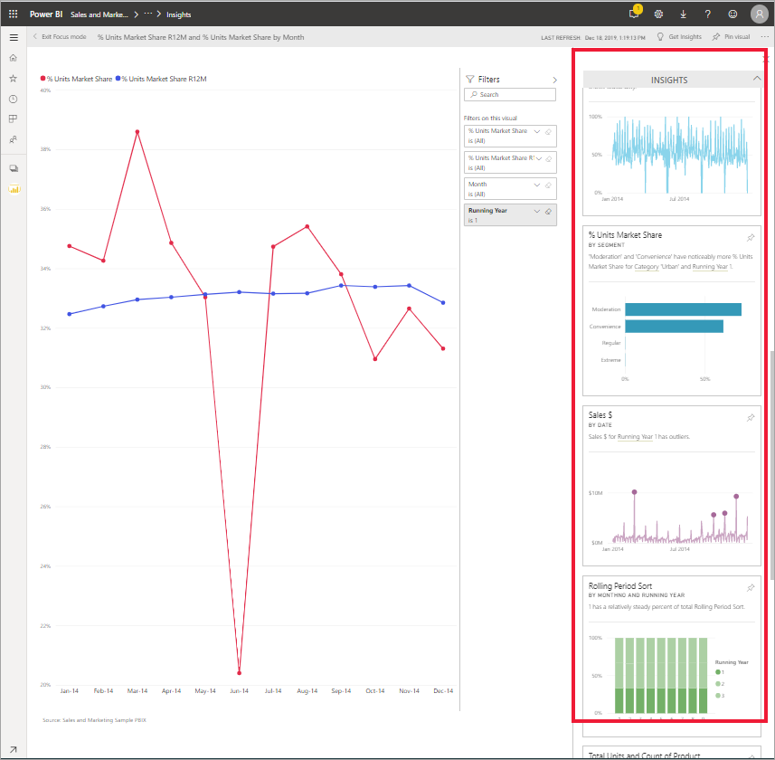
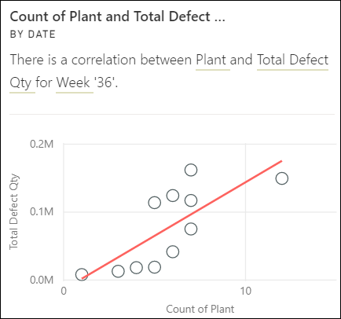

# Types of insights supported by Power BI

[!INCLUDE[consumer-appliesto-yyny](../includes/consumer-appliesto-yyny.md)]

You can ask Power BI to look through your data and find interesting trends and patterns. These trends and patterns are presented in the form of visuals that are called *Insights*. Insights are available for visuals on dashboards, visuals in reports, and entire report pages. 

To learn how to use Insights, see [Power BI Insights](end-user-insights.md)

## How does Insights work?
Power BI quickly searches different subsets of your dataset. As it searches, Power BI applies a set of sophisticated algorithms to discover potentially interesting insights. You can run Insights on dashboard tiles, report visuals, and report pages.

## Some terminology
Power BI uses statistical algorithms to uncover  Insights. The algorithms are listed and described in the next section of this article. Before we get to the algorithms, here are definitions for some terms that may be unfamiliar. 

* **Measure** - a measure is a quantitative (numeric) field that can be used to do calculations. Common calculations are sum, average, and minimum. For example, if our company makes and sells skateboards, our measures might be number of skateboards sold and average profit per year.  
* **Dimension** - dimensions are categorical (text) data. A dimension describes a person, object, item, products, place, and time. In a a dataset, dimensions are a way to group *measures* into useful categories. For our skateboard company, some dimensions might include looking at sales (a measure) by model, color, country, or marketing campaign.   
* **Correlation** - a correlation tells us how the behavior of things are related.  If their patterns of increase and decrease are similar, then they are positively correlated. And if their patterns are opposite, then they are negatively correlated. For example, if sales of our red skateboard increase each time we run a tv marketing campaign, then sales of the red skateboard and the tv campaign are positively correlated.
* **Time series** - a time series is a way of displaying time as successive data points. Those data points could be increments such as seconds, hours, months, or years.  
* **Continuous variable** - a continuous variable can be any value between its minimum and maximum limits, otherwise it is a discrete variable. Examples are temperature, weight, age, and time. Continuous variables can include fractions or portions of the value. The total number of blue skateboards sold is a discrete variable since we can't sell half a skateboard.  

## What types of insights can you find?
Power BI can find ten types of insights for dashboard tiles and these ten are described below.  For reports, Power BI proactively  performs analyses for anomalies, trends, and KPIs. 

### Category outliers (top/bottom)
Highlights cases where one or two categories have much larger values than other categories.  

### Change points in a time series
Highlights when there are significant changes in trends in a time series of data.

### Correlation
Detects cases where multiple measures show a similar pattern or trend when plotted against a category or value in the dataset.

### Low Variance
Detects cases where data points for a dimension aren't far from the mean, so the "variance" is low. Let's say you have the measure "sales" and a dimension "region". And looking across region you see that there is very little difference between the data points and the mean (of the data points). The insight triggers when the variance of sales across all regions is below a threshold. In other words, when sales are pretty similar across all regions.

### Majority (Major factors)
Finds cases where a majority of a total value can be attributed to a single factor when broken down by another dimension.  

### Outliers
This insight type uses a clustering model to find outliers in non-time series data. Outliers detects when there are specific categories with values significantly different than the other categories.

### Overall trends in time series
Detects upward or downward trends in time series data.

### Seasonality in time series
Finds periodic patterns in time series data, such as weekly, monthly, or yearly seasonality.

### Steady share
Highlights cases where there is a parent-child correlation between the share of a child value in relation to the overall value of the parent across a continuous variable. The steady share insight applies to the context of a measure, a dimension, and another date/time dimension. This insight triggers when a particular dimension value, e.g. "the east region", has a steady percentage of overall sales across that date/time dimension.

The steady share insight is similar to the low variance insight, because they both relate to the lack of variance of a value across time. However, the steady share insight measures the lack of variance of the **percentage of overall** across time, while the low variance insight measures the lack of variance of the absolute measure values across a dimension.

### Time series outliers
For data across a time series, detects when there are specific dates or times with values significantly different than the other date/time values.

## Next steps
[Power BI insights](end-user-insights.md)

More questions? [Try the Power BI Community](https://community.powerbi.com/)

