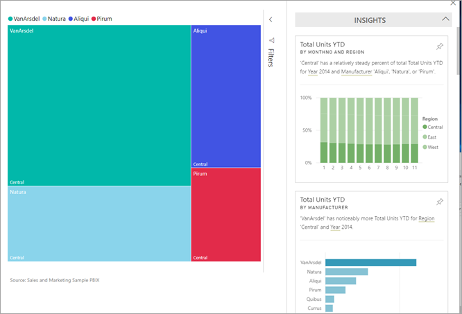
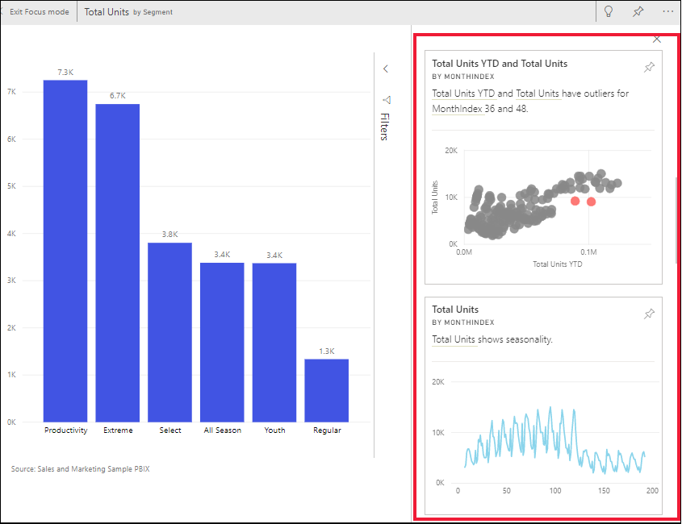
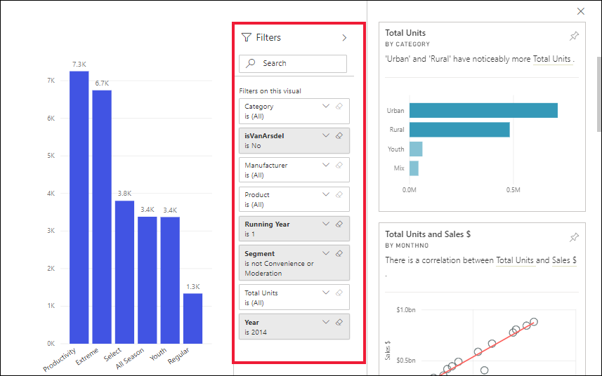
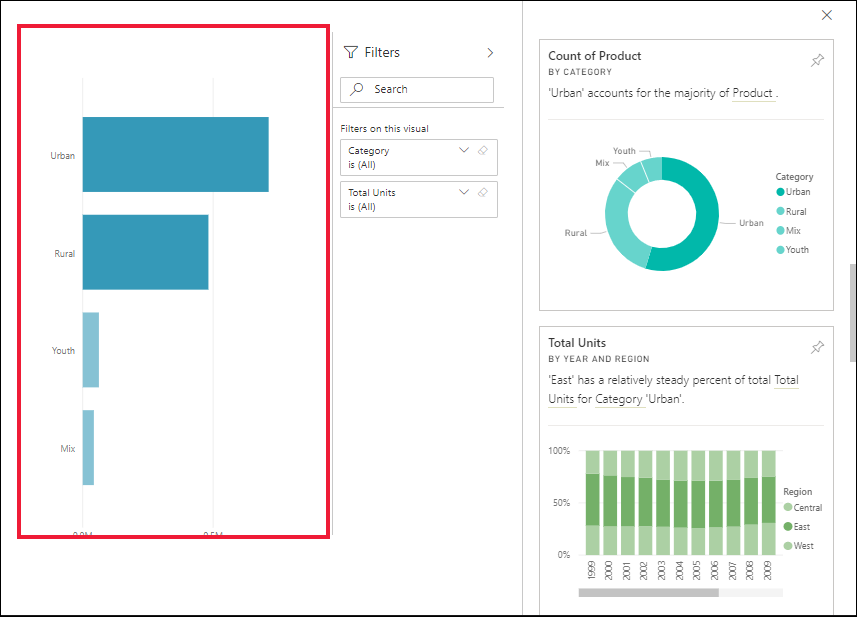

# View data insights on dashboard tiles with Power BI

[!INCLUDE[consumer-appliesto-yyny](../includes/consumer-appliesto-yyny.md)]

Each visual [tile](end-user-tiles.md) on your dashboard is a doorway into data exploration. When you select a tile, it opens a report or [opens Q&A](end-user-q-and-a.md) where you can filter and sort and dig into the dataset behind the report. And when you run insights, Power BI does the data exploration for you.

When you run insights on tiles, Power BI looks at the data being used to render that tile. If Power BI finds interesting facts or trends in that data, you'll be presented with those facts or trends in the form of interactive visuals. Insights can be run on a specific dashboard tile and you can even run insights on an insight!

The insights feature is built on a growing [set of advanced analytical algorithms](end-user-insight-types.md) developed in conjunction with Microsoft Research that we'll continue to use to allow more people to find insights in their data in new and intuitive ways. The dashboard insights feature is similar to the [dataset **quick insights** feature](../create-reports/service-insights.md).

## Run insights on a dashboard tile
When you run insights on a dashboard tile, Power BI searches just the data used to create that single dashboard tile. 

1. [Open a dashboard](end-user-dashboards.md).
2. Hover over a tile. select **More options** (...), and choose **View insights**. 

    

3. The tile opens in [Focus mode](end-user-focus.md) with the insights cards displayed along the right.    
   
    
4. Does one insight pique your interest? Select that insight card to dig further. The selected insight appears on the left and new insight cards, based solely on the data in that single insight, display along the right.    

## Interact with the insight cards

Once you have an insight open, continue exploring.

   * Filter the visual on the canvas.  To display the filters, in the upper right corner, select the arrow to expand the Filters pane.

      
   
   * Run insights on the insight card itself. This is often referred to as **related insights**. Select an insight card to make it active. It will move to the left side of the report canvas, and new cards, based solely on the data in that single insight,will  display along the right.
   
      
   
     
To return to your report, from the upper left corner, select **Exit Focus mode**.

## Considerations and troubleshooting
- **View insights** doesn't work with all dashboard tile types. For example, it is not available for Power BI custom visuals, streaming data, DirectQuery tiles, or data that is protected with RLS (row-level security).<!--[Power BI visuals](end-user-custom-visuals.md)-->

## Next steps

Run insights on report visuals [using the Analyze feature](end-user-analyze-visuals.md)    
Learn about the [types of Insights available](end-user-insight-types.md)
