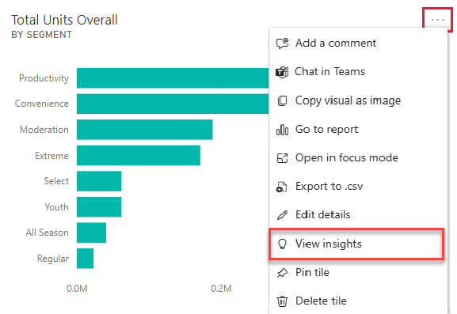

# Generate data insights with Power BI
Each visualization tile on your dashboard is a doorway into data exploration. When you select a tile, it opens a report where you can filter and sort and dig into the dataset behind the report. And when you run insights, Power BI does the data exploration for you.

Run quick insights to generate interesting interactive visualizations based on your data. Quick insights can be run on a specific dashboard tile and you can even run insights on an insight!

The insights feature is built on a growing [set of advanced analytical algorithms](end-user-insight-types.md) developed in conjunction with Microsoft Research that we’ll continue to use to allow more people to find insights in their data in new and intuitive ways.

## Run insights on a dashboard tile
When you run insights on a dashboard tile, Power BI searches just the data used to create that single dashboard tile. 

1. [Open a dashboard](end-user-dashboards.md).
2. Hover over a tile. select the ellipsis (...), and choose **View insights**. 

    

3. The tile opens in [Focus mode](end-user-focus.md) with the insights cards displayed along the right.    
   
        
4. Does one insight pique your interest? Select that insight card to dig further. The selected insight appears on the left and new insight cards, based solely on the data in that single insight, display along the right.    

 ## Interact with the insight cards
Once you have an insight open, continue exploring.

   * Filter the visual on the canvas.  To display the filters, in the upper right corner, select the arrow to expand the Filters pane.

     
   
   * Run insights on the insight card itself. This is often referred to as **related insights**. In the upper-right corner, select the lightbulb icon   or **Get insights**.
     
     
     
     The insight displays on the left and new cards, based solely on the data in that single insight, display along the right.
     
     

To return to the original insights canvas, from the upper left corner, select **Exit Focus mode**.

## Considerations and troubleshooting
- **View insights** does not work with DirectQuery - it only works with data uploaded to Power BI.
- **View insights** doesn't work with all dashboard tile types. For example, it is not available for custom visuals.<!--[custom visuals](end-user-custom-visuals.md)-->

## Next steps
Learn about the [types of Quick Insights available](end-user-insight-types.md)

