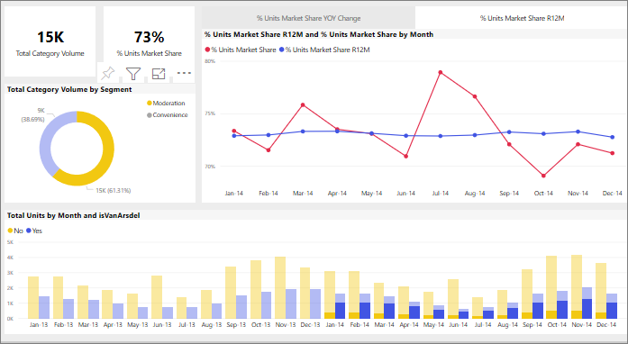

# How visuals cross-filter each other in a Power BI report
One of the great features of Power BI is the way all visuals on a report page are interconnected. If you select a data point on one of the visuals, all the other visuals on the page that contain that data change, based on that selection. 

## How visuals interact with each other

By default, selecting a data point in one visual on a report page will cross-filter, cross-highlight, and drill the other visuals on the page. 

This can be useful to identify how one value in your data contributes to another. For example, selecting the Moderation segment in the doughnut chart, highlights the contribution from that segment to each column in the "Total units by Month" chart, and it has filtered the line chart on the right.

See [About filtering and highlighting](end-user-report-filter.md). 

Exactly how the visuals on a page interact is set by the report *designer*. Designers have options to turn visual interactions on and off, and to change the default cross-filtering,  cross-highlighting, and drilling behavior. 
  
> [!NOTE]
> The terms *cross-filter* and *cross-highlight* are used to distinguish the behavior described here from what happens when you use the **Filters** pane to filter and highlight visuals.  

## Considerations and troubleshooting
- If your report has a visual that supports [drilling](end-user-drill.md), by default, drilling one visual has no impact on the other visuals on the report page.     
- If you use visualA to interact with visualB, visual-level filters from visualA will be applied to visualB.

## Next steps
[How to use report filters](../power-bi-how-to-report-filter.md)
