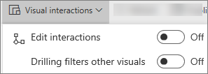
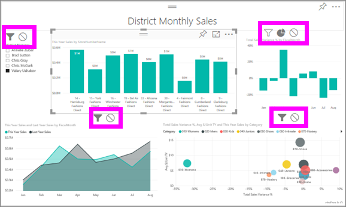
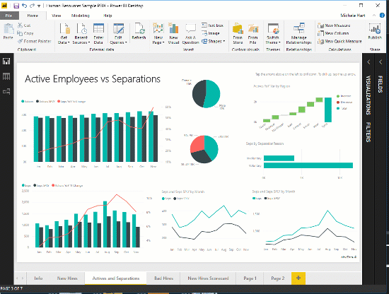

ADD TO FILTERS TOPIC
# Visualization interactions in a Power BI report
One of the great features of Power BI is the way all visuals on a report page are interconnected. If you select a field on one of the visuals, all the other visuals on the page that contain that field are also cross-filtered or cross-highlighted.

By default, visualizations on a report page can be used to cross-filter and cross-highlight the other visualizations on the page. For example, selecting a state on a map visualization highlights the column chart and filters the line chart to display only data that applies to that one state.
See [About filtering and highlighting](power-bi-reports-filters-and-highlighting.md). And if you have a visualization that supports [drilling](power-bi-visualization-drill-down.md), by default, drilling one visualization has no impact on the other visualizations on the report page. 

But both of these default behaviors can be overridden, and the default interactions changed, by the report *creator*. As a report consumer, you will see the interactions in action, but won't be able to change the interactions set by the report creator.  

> [!NOTE]
> The terms *cross-filter* and *cross-highlight* are used to distinguish the behavior described here from what happens when you use the **Filters** pane to filter and highlight visualizations.  
> 

Watch the video and then 

<iframe width="560" height="315" src="https://www.youtube.com/embed/N_xYsCbyHPw?list=PL1N57mwBHtN0JFoKSR0n-tBkUJHeMP2cP" frameborder="0" allowfullscreen></iframe>

1. Select a visualization to make it active.  
2. Display the **Visual Interactions** options.
    - In Power BI service, select the dropdown from the report menubar.

       

    - In Desktop, select **Format > Interactions**.

        

3. To turn on the visualization interaction controls, select **Edit interactions**. Power BI adds cross-filter and cross-highlight icons to all of the other visualizations on the report page.
   
    
3. Determine what impact the selected visualization should have on the others.  And, optionally, repeat for all other visualizations on the report page.
   
   * If it should cross-filter the visualization, select the **filter** icon .
   * If it should cross-highlight the visualization, select the **highlight** icon .
   * If it should have no impact, select the **no impact** icon .

4. To turn on drilling controls, select **Drilling filters other visuals**.  Now when you drill down (and up) in a visualization, the other visualizations on the report page change to reflect your current drilling selection. 

   

### Next steps
[How to use report filters](power-bi-how-to-report-filter.md)

[Filters and highlighting in reports](power-bi-reports-filters-and-highlighting.md)

[Power BI - Basic Concepts](service-basic-concepts.md)

More questions? [Try the Power BI Community](http://community.powerbi.com/)

