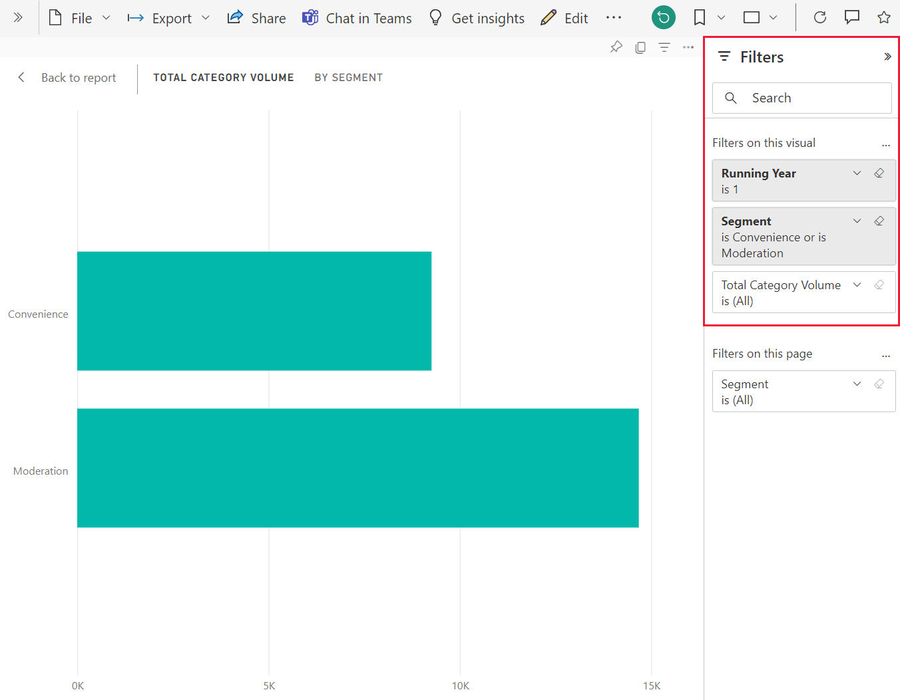

# How visuals cross-filter each other in a Power BI report

[!INCLUDE[consumer-appliesto-yyny](../includes/consumer-appliesto-yyny.md)]

One of the great features of Power BI is the way all visuals on a report page are interconnected. If you select a data point on one of the visuals, all the other visuals on the page contain that data change based on your selection.

## How visuals interact with each other

By default, selecting a data point in one visual on a report page will cross-filter or cross-highlight the other visuals on the page. Exactly how the visuals on a page interact is set by the report *designer*. *Designers* have options to turn visual interactions on and off, and to change the default cross-filtering, cross-highlighting, and [drilling](end-user-drill.md) behavior.

If you haven't encountered hierarchies or drilling yet, you can learn all about them by reading [Drill down in Power BI](end-user-drill.md).

### Cross-filtering and cross-highlighting

Cross-filtering and cross-highlighting can be useful to identify how one value in your data contributes to another. The terms *cross-filter* and *cross-highlight* are used to distinguish the behavior described here from what happens when you use the **Filters** pane to filter and highlight visuals.  

Let's define these terms as we look at the following report pages. The "Total category volume by segment" doughnut chart has two values: "Moderation" and "Convenience".

:::image type="content" source="media/end-user-interactions/power-bi-gauge.png" alt-text="Report page":::

1. Let's see what happens when we select **Moderation**.

    :::image type="content" source="media/end-user-interactions/power-bi-filtered.png" alt-text="Report page after Moderation segment of doughnut chart selected.":::

2. **Cross-filtering** removes data that doesn't apply. Selecting **Moderation** in the doughnut chart cross-filters the line chart. The line chart now only displays data points for the Moderation segment.

3. **Cross-highlighting** retains all the original data points but dims the portion that doesn't apply to your selection. Selecting **Moderation** in the doughnut chart cross-highlights the column chart. The column chart dims all the data that applies to the Convenience segment and highlights all the data that applies to the Moderation segment.

## Considerations and troubleshooting

- If your report has a visual that supports [drilling](end-user-drill.md), by default, drilling one visual has no effect on the other visuals on the report page. However, the report *designer* can change this behavior, so check your drillable visuals to see if **drilling filters other visuals** has been enabled by the report *designer*.

- Visual-level filters are retained when cross-filtering and cross-highlighting other visuals on the report page. So, if VisualA has visual-level filters applied by the report designer or by you, and you use VisualA to interact with VisualB, visual-level filters from VisualA will be applied to VisualB.

    

- If the tables have no hierarchical relationships, slicing up the measures (often referred as complex slicers) might result in an error. If you have access to the logs, you'll see the message "Measures are not allowed with complex slicers unless they have a filter context change". To avoid this situation, don't use complex slicers or remodel the relationships to get the desired output.

## Next steps

[How to use report filters](../consumer/end-user-report-filter.md)

[About filtering and highlighting](end-user-report-filter.md).
