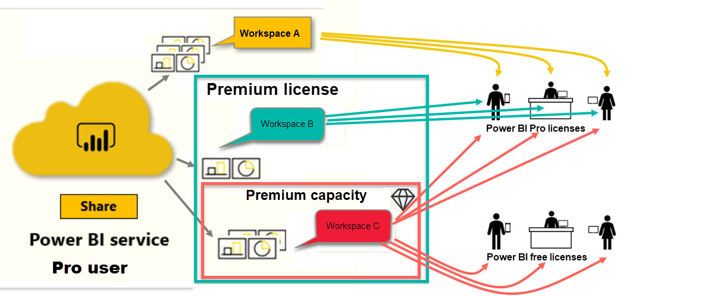

# Types of Power BI licenses

[!INCLUDE[consumer-appliesto-ynnn](../includes/consumer-appliesto-ynny.md)]

As a *consumer*, you use the Power BI service to explore reports and dashboards in order to make business decisions. If you've been using Power BI for a while, or have been chatting with your *designer* colleagues, you've probably discovered that there are some features that only work if you have a certain type of license. 

This article explains the differences between the license types and combinations: free, Pro, Premium, and Premium capacity. You'll also learn how to figure out which license combination you are using.  

We'll start by looking at the two categories of licenses -- per-user licenses and organizational licenses. Our starting point will be the default capabilities available with the licenses. Then we'll look at how your Power BI administrator and the content owners can use roles and permissions to modify the default license capabilities. 

For example, even if your license allows it, your administrator can limit your ability to do things like export data, use Q&A natural language queries, or publish to web. And when a report *designer* assigns content to a workspace, they can assign you to a workspace role. The roles determine what you can and can't do within that workspace. The *designer* can further adjust the limits of your license using permission settings. In other words...it's complicated. Hopefully this article will clear up most, if not all, of the confusion.

## Per-user licenses
The first type of license is a **per-user** license. Each Power BI service user has either a free license or a Pro license. Certain features are reserved for users with Pro licenses.  

- **A Power BI Pro license** enables a user to collaborate with other Pro users by creating and sharing content. Only users with a Pro license can publish reports, subscribe to dashboards and reports, and collaborate with colleagues in workspaces. 

    

    Power BI Pro is an individual user license that lets users read and interact with reports and dashboards that others have published to the Power BI service. Users with this license type can share content and collaborate with other Power BI Pro users. Only Power BI Pro users can publish or share content with other users or consume content that's created by others. The exception to this is content that's hosted in [Power BI Premium capacity](#understanding-premium-and-premium-capacity). Pro licenses are typically used by report *designers* and developers. For more information, see [Power BI Premium capacity](#understanding-premium-and-premium-capacity) below.

- **A standalone Power BI free license**, although still powerful, is for those users getting started with Power BI or those users creating content for themselves. [Sign up for Power BI service as an individual](../service-self-service-signup-for-power-bi.md). A free standalone license is not associated with an organizational license. 

    A free standalone user license is perfect for someone using the Microsoft samples to learn Power BI. Users with free standalone licenses can't view content shared by others or share their own content with other Power BI users. 

    

Clear so far?  OK. Let's add another layer, **Premium capacity**.

## Understanding Premium and Premium capacity
Premium is an **organizational** license. Think of it as adding a layer of features and functionality on top of all the Power BI **per-user** licenses in an organization. 

When an organization purchases a Premium license, the administrator typically assigns Pro licenses to the employees who will be creating and sharing content. And the administrator assigns free licenses to everyone who will be consuming that content. The Pro users create [workspaces](end-user-workspaces.md) and add content (dashboards, reports, apps) to those workspaces. To allow others to collaborate in those workspaces, the Pro users use a combination of *capacity*, permissions, and roles. 

When an organization purchases a Premium license, they receive capacity in the Power BI service exclusively allocated to them. It is not shared. The capacity is supported by dedicated hardware fully managed by Microsoft. Organizations can choose to apply their dedicated capacity broadly, or allocate it to specific workspaces. A workspace in a Premium capacity is a space where Pro users can share and collaborate with free users -- without requiring the free users to have Pro accounts.  

In Premium capacity, Pro licenses are still required for content designers. Designers connect to data sources, model data, and create reports and dashboards that are packaged as workspace apps. Users without a Pro license can still access a workspace that's in Power BI Premium, as long as that content is in Premium *capacity*, and as long as the workspace owner gives them permission.

In the diagram below, the left side represents Pro users who create and share content in workspaces.  
- **Workspace A** was created in an organization that doesn't have Premium. 

- **Workspace B** was created in an organization that does have a Premium license, though this particular workspace was not saved in Premium capacity. The workspace does not have the diamond icon.

- **Workspace C** was created in an organization that does have a Premium license, and was saved in Premium capacity. This workspace does have a diamond icon.  

The Power BI Pro *designer* can share and collaborate with other Pro users using any of the three workspaces. As long as the designer shares the workspace with the entire organization or assigns workspace roles to the Pro users. 

The Power BI Pro *designer* can only share and collaborate with free users using Workspace C. The workspace must be assigned to Premium capacity for free users to be able to access the workspace. Within the workspace, the designer assigns roles to collaborators: *Admin*, *Member*, *Contributor*, or *Viewer*. Your role determines what actions you can take within the workspace. Power BI *consumers* are usually assigned the *Viewer* role. To learn more, see [Workspaces for Power BI consumers](end-user-workspace.md).

## Find out which license you have
There are several ways to look up your Power BI license information. 

First, determine which **user** license you have.

- Certain versions of Microsoft Office include a Power BI Pro license.  To see if your version of Office includes Power BI, visit [the Office portal](https://portal.office.com/account) and select **Subscriptions**.

    This first user, Pradtanna, has Office 365 E5, which includes a Power BI Pro license.

    

    This second user, Zalan, has a Power BI free license. 

    

Next, check to see if your account also has a Premium license. Either of the users above, Pro or free, could belong to an organization that has a Premium license.  Let's check for our second user, Zalan.  

- In the Power BI service, select **My workspace** and then select the cog icon from the upper right corner. Choose **Manage personal storage**.

    

    **Per-User** licenses, Pro or free, provide 10GB of storage in the cloud that can be used for hosting Power BI reports, or Excel workbooks. If you see more than 10GB, then you are a member of an organizational account with a Premium license.

    

    Remember that on the Office portal page, Zalan's user subscription was for Power BI (free). But because his organization purchased a Premium license, in the Power BI service, Zalan isn't limited to 10GB of storage; he has 100GB available. As a *consumer* in an organization with a Premium license, as long as the *designer* places the workspace in Premium capacity, Zalan has the ability to view shared content, collaborate with colleagues, work with apps, and more. The extent of his permissions are set by his Power BI administrator and by the content designer. Notice that a Pro user has already shared a workspace with Zalan. The diamond icon let's him know that this workspace is stored in Premium capacity. 

   
## Understanding workspace roles
So far, we've reviewed per-user licenses, Premium licenses, and Premium capacity. Now let's take a look at workspace *roles*.

Since this is an article for Power BI *consumers*, we have the following scenario:

-  You are a *free* user within an organization that has a Power BI Premium license. 
- A Power BI Pro user has created a collection of dashboards and reports and published this collection as an *app* to your whole organization.  
- Apps exist within *workspaces* and the workspace is in Premium capacity.    
- This app workspace has one dashboard and two reports.
- The Pro user has assigned us the **Viewer** role.

### The Viewer role
Roles let Power BI *designers* manage who can do what in a workspace, so teams can collaborate. One of those roles is **Viewer**. 

When the workspace is in a Power BI Premium capacity, users with the Viewer role can access the workspace even if they don't have a Power BI Pro license. But because the Viewer role can't access or export the underlying data, it's a safe way to interact with dashboards, reports, and apps.

> [!TIP]
> To learn about the other roles (Admin, Member, and Contributor) see [creating a new workspace](../service-new-workspaces.md).

#### Viewer role in an organization with a Premium subscription
The following chart identifies which tasks can be performed by a *consumer* in an organization that has a Premium subscription. A *consumer* fits the following criteria:

- has a free user license
- is part of an organization that has a Premium subscription
- gets content (apps, dashboards, reports) from Pro users who share that content using app workspaces in Premium capacity.
- is assigned the **Viewer** role to those app workspaces by the Pro user (the content *designer*). 

> [!IMPORTANT]
> This article does not address Power BI features and capabilities for users with free licenses who are not part of an organization with a Premium subscription.

For free users, being a member of an organization that has a Premium subscription is what gives them super powers. As long as your Pro colleagues use Premium capacity workspaces to share content, free users can view and collaborate with your Pro colleagues.  In this way, the free user becomes a Power BI *consumer*, with the ability to receive and share content to make business decisions. 

The following table compares features available to *consumers* and to free users. 

|*Viewer* capability   | Premium subscription, content not in capacity     | Premium subscription, content in capacity  | Free user, no Premium subscription | x
|---|---|---|---|----|
|**Apps** 
|Installs automatically | no | set by app designer| no |
|Open | no | yes |nox | 
|Favorite | y | yes |no  |
|Reshare |no |no |no |
 |Edit |no |no |no |
 | Update |no |no |no |
 |Republish |no |no |no |
 |Create new app |no |no |no |
 |Appsource: download and open | no |no| no| 
|Organization store: download and open|no |yes |no |
|View usage metrics |no |no |no |
 |**App workspaces**
| Create   |no |no |no |
|Edit |no |no |no |
|Delete |no |no |no |
|Add endorsements | | | | ||no |no |no |
|Import or add new data   |no |no |no |
|Delete content  |no |no |no |
|Open and view  |  no |    | no |  |
|Set or change permissions |no |no |no |
|**Dashboards**
| Add alerts to tiles  |  MW |    | MW |  |
|Add bookmarks  |  MW |    | MW  |   |
| View bookmarks created by others  |  no |    | no |  |
|  Add comments   |  MW |    | MW |  |
| View and respond to comments from others: see comments created by owners  |  no |    | no |  |
| Save a copy |no |no |no |
|Copy visual as an image |y |y|y | |
|Change data classification |no |no |no |
|Create new in same app workspace |no |no |no |
| Display dimensions and ratios, adjust   | MW  | no | MW  |   |
|Export tile to Excel |MW | y|MW | |
|Favorite |y| y|y | |
|Featured | ?| ?| ?| |
|Full screen and focus modes |y |y |y | |
|Global search |y |y |y | |
|Insights on tiles |MW     | Y*|MW | |
|Q&A add featured questions |no |no |no |
|  Q&A: use on dashboard2   |y |y |y | |
|Q&A: add to dashboard |no |no |no |
|Q&A: review asked questions |no |no |no |
|  Q&A: add saved questions  |no |no |no |
|  Q&A: add featured questions |no |no |no |
|Performance inspector |y | y| y| |
|Pin tiles from Q&A |no |no |no |
|Pin tiles from reports |no |no |no |
|Print |y |y| y| |
|Refresh |y | y| y| |
|Reshare |no |no |no |
|View related |y |y |y | |
|Change tile flow |no |no |no |
|Subscribe yourself |no | y|no | |
|Subscribe others |no |no |no |
|**Datasets**
|  Add new  |  MW  |  no   |   no  |  |
| Delete |MW |no | no| |
|Edit |no |no |no |
| Create a report based on a dataset in this workspace3 |no |no |no |
|  Insights on datasets  |no |no |no |
|**Reports**
| Analyze report in Excel4  |no |y | no| |
|Add bookmarks  |y | y| y| |
| View bookmarks created by others  | no|y |no | |
|  Add comments   |MW |y |MW | |
| View and respond to comments from others: see comments created by owners  | no|y |no | |
|Change display dimensions and ratios   | MW  | y | MW  |   |
| Save a copy5 |no |y |no | |
|Copy visual as an image |MW | y| |MW |
| Cross-highlight and cross-filter report visuals   | y|y |y | |
|  Drill   |y |y |y | |
| Drillthrough * |y |y | y| |
|  Embed |no |no |no |
|  Endorsements: add or modify |no |no |no |
|  Export summarized data from report visuals6  |y |y |y | |
|Export underlying data from report visuals6 | y|y | y| |
|  Favorite the report  |y | y|y | |
|  Filters: change types  |y |y|y | |
|  Filters: interact   |y | y| y| |
|  Filters: persistent  |y |y |y | |
| Full screen and focus modes   |y |y |y | |
|  Global search  |y |y |y | |
| Lineage view  |y |no |y | |
|PDF: create from report pages |y | y|y | |
|Performance Inspector |y | y| y| |
| PowerPoint: create from report pages*   |y |y |y | |
|  Promote content to Home  |no |no |no | |
|  Publish to web  |no |no |no |
|Interact with Q&A visual |y |y |y | |
|QR Code |y |y|y | |
|  Refresh |y |y |y | | 
|  Share content with external users  |no |no |no |
| Share: allow others to reshare items |no |no |no |
| Share an item or share an app |no |no |no |
|Show as table (show data)|y |y |y | |
|  Slicers: add or delete  |y |no |y |
| Interact with slicers |y | y|y | |
|  Sort report visuals  |y | y| y| |
|  Subscribe yourself to dashboards & reports  |y |y |y | |
|  Subscribe others to dashboards and reports  |no |no |no |
| Usage metrics: view |n |n |n | |
|  View related  |y | y| y| |
|  Visuals: change types in reports  |y | y|y | |
|  Change visual interactions  |y |n |y | |
|  Visuals: add new  |y |no |y | |
|  Visuals: add new fields  |y |no |y | |
|Visuals: change type | y| y|y | |
| Visuals: hover to reveal details and tooltips  |y |y |y | |

1. Contributors and Viewers can share items in a workspace if they have Reshare permissions.
2. To copy a report, and to create a report in another workspace based on a dataset in this workspace, you need to meet additional criteria:
    - You need a Power BI Pro license. See the next section, [Licensing](#licensing), for details.
    - You need Build permission for the dataset. For datasets in this workspace, the people with the Admin, Member, and Contributor roles have Build permission through their workspace role.
3. Even if you don't have a Power BI Pro license, you can view and interact with items in the Power BI service if the items are in a workspace in a Premium capacity.
4. Viewer can view and interact with content. 
Share if have rshare perms.
5. Viewers can only view content and can't export underlying data or analyze in Excel for any workspace datasets -->

## Next steps
