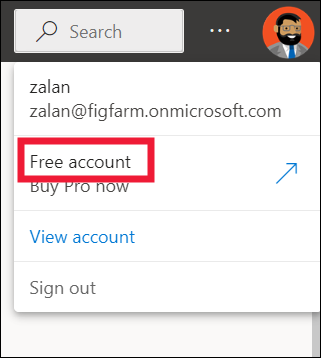
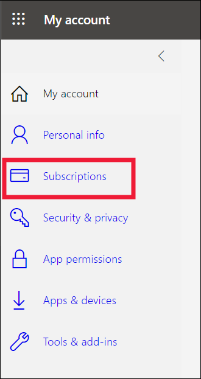
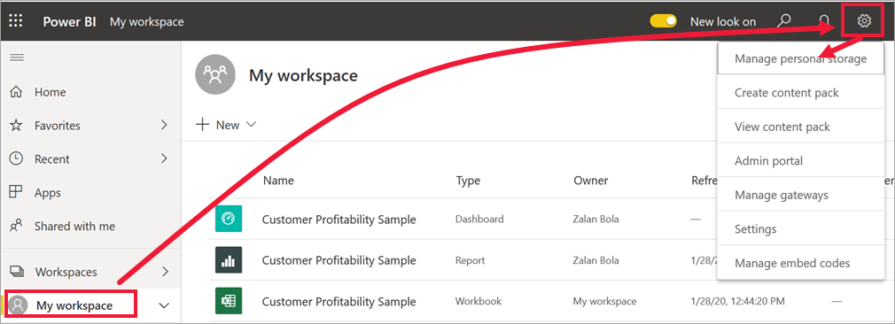
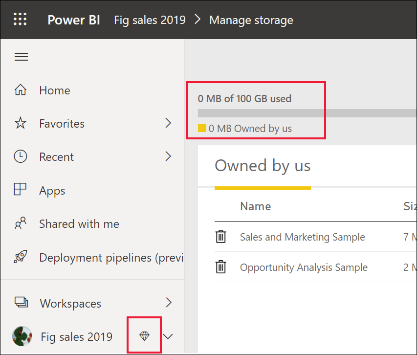

# Licenses and subscriptions for business users

[!INCLUDE[consumer-appliesto-ynnn](../includes/consumer-appliesto-ynnn.md)]

As a [business user](end-user-consumer.md), you use the Power BI service to explore reports and dashboards so you can make data-backed business decisions. If you've been using Power BI for a while, you've probably discovered that there are some features that only work if you have a certain type of license, subscription, or permissions.

What you can do in the Power BI service depends on three things:

- The type of license and subscription you're using
- Where the content is stored
- The roles and permissions you're assigned

:::image type="content" source="media/end-user-license/power-bi-questions-small.png" alt-text="Graphic of a woman with questions about licenses and permissions surrounding her.":::

This article describes the capabilities of each license type and how the location where content is stored affects what you can do with it. You learn how to look up your license and subscription information, and figure out where your content is stored. For more information about roles and permissions, see [Collaborate in workspaces](end-user-workspaces.md).

## Licenses

Each user of the Power BI service has either a *free* license, a *Pro* license, or a *Premium per-user* license. If you're a Power BI business user, you're probably using a free license that's managed by your Power BI administrator.

It's possible to have more than one license at the same time. The service always delivers you the experience equal to the most permissive license you currently have.

## Power BI Premium capacity subscription

Premium is an organizational subscription that provides a way to store content in a virtual container called a capacity. With Premium capacity, anyone with permissions, whether they're inside or outside your organization, can view content stored in this virtual container. It isn't required that they purchase an individual Power BI Pro or Premium per-user license.

Premium capacity enables widespread distribution of content by Pro users without requiring Pro licenses for the recipients who view the content. The person who is creating the content in the Premium capacity uses a Pro license to connect to data sources, model data, and create reports and dashboards that are saved to a workspace in Premium capacity. Users without a Pro license can still access a workspace that's in Power BI Premium capacity, as long as they're assigned a [role in that workspace](end-user-workspaces.md). If the workspace owner creates an app based on content in that workspace, users without a Pro license can still view that app in Premium capacity, as long as they've been given a role that has permissions for that app. 

Within those workspaces, designers assign roles, like **Viewer**, **Contributor**, **Member**, and **Administrator**. These roles determine the extent to which colleagues can interact with the content. For more information, see [workspace permissions and roles](end-user-workspaces.md#permissions-in-the-workspaces).

When a designer creates and publishes an app, they grant access to individuals or entire organizations. The extent to which you can interact with the app's content depends on the specific access permissions given to you. For example, you might be given access to view the app, connect to the underlying datasets, make copies of reports, or share the content.

For more info about Premium capacity, see [What is Microsoft Power BI Premium?](../enterprise/service-premium-what-is.md).

## Find out which licenses you have

To display your account information, select your profile picture in the upper right corner. In the following screenshot, you can see that a user named Zalan uses a free license. Other types of licenses are Pro and Premium per-user. To see more details about your account, select **View account**.

<!-- [Your Microsoft **My account** page](https://portal.office.com/account) opens in a new browser tab.  To see what licenses are assigned to you.  Select the tab for  **Subscriptions**.

This first user, Pradtanna, has Office 365 E5, which includes a Power BI Pro license.

This second user, Zalan, has a Power BI free license. 

 

## Find out if you have access to Premium capacity

Next, check to see if you're part of an organization that has Premium capacity. Either of the users above, Pro or free, could belong to an organization that has Premium capacity.  Let's check for our second user, Zalan.  

We can determine whether Zalan's organization has Premium capacity by looking up the amount of storage available. 

- In the Power BI service, select **My workspace** and then select the cog icon from the upper right corner. Choose **Manage personal storage**.

    

    If you see more than 10 GB, then you're a member of an organization that has a Premium subscription. The image below shows that Zalan's organization has up to 100 GB of storage. Zalan, personally, doesn't own 100GB as indicated by the heading **Owned by us**.  

    

    Notice that a Pro user has already shared a workspace with Zalan. The diamond icon shows that this workspace is stored in Premium capacity. 

    If you see any amount of storage, the words **Pro user** next to your name, and the heading **Owned by me**, then you have a Premium per-user license.  

    -->

## Identify content that's hosted in Premium capacity

There are a couple of ways to identify content that's stored in Premium capacity. One way is to look for apps and app workspaces with a diamond icon. The diamond indicates that the content is stored in Premium capacity.

In the following image, two of the apps are stored in Premium capacity.

If the designer places a workspace in Premium capacity, a user with a free license can view shared content, collaborate with colleagues, and work with the apps, dashboards, and reports in that workspace. The Power BI administrator and content designer set the permissions for the user.

## Put it all together

There are many ways organizations set up their Power BI subscriptions and licenses. From a business user's perspective, a common scenario is when an organization buys a Premium subscription, the administrator assigns Pro licenses to a small group of users, and all the other users have free licenses. Typically, the administrator assigns the Pro licenses to the employees who create and share content. The Pro users create [workspaces](end-user-workspaces.md) and add dashboards, reports, datasets, apps, and other content to those workspaces. To allow free users to collaborate in those workspaces, the administrator or Pro user then assigns the workspaces to Premium capacity.  

|License type  |Not in Premium capacity | Premium capacity  |
|---------|---------|---------|
|**Free**     |  Use as a personal sandbox to create content for yourself and interact with that content. A free license is a great way to try out the Power BI service. You can't consume content from anyone else or share your content with others.     |   Interact with content that's assigned to Premium capacity and shared with you. Free, Premium per-user, and Pro users can collaborate without requiring the free users to have Pro accounts.      |
|**Pro**     |  Collaborate with Premium per-user and Pro users by creating and sharing content.        |  Collaborate with free, Premium per-user, and Pro users by creating and sharing content.       |

In the following diagram, the left side represents Pro users who create and share content in app workspaces.

- **Workspace A** wasn't created in Premium capacity.

- **Workspace B** was created and saved in Premium capacity. This workspace has a diamond icon.  

    

The Power BI Pro designer can share and collaborate with other Pro users in either of the workspaces. The Power BI Pro user can only share and collaborate with free users by using Workspace B, which is in Premium capacity. The designer assigns roles to collaborators within the workspace. Your role determines what actions you can take. Power BI business users are usually assigned the Viewer role. For more information, see [Permissions in the workspaces](end-user-workspaces.md#permissions-in-the-workspaces).

## Considerations and limitations

- It's possible to have more than one Power BI license. The Power BI service always delivers the experience equal to the best license that you currently have. For example, if you have both a Pro and a free license, the Power BI service uses the Pro license.

- If you want to create and share content, or open content that someone else shared with you, you must have a Pro license or a Premium per-user license. You might be able to sign up for a free 60-day trial of the Power BI Premium per-user paid version. If your organization has self-service trials enabled, you can select the upgrade dialog that appears in the Power BI service when you try to use a Pro feature.

    :::image type="content" source="media/end-user-license/power-bi-ppu-trial.png" alt-text="Screenshot showing the dialog for a Power BI Pro free trial.":::

  When the 60-day trial expires, your license reverts back to the previous version, either free or Pro, and you no longer have access to features that require a Power BI Premium per-user license. If you want to continue with a Premium per-user or a Pro license, contact your administrator or IT Help Desk about purchasing an upgrade. If you don't have an administrator or IT Help Desk, visit the [Power BI pricing page](https://powerbi.microsoft.com/pricing/).

- If you sign up for a free license by selecting a **Try it free** button, it never expires unless you cancel it. If your trial upgrade ends or if your organization removes your Pro or Premium license, your free license is still available to you.

- A free user license for the Power BI service is perfect for someone exploring or using it for personal data analysis and visualizations by using **My workspace**. A free standalone user doesn't use Power BI to collaborate with colleagues. Standalone users with free licenses can't view content shared by others or share their own content with other Power BI users.

## Next steps

- [Am I a Power BI business user?](end-user-consumer.md)  
- [Learn about workspaces](end-user-workspaces.md)  
- [Features for free users](end-user-features.md)
