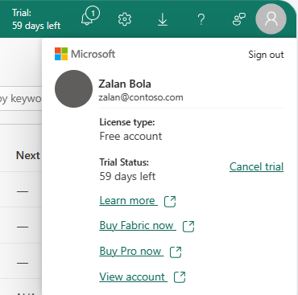
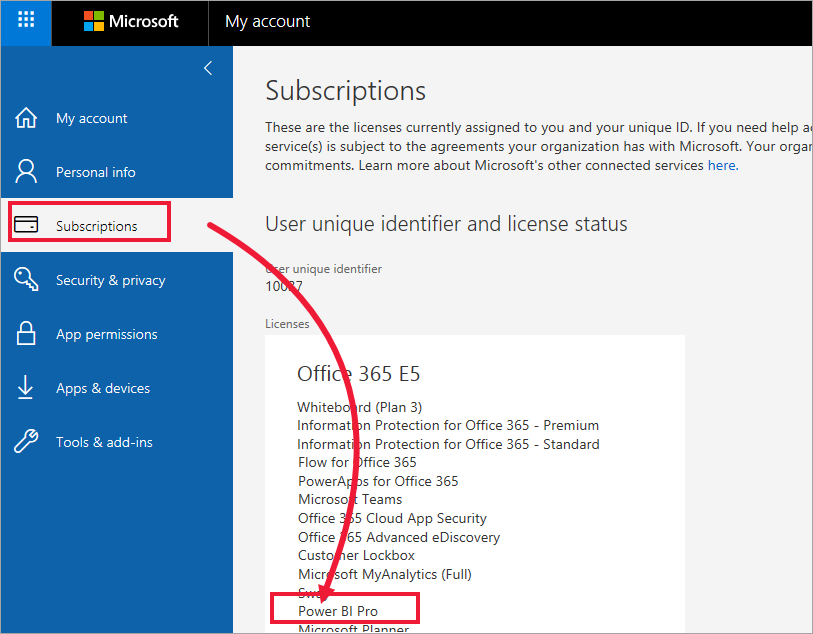
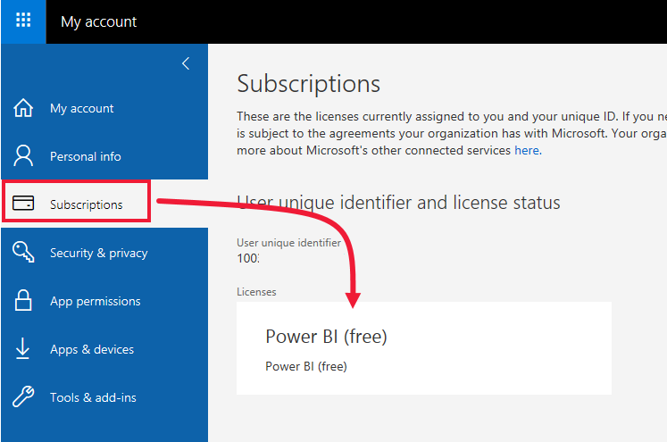
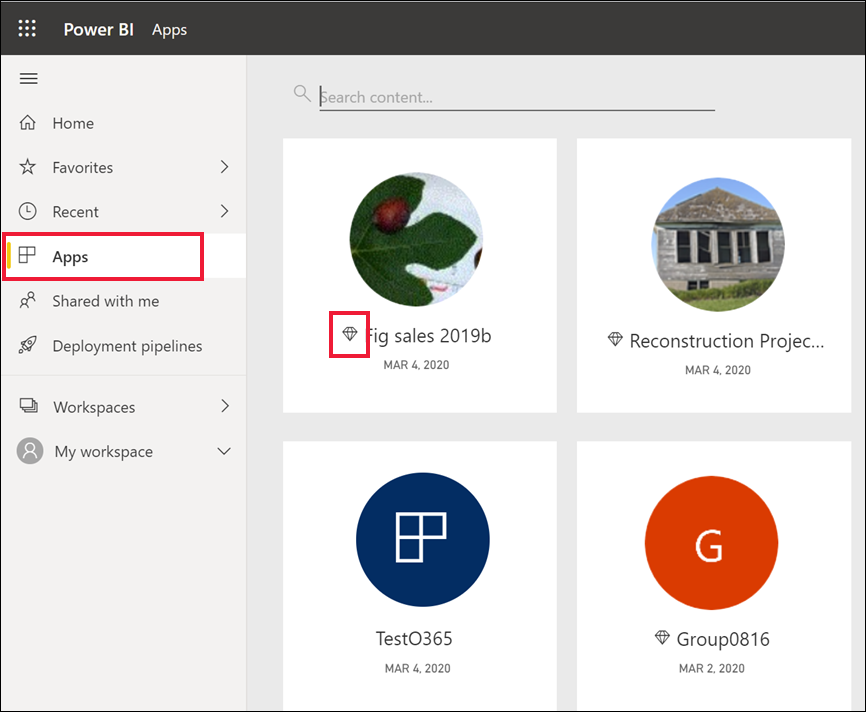

# Licenses and subscriptions for business users

[!INCLUDE[consumer-appliesto-ynnn](../includes/consumer-appliesto-ynnn.md)]

As a [business user](end-user-consumer.md), you use the Power BI service to explore reports and dashboards so you can make data-backed business decisions. If you've been using Power BI for a while, you probably discovered that there are some features that only work if you have a certain type of license, subscription, or permissions.

What you can do in the Power BI service depends on three things:

- The type of license and subscription you're using
- The type of workspace that stores the content
- The roles and permissions you're assigned in a workspace

:::image type="content" source="media/end-user-license/power-bi-questions-small.png" alt-text="Illustration that shows a person with questions about licenses and permissions surrounding them.":::

This article describes the capabilities of each license type and how the location where content is stored affects what you can do with it. You learn how to look up your license and subscription information, and figure out where your content is stored. For more information about workspace *roles* and *permissions*, see [Collaborate in workspaces](end-user-workspaces.md).

## Licenses

Each user of the Power BI service has either a *free* license, a *Pro* license, or a *Premium per-user (PPU)* license. If you're a Power BI business user, you're probably using a free license managed by your Power BI administrator.

It's possible to have more than one license at the same time. The service always delivers you the experience equal to the most permissive license you currently have.

> [!NOTE]
>* A [Power BI Pro](../enterprise/service-admin-purchasing-power-bi-pro.md) or [Premium Per User (PPU)](../enterprise/service-premium-per-user-faq.yml) license is required for publishing content to a Power BI app workspace, editing content, and for sharing content with others.

## Power BI Premium capacity subscription

Premium is an organizational subscription that provides a way to store content in a virtual container called a Power BI Premium capacity. With Premium capacity, anyone granted permissions, whether they're inside or outside your organization, can access content stored in this virtual container. This access includes users with free licenses.

Premium capacity enables widespread distribution of content by users with paid licenses without requiring paid licenses for the recipients who view the content. The person who is creating the content in the Premium capacity uses a paid license to connect to data sources, model data, and create reports, dashboards, and apps that are saved to a workspace in Premium capacity. Users without a paid license can access a workspace that's in Power BI Premium capacity, as long as they're assigned a [role in that workspace](end-user-workspaces.md). When users with a free license attempt to access a workspace in Premium capacity, and they aren't assigned a role in that workspace, they're prompted to upgrade their license to Pro, Premium, or a trial. 

Within the workspaces in Premium capacity, creators assign roles, like **Viewer**, **Contributor**, **Member**, and **Administrator**. The roles creators assign to their colleagues, and the licenses the colleagues have, determine the extent to which those colleagues can interact with the content. For more information, see [workspace permissions and roles](end-user-workspaces.md#permissions-in-the-workspaces).

When a creator creates and publishes an app, they grant access to individuals or entire organizations. The extent to which you can interact with the app's content depends on the specific access permissions given to you. For example, you might be given access to view the app, connect to the underlying semantic models, make copies of reports, or share the content.

For more info about Premium capacity, see [What is Microsoft Power BI Premium?](../enterprise/service-premium-what-is.md).

## Find out which licenses you have

To display your account information, select your profile picture in the upper right corner. In the following screenshot, a user named Zalan has a free account and is signed up for a free trial. Other types of licenses are Pro and Premium per-user. To see more details about your account, select **View account** > **Subscriptions.**

This first user, Pradtanna, has Office 365 E5, which includes a Power BI Pro license.

This second user, Zalan, has a Fabric free license that includes a Power BI free license. 

 

## Find out if you have access to Premium capacity

Next, check to see if you have access to content in Premium capacity. Either of the users, Pro or free, can belong to an organization that has Premium capacity.

Select **Workspaces** and scroll through the list of workspaces shared with you. Workspaces in Premium capacity are marked with a diamond icon. To open a Premium workspace, select it. 

:::image type="content" source="media/end-user-license/power-bi-premium-diamond.png" alt-text="Screenshot of workspaces and some have diamond icons.":::

Not only workspaces are marked with a diamond icon. Apps and app workspaces saved in Premium capacity also have a diamond icon. 

In the following image, two of the apps are stored in Premium capacity.

## Put it all together

There are many ways organizations set up their Power BI subscriptions and licenses. From a business user's perspective, one common scenario gives you a free license. Your organization buys a Premium subscription, the administrator assigns Pro licenses to a small group of users, and all the other users have free licenses. Typically, the administrator assigns a Pro license to employees who create and share content. The Pro users create [workspaces](end-user-workspaces.md) and add dashboards, reports, semantic models, apps, and other content to those workspaces. To allow free users to collaborate in those workspaces, the administrator or Pro user then assigns the workspaces to Premium capacity and gives free users permissions (roles) to that workspace.  

|License type  |Not in Premium capacity | Premium capacity  |
|---------|---------|---------|
|**Free**     |  Use as a personal sandbox to create content for yourself and interact with that content. A free license is a great way to try out the Power BI service. You can't consume content from anyone else or share your content with others.     |   Interact with content assigned to Premium capacity and shared with you. Free, Premium per-user, and Pro users can collaborate without requiring the free user to have a paid license.      |
|**Pro**     |  Collaborate with Premium per-user and Pro users by creating and sharing content.        |  Collaborate with free, Premium per-user, and Pro users by creating and sharing content.       |

In the following diagram, the left side represents Pro users who create and share content in app workspaces.

- **Workspace A** isn't in Premium capacity.

- **Workspace B** was created and saved in Premium capacity. This workspace has a diamond icon.  

    

The Power BI Pro creators can share and collaborate with other Pro users in either of the workspaces. The Power BI Pro user can only share and collaborate with free users by using Workspace B, which is in Premium capacity. The creator assigns roles to collaborators within the workspace. Your role determines what actions you can take. Power BI business users are usually assigned the Viewer role. For more information, see [Permissions in the workspaces](end-user-workspaces.md#permissions-in-the-workspaces).

## Considerations and limitations

- It's possible to have more than one Power BI license. The Power BI service always delivers the experience equal to the best license that you currently have. For example, if you have both a Pro and a free license, the Power BI service uses the Pro license.
- Only SKUs (Stock Keeping Units) equivalent or higher than a **F64 SKU** allow free Power BI users to consume Power BI apps and shared content in Premium capacity in the Power BI service. Smaller **F SKU**s require a paid license to consume Power BI content.
- Users without a paid license can view apps created by colleagues if certain conditions are met. First, the workspace owner creates the app based on content in a workspace that is saved in Premium capacity. Second, the workspace owner assigns the free user a role that has permissions for that app. 
- You want to create and share content, or open content that someone else shared with you. That content isn't in Premium capacity. You must have a paid license. Either purchase a license or sign up for a trial, if there is one available. One option that might be available is the [free trial of Power BI paid features](../fundamentals/service-self-service-signup-for-power-bi.md). If your organization has self-service trials enabled, you can select the upgrade dialog that appears in the Power BI service when you try to use a Pro feature.

    :::image type="content" source="media/end-user-license/power-bi-ppu-trial.png" alt-text="Screenshot showing the dialog for a Power BI Pro free trial.":::

  When the trial expires, your license reverts back to the previous version, either free or Pro. You no longer have access to features that require a paid license. If you want to continue with a paid license, contact your administrator or IT Help Desk about purchasing an upgrade. If you don't have an administrator or IT Help Desk, visit the [Power BI pricing page](https://powerbi.microsoft.com/pricing/).

- If you sign up for a free license by selecting a **Try it free** button, it never expires unless you cancel it. If your trial upgrade ends or if your organization removes your Pro or Premium license, your free license is still available to you.

- A free user license for the Power BI service is perfect for someone exploring or using it for personal data analysis and visualizations by using **My workspace**. A free standalone user doesn't use Power BI to collaborate with colleagues. Standalone users with free licenses can't view content shared by others or share their own content with other Power BI users.

## Related content

- [Am I a Power BI business user?](end-user-consumer.md)  
- [Learn about workspaces](end-user-workspaces.md)  
- [Features for free users](end-user-features.md)
