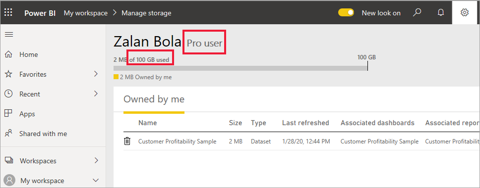

# Types of Power BI licenses
As a consumer, you use the Power BI service to explore reports and dashboards in order to make business decisions. A few of the consumer features require a special type of license -- either Power BI Pro or Power BI Premium. This article explains the differences between Pro, Premium, and free. You'll also learn how to figure out which license you are using.  

## User licenses
The first type of license is a **user** license. Each Power BI user has either a free license or a Pro license. Certain features are limited to users with a Pro license.  

- A Power BI Pro license enables a user to collaborate with other Pro users by creating and sharing content. Only users with a Pro license can publish reports, subscribe to dashboards and reports, and collaborate with colleagues in workspaces. Pro licenses are typically used by report ***designers***, developers, analysts, and administrators.

- A Power BI free license, although still powerful, is for those users getting started with Power BI or those users creating content for themselves. A free user license is perfect for someone using the Microsoft samples to learn Power BI. Users with free licenses can't view content shared by others or share their own content with other Power BI users.  

Clear so far?  OK. Let's add another layer, **Premium capacity**.

## What does Power BI Premium do? How does it work?
Premium capacity is an **organizational** license. One of the many benefits is that it adds features for free users. If your company has a Premium capacity license, then Pro users can share content with all members of the organization, without requiring users who view the content to have Power BI Pro licenses.   

When an organization purchases a Premium license, the administrator typically assigns Pro licenses to the employees who will be creating and sharing content. And the administrator assigns free licenses to everyone who will be consuming that content.  

Want more details about Premium? Read on. Otherwise, skip to [Find out which licenses you have](#find-out-which-licenses-you-have), below.

When an organization purchases a Premium capacity license, they receive capacity in the Power BI service exclusively allocated to them. It is not shared. The capacity is supported by dedicated hardware fully managed by Microsoft. Organizations can choose to apply their dedicated capacity broadly, or allocate it to assigned workspaces based on the number of users, workload needs, or other factors—and scale up or down as requirements change.

Power BI Premium provides dedicated capacity to deliver more consistent performance and support larger data volumes in Power BI. 

## Find out which license you have
There are several ways to look up your Power BI license information. 

First, determine which **user** license you have.

- Certain versions of Microsoft Office include a Power BI Pro license.  To see if your version of Office includes Power BI, visit [the Office portal](https://portal.office.com/account) and select **Subscriptions**.

    This first user, Pradtanna, has Office 365 E5, which includes a Power BI Pro license.

    

    This second user, Zalan, has a Power BI free license. 

    

Next, check to see if your account also has a Premium capacity license. Either of the users above, Pro or free, could belong to an organization that has a Premium capacity license.  Let's check for our second user, Zalan.  

- In the Power BI service, select **My workspace** and then select the cog icon from the upper right corner. Choose **Manage personal storage**.

    

    **User** licenses, Pro or free, provide 10GB of storage in the cloud that can be used for hosting Power BI reports, or Excel workbooks. If you see more than 10GB, then you are a member of an organizational account with a Premium capacity license.

    Remember that on the Office portal page, Zalan's user subscription was for Power BI (free). But because his organization purchased a Premium capacity license, in the Power BI service, Zalan is a **Pro user**. <!-- how can he be Pro if I assigned him a Free account in the O365 portal?  Is he a Pro user with consumer permissions?>

    
