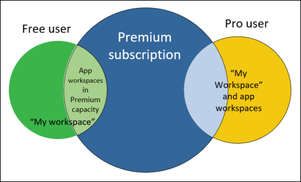
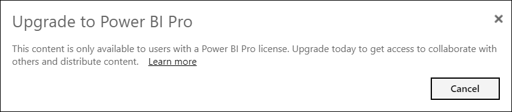
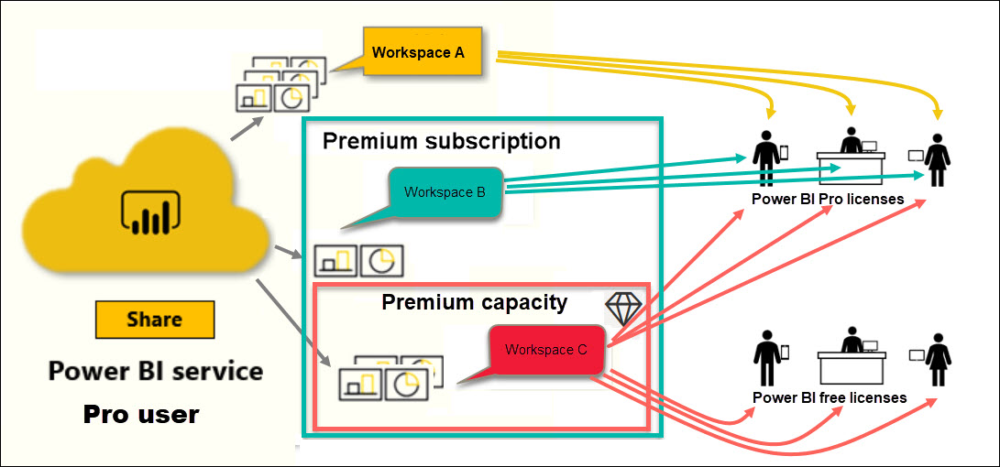

# Types of Power BI licenses

[!INCLUDE[consumer-appliesto-ynnn](../includes/consumer-appliesto-ynnn.md)]

As a *consumer*, you use the Power BI service to explore reports and dashboards in order to make business decisions. If you've been using Power BI for a while, or have been chatting with your *designer* colleagues, you've probably discovered that there are some features that only work if you have a certain type of license or subscription. 

This article explains the differences between user licenses and organization subscriptions, and how they work together: free, Pro, Premium, and Premium capacity. You'll also learn how to figure out which license and subscription combination you are using.  

We'll start by looking at the two categories of licenses -- per-user and organizational subscriptions. Our starting point will be the default capabilities available with each. Then we'll look at how your Power BI administrator and the content owners can use roles and permissions to modify the default license and subscription capabilities. 

For example, even if your license allows it, your administrator can limit your ability to do things like export data, use Q&A natural language queries, or publish to web. And when a report *designer* assigns content to a [workspace](end-user-workspaces.md), they can assign you to a workspace role. The roles determine what you can and can't do within that workspace. The *designer* can further adjust the limits of your license using permission settings. In other words...it's complicated. Hopefully this article will clear up most, if not all, of the confusion.

## Per-user licenses
The first type of license is a **per-user** license. Each Power BI service user has either a free license or a Pro license. Certain features are reserved for users with Pro licenses.  

- **A Power BI Pro license (without a Premium subscription)** enables a user to collaborate with other Pro users by creating and sharing content. Only users with a Pro license can publish reports, subscribe to dashboards and reports, and collaborate with colleagues in workspaces. 

    

    Power BI Pro is an individual user license that lets users read and interact with reports and dashboards that others have published to the Power BI service. Users with this license type can share content and collaborate with other Power BI Pro users. Only Power BI Pro users can publish or share content with other users or consume content that's created by others. The exception to this is content that's hosted in [Power BI Premium capacity](#understanding-premium-and-premium-capacity). (For more information, see [Power BI Premium capacity](#understanding-premium-and-premium-capacity) below.) Pro licenses are typically used by report *designers* and developers. 

- **A standalone Power BI free license (without a Premium subscription)**, although still powerful, is for those users getting started with Power BI or those users creating content for themselves. See [Sign up for Power BI service as an individual](../service-self-service-signup-for-power-bi.md).   

    A free standalone user license is perfect for someone using the Microsoft samples to learn Power BI. Users with free standalone licenses can't view content shared by others or share their own content with other Power BI users. 

    

    All customers with a free standalone license can upgrade to a [free Power BI Pro license trial](../service-self-service-signup-for-power-bi.md). The trial gives you all the power and functionality of a Power BI Pro user.

    

- **A Power BI free license with a Premium subscription** When an organization has a Premium subscription, admins and Pro users can assign workspaces to *Premium capacity* and grant free users access to those workspaces. A workspace in a Premium capacity is a space where Pro users can share and collaborate with free users -- without requiring the free users to have Pro accounts. Within those workspaces, free users have elevated permissions; they can collaborate and share, export data, subscribe, interact with filters, and much more. 

Clear so far?  OK. Let's take a closer look at **Premium capacity**.

## Understanding Premium and Premium capacity
Premium is an **organizational** subscription. Think of it as adding a layer of features and functionality on top of all the Power BI **per-user** licenses in an organization. 

When an organization purchases a Premium license, the administrator typically assigns Pro licenses to the employees who will be creating and sharing content. And the administrator assigns free licenses to everyone who will be consuming that content. The Pro users create [app workspaces](end-user-workspaces.md) and add content (dashboards, reports, apps) to those workspaces. To allow free users to collaborate in those workspaces, the admin or Pro user saves the workspaces in *Premium capacity*. 

When an organization purchases a Premium license, they receive capacity in the Power BI service exclusively allocated to them. It is not shared by other organizations. The capacity is supported by dedicated hardware fully managed by Microsoft. Organizations can choose to apply their dedicated capacity broadly, or allocate it to specific workspaces. An organization may have all workspaces in capacity, or only some. You can identify a workspace in Premium capacity by its diamond icon .  A workspace in a Premium capacity is a space where Pro users can share and collaborate with free users -- without requiring the free users to have Pro accounts. 

In Premium capacity, Pro licenses are still required for content designers. Designers create app workspaces, connect to data sources, model data, and create reports and dashboards that are shared directly or packaged and shared as apps. Users without a Pro license can still access an app workspace that's in Power BI Premium, as long as that workspace is in Premium *capacity*, and as long as the workspace owner gives them permission.

In the diagram below, the left side represents Pro users who create and share content in app workspaces. 

- **Workspace A** was created in an organization that doesn't have a Premium subscription. 

- **Workspace B** was created in an organization that does have a Premium subscription, though this particular workspace was not saved in Premium capacity. The workspace does not have the diamond icon.

- **Workspace C** was created in an organization that does have a Premium subscription, and was saved in Premium capacity. This workspace does have a diamond icon.  

The Power BI Pro *designer* can share and collaborate with other Pro users in any of the three workspaces. As long as the designer shares the workspace with the entire organization or assigns workspace roles to the Pro users. 

The Power BI Pro user can only share and collaborate with free users using Workspace C. The workspace must be assigned to Premium capacity for free users to be able to access the workspace. Within the workspace, the designer assigns roles to collaborators: *Admin*, *Member*, *Contributor*, or *Viewer*. Your role determines what actions you can take within the workspace. Power BI *consumers* are usually assigned the *Viewer* role. To learn more, see [Workspaces for Power BI consumers](end-user-workspaces.md).

## Find out which license and subscription you have
There are several ways to look up your Power BI license and subscription information. 

First, determine which **user** license you have.

- Certain versions of Microsoft Office include a Power BI Pro license.  To see if your version of Office includes Power BI, visit [the Office portal](https://portal.office.com/account) and select **Subscriptions**.

    This first user, Pradtanna, has Office 365 E5, which includes a Power BI Pro license.

    

    This second user, Zalan, has a Power BI free license. 

    

Next, check to see if your account also part of a Premium subscription. Either of the users above, Pro or free, could belong to an organization that has a Premium license.  Let's check for our second user, Zalan.  

- In the Power BI service, select **My workspace** and then select the cog icon from the upper right corner. Choose **Manage personal storage**.

    

    **Per-User** licenses, Pro or free, provide 10GB of storage in the cloud that can be used for hosting Power BI reports, or Excel workbooks. If you see more than 10GB, then you are a member of an organizational account with a Premium license.

    

    Remember that on the Office portal page, Zalan's user license was for Power BI (free). But because his organization purchased a Premium subscription, in the Power BI service, Zalan isn't limited to 10GB of storage; he has 100GB available. As a *consumer* in an organization with a Premium license, as long as the *designer* places the workspace in Premium capacity, Zalan has the ability to view shared content, collaborate with colleagues, work with apps, and more. The extent of his permissions are set by his Power BI administrator and by the content designer. Notice that a Pro user has already shared a workspace with Zalan. The diamond icon let's him know that this workspace is stored in Premium capacity. 

   
## Understanding workspace roles
So far, we've reviewed per-user licenses, Premium subscriptions, app workspaces, and Premium capacity. Now let's take a look at workspace *roles*.

Since this is an article for Power BI *consumers*, we have the following scenario:

-  You are a *free* user within an organization that has a Power BI Premium subscription. 
- A Power BI Pro user has created a collection of dashboards and reports and published this collection as an *app* to your entire organization.  
- Apps exist within *workspaces* and this workspace is in Premium capacity.    
- This app workspace has one dashboard and two reports.
- The Pro user has assigned us the **Viewer** role.

### The Viewer role
Roles let Power BI *designers* manage who can do what in a workspace, so teams can collaborate. One of those roles is **Viewer**. 

When the workspace is in a Power BI Premium capacity, users with the Viewer role can access the workspace even if they don't have a Power BI Pro license. And because the Viewer role can't access or export the underlying data, it's a safe way to interact with dashboards, reports, and apps.

> [!TIP]
> To learn about the other roles (Admin, Member, and Contributor) see [creating a new workspace](../service-new-workspaces.md).

## Next steps
[Am I a Power BI *consumer*?](end-user-consumer.md)    
[Learn about workspaces](end-user-workspaces.md)    
<!--[View Power BI features by license type](end-user-features.md) -->

