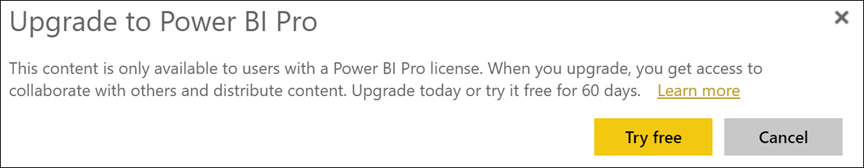
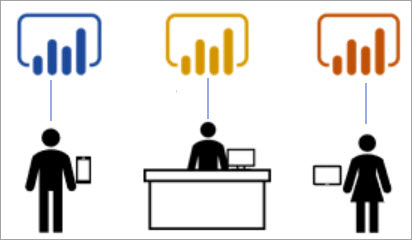

# Using the Power BI service as a *consumer*

[!INCLUDE[consumer-appliesto-ynnn](../includes/consumer-appliesto-ynnn.md)]

As a [*consumer*](end-user-consumer.md), you use the Power BI service to explore reports and dashboards in order to make data-backed business decisions. If you've been using Power BI for a while, or have been chatting with your *designer* colleagues, you've probably discovered that there are some features that only work if you have a certain type of license,  subscription, or permissions. 

What you can do in the Power BI service depends on three things:
-    the type of license and subscription you are using
-    where content is stored
-    the roles and permissions you're assigned

In this article we describe the capabilities of each license type and how *where content is stored* can affect *what you can do with it*. You'll also learn how to look up your license and subscription and figure out where your content is stored. For more information about roles and permissions, see [workspace roles](end-user-workspaces.md).

## Licenses

Each user of the Power BI service is using either a *free* license or a *Pro* license. If you're a Power BI *consumer*, then you're probably using a free license that is managed by your administrator. 

It is possible to have more than one license at the same time.  The service always delivers you an experience equal to the best license you currently have. 

## Power BI Premium capacity

Premium is an organizational subscription that provides a different way to store content -- in dedicated capacity. With Premium, anyone, whether they're inside or outside your organization, can view your Power BI content without purchasing individual Power BI Pro licenses. 

Premium enables widespread distribution of content by Pro users without requiring Pro licenses for recipients who view the content. Pro licenses are required for content designers. Designers connect to data sources, model data, and create reports and dashboards that are packaged as workspace apps. User without a Pro license can still access a workspace that's in Power BI Premium capacity, as long as they have a Viewer role.

Within those workspaces, designers assign roles, like **Viewer**, **Contributor**, **Member**, and **Administrator**, that determine the extent to which colleagues can interact with the content. For more information, see [workspace permissions and roles.](end-user-workspaces.md) 

For more info about Premium capacity, see [What is Microsoft Power BI Premium?](../service-premium-what-is.md).

## Find out which licenses you have

Visit [your Microsoft **My account** page](https://portal.office.com/account) to see what licenses are assigned to you.  Select the tab for  **Subscriptions**.

This first user, Pradtanna, has Office 365 E5, which includes a Power BI Pro license.

This second user, Zalan, has a Power BI free license. 

## Find out if you have access to Premium capacity

Next, check to see if you are part of an organization that has Premium capacity. Either of the users above, Pro or free, could belong to an organization that has Premium capacity.  Let's check for our second user, Zalan.  

We can determine whether Zalan's organization has Premium capacity by looking up the amount of storage available. 

- In the Power BI service, select **My workspace** and then select the cog icon from the upper right corner. Choose **Manage personal storage**.

    

    If you see more than 10 GB, then you are a member of an organizational that has a Premium subscription. The image below shows that Zalan's organization has up to 100 GB of storage.  

    

Notice that a Pro user has already shared a workspace with Zalan. The diamond icon indicates that this workspace is stored in Premium capacity. 

## Identify content hosted in Premium capacity

Another way to find out if your organization has Premium capacity is to look for apps and app workspaces with a diamond icon. The diamond indicates that the content is stored in Premium capacity. 

In the image below, three of the apps are stored in Premium capacity.

    
As a *consumer*, as long as the *designer* places the workspace in Premium dedicated capacity, you have the ability, **within that workspace**, to view shared content, collaborate with colleagues, work with the app dashboards and reports, and more. The extent of your permissions is set by your Power BI administrator and by the content designer. 

   

## Putting it all together

When an organization purchases a Premium subscription, the administrator typically assigns Pro licenses to the employees who will be working in Premium capacity, creating and sharing content. And the administrator assigns free licenses to everyone who will be consuming that content. The Pro users create [app workspaces](end-user-workspaces.md) and add content (dashboards, reports, apps) to those workspaces. To allow free users to collaborate in those workspaces, the admin or Pro user assigns the workspaces to *dedicated capacity*.    
 

|License type  |shared capacity  |dedicated capacity  |
|---------|---------|---------|
|**Free**     |  For use as a personal sandbox where you create content for yourself and interact with that content. This is a great way to try out the Power BI service. You cannot consume content from anyone else or share your content with others  1     |   Interact with content assigned to dedicated capacity and shared with you. Free and Pro users can collaborate without requiring the free users to have Pro accounts.      |
|**Pro**     |  Collaborate with other Pro users by creating and sharing content.        |  Collaborate with free and Pro users by creating and sharing content.       |

1 See [Considerations and troubleshooting](#considerations-and-troubleshooting). 

In the diagram below, the left side represents Pro users who create and share content in app workspaces. 

- **Workspace A** was created in an organization that doesn't have Premium capacity. 

- **Workspace B**  was created in an organization that does have a Premium subscription, and the workspace was saved in dedicated capacity. This workspace has a diamond icon.  

    

The Power BI Pro *designer* can share and collaborate with other Pro users in either of the three workspaces. But, the only way the Power BI Pro user can share and collaborate with free users is by using Workspace B, which is in Premium dedicated capacity.  Within the workspace, the designer assigns roles to collaborators. Your role determines what actions you can take within the workspace. Power BI *consumers* are usually assigned the *Viewer* role. To learn more about roles, see [Workspaces for Power BI consumers](end-user-workspaces.md).

## Considerations and troubleshooting
- It is possible to have more than one Power BI license. The Power BI service will always deliver the experience equal to the best license that you currently have. For example, if you have both a Pro and a free license, the Power BI service will use the Pro license.

- If you want to share and create content (dashboards, reports, apps), then you may not be a Power BI *consumer*, but instead be a *designer*. Consider changing to a Pro user license. You can sign up for a free 60 day individual trial of Power BI Pro by selecting the upgrade dialog that appears in the Power BI service whenever you attempt to use a Pro feature.

    

  When the 60-day trial expires, your license changes back to a Power BI free license. After this happens, you no longer have access to features that require a Power BI Pro license. If you'd like to continue with a Pro license, contact your admin about purchasing a Power BI Pro license. If you do not have an admin, visit [the Power BI pricing page](https://powerbi.microsoft.com/pricing/).     

- If you signed up for a free license, it never expires. So if you upgrade to a Pro trial or your organization provides you with a Pro license, and then your trial ends or your organization removes your Pro license, you'd still have the free license to fall back on - unless you or an administrator cancels the license. 

- 1 A free user license for the Power BI service is perfect for someone exploring or using it for personal data analysis and visualizations using **My workspace**. A free user isn't using Power BI to collaborate with colleagues. Users with free  licenses can't view content shared by others or share their own content with other Power BI users. 

    

## Next steps
- [Am I a Power BI *consumer*?](end-user-consumer.md)    
- [Learn about workspaces](end-user-workspaces.md)    
- [View Power BI consumer features by license type](end-user-features.md)
