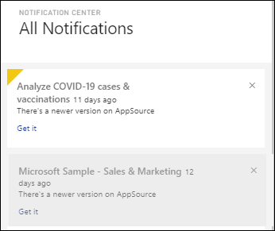
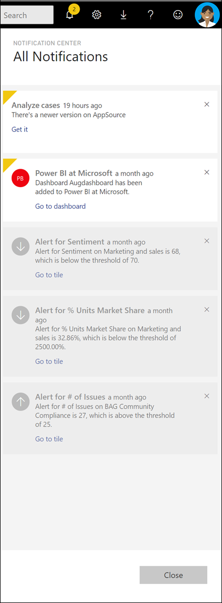
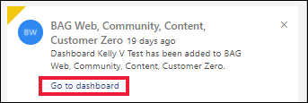

# View Power BI notifications

[!INCLUDE[consumer-appliesto-yynn](../includes/consumer-appliesto-yynn.md)]

The Power BI service keeps track of events that have occurred since the last time you signed in. This includes updates to apps, alerts that have been triggered on dashboards, information about Power BI events and meetings, and new content added to workspaces. The Notification Center saves a sequential list of these events. 

When you're ready to review your notifications, select the bell icon . Your notifications are listed, with the most recent at the top. Viewed items are shown in gray, and unviewed items are highlighted and have a yellow corner.   

## View your notifications

When you sign in to Power BI, any new notifications that you've received while you were offline are added to your feed. If you do have new notifications, Power BI displays a yellow bubble with the number of new items above the Notification Center icon. 

Because the Notification Center is part of the Power BI service top menu bar, you can open your notifications from most areas of the Power BI service. For example, you can open your notifications from **Home**, **Recents**, dashboards, reports, apps, workspaces, and the Power BI Q&A screen.

You get notifications for a variety of reasons, and these might also be sent to you via email. You get notifications: 

- When an app has been updated and the newer version is available.
- When new content (for example, a dashboard or report) has been added to a workspace.
- When [an alert](end-user-alerts.md) has been triggered. (Alerts can be set in the Power BI service and in Power BI Mobile apps.)

Follow these steps to view your notifications:
   
1. In the Power BI service menu bar, select the bell icon. In this example, you have two new notifications since the last time you opened the Notification Center.
   
   

1. Under **All Notifications**, see the most recent notifications at the top of the list. Notice that the unread messages are highlighted. Power BI retains notifications for 90 days, unless your list reaches the maximum limit of 100 notifications.
   
   

1. Read the notification and take action. Most notifications contain one or more active links. The following example contains a link to a dashboard.

   

1. When you no longer need a notification, dismiss it by selecting the **x** icon.    

## Cancel a notification

Power BI sends some notifications automatically. You or your colleagues create other notifications. You can always delete notifications before or after you read them. If you're receiving certain notifications too often, or you just don't need the information any longer, there are ways to cancel the delivery. 

For notifications that you or your colleagues create, you can cancel the notifications without deleting the content that they reference. For example, to stop receiving an alert each time your total daily sales rises above $100, [edit or cancel the alert](end-user-alerts.md) from the dashboard. If your colleague created the alert notification, contact them and ask to be removed.

## Next steps

* [Data alerts in the Power BI service](end-user-alerts.md)
* [Set data alerts in the iPhone app (Power BI for iOS)](mobile/mobile-set-data-alerts-in-the-mobile-apps.md)
* [Set data alerts in the Power BI mobile app for Windows 10](mobile/mobile-set-data-alerts-in-the-mobile-apps.md)
* More questions? [Try the Power BI community](https://community.powerbi.com/)

